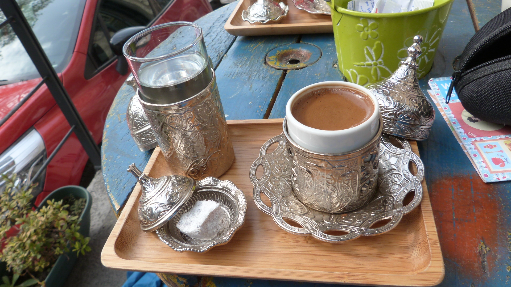
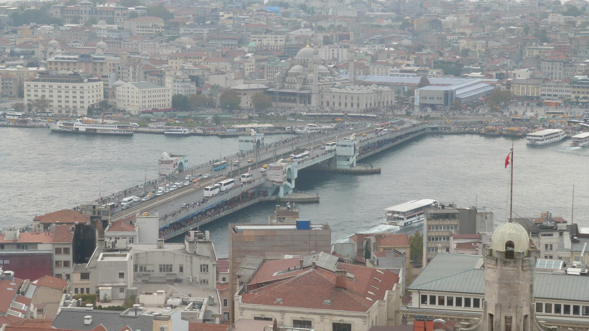
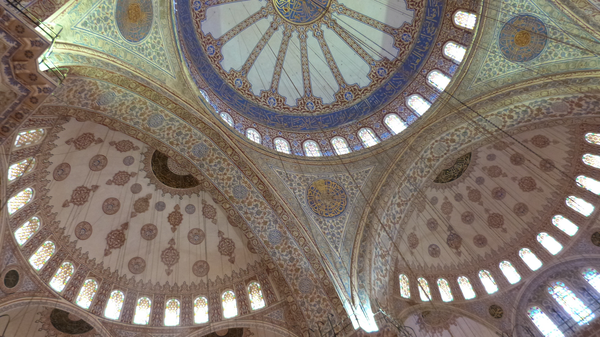
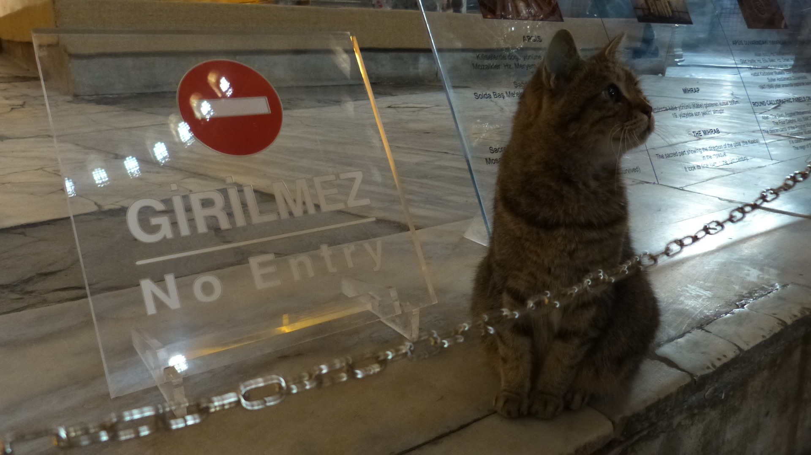
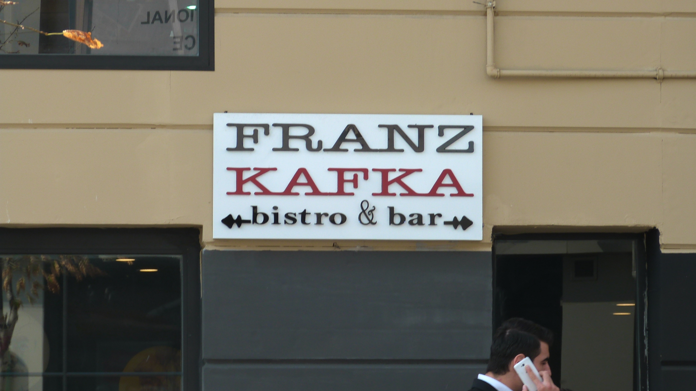
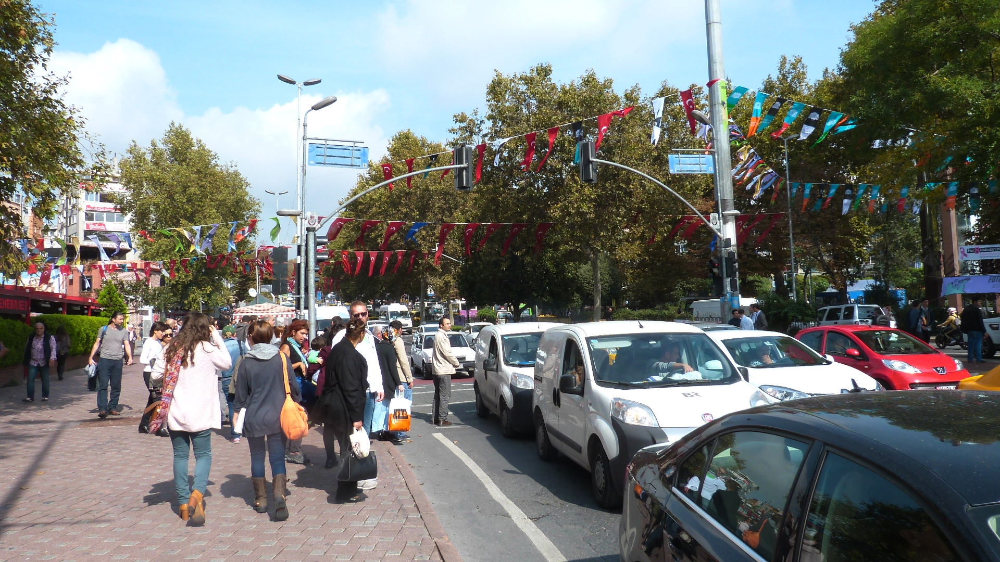
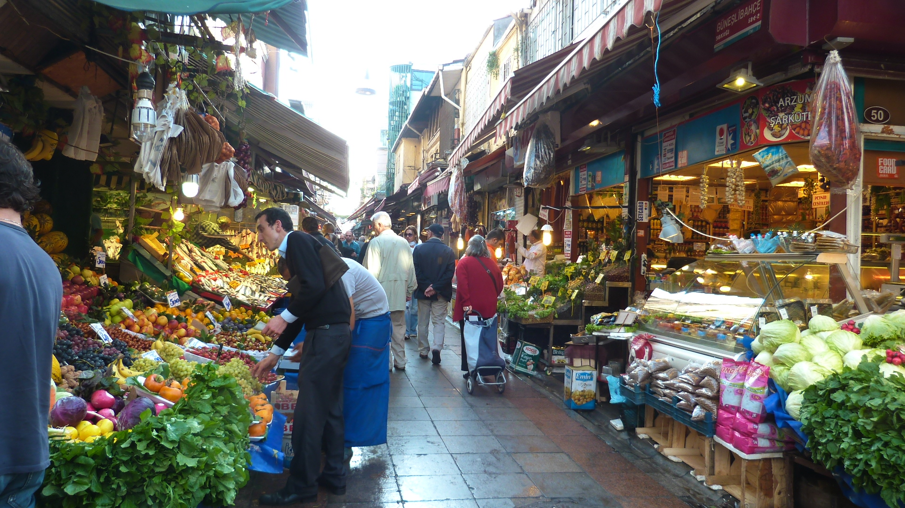
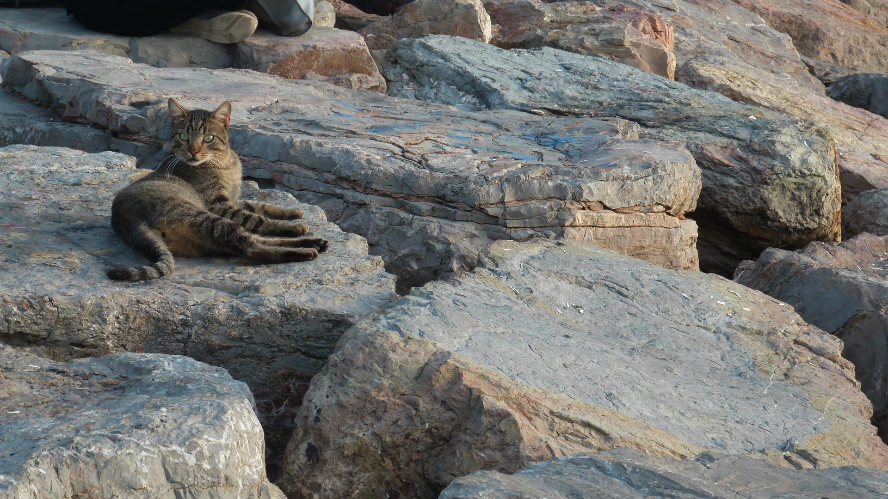
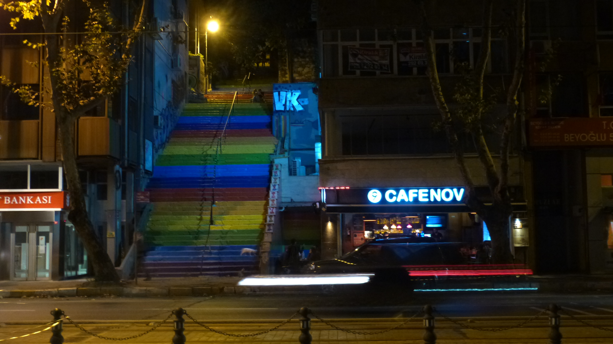
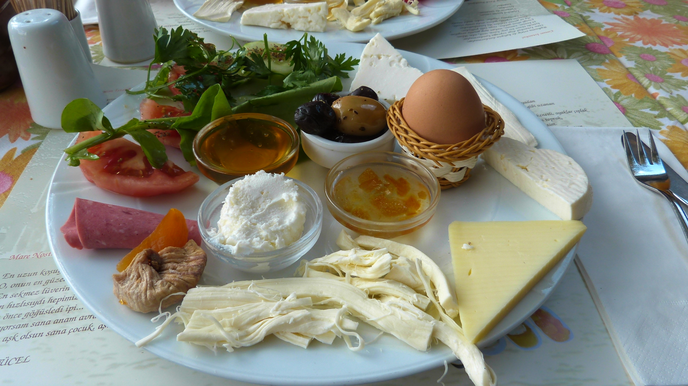

Hoje é dia de reviver. Aqui ficam alguns momentos da minha visita à Turquia em Outubro do ano passado.

Revivaremos principalmente Istambul, em momentos oportunos levar-vos-ei a outros momentos. :)

<figure>
	
	<figcaption>Türk kahvesi. Muito diferente, igualmente bom.</figcaption>
</figure>

<figure>
	
	<figcaption>Galata Tower.</figcaption>
</figure>

<figure>
	
	<figcaption>Blue Mosque. A mesquita mais imponente em toda a Turquia.</figcaption>
</figure>

<figure>
	
	<figcaption>Gatos, gatos e gatos, em sítios muitas vezes improváveis.</figcaption>
</figure>

<figure>
	
	<figcaption>Não consegui esconder o meu contentamento ao ver uma referência a este Senhor.</figcaption>
</figure>

<figure>
	
	<figcaption>Beşiktaş, ou o sítio não falado mais familiar de Istambul.</figcaption>
</figure>

<figure>
	
	<figcaption>Kadıköy um pequeno paraíso na parte asiática de Istambul onde variedade e beleza abundam.</figcaption>
</figure>

<figure>
	
	<figcaption><i>"You talkin' to me?"</i></figcaption>
</figure>

<figure>
	
	<figcaption>Foi pena tê-las encontrado à noite. Mesmo assim conseguem ainda guardar alguma da sua magia.</figcaption>
</figure>

<figure>
	
	<figcaption>Kahvaltı. Eu sei, o aspecto fala por si.</figcaption>
</figure>