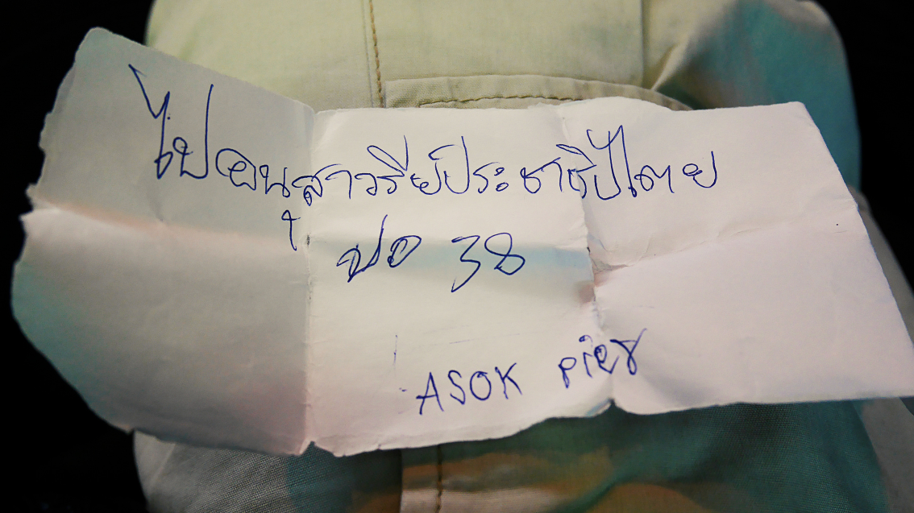
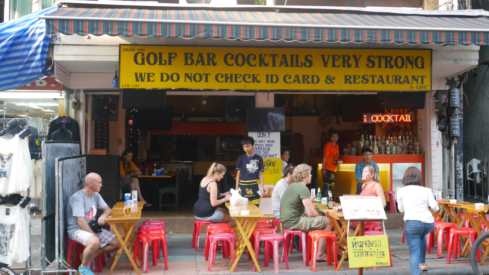
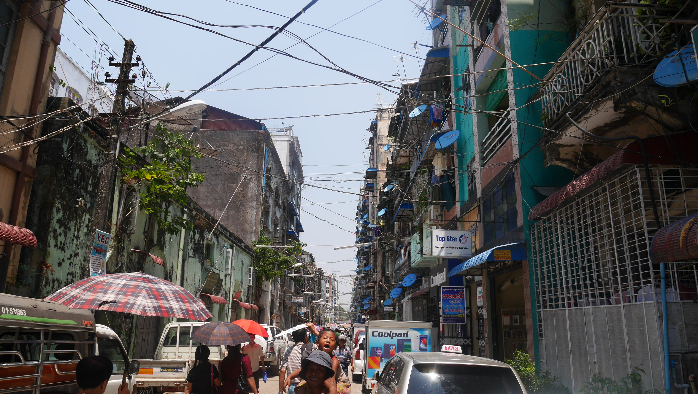
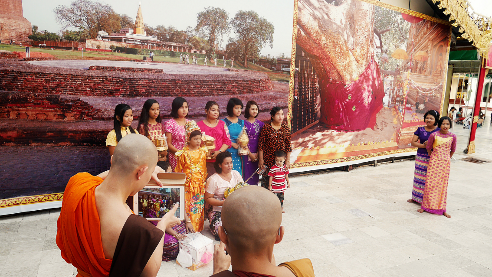
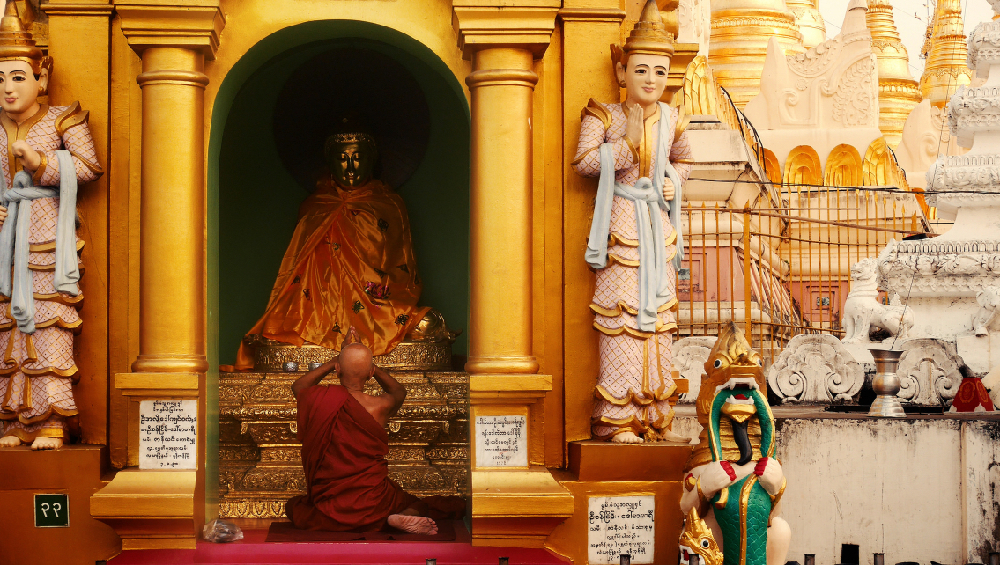
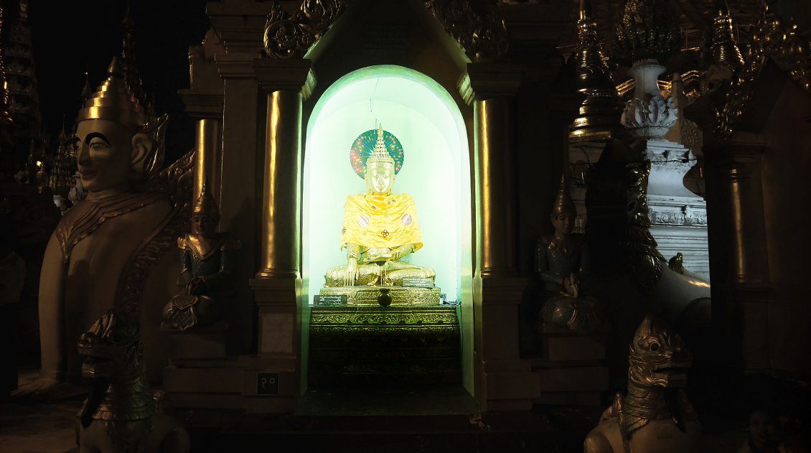
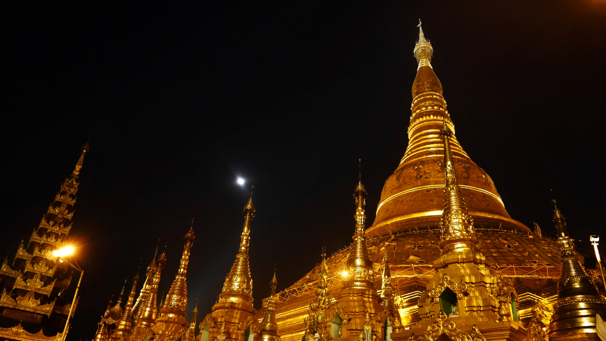
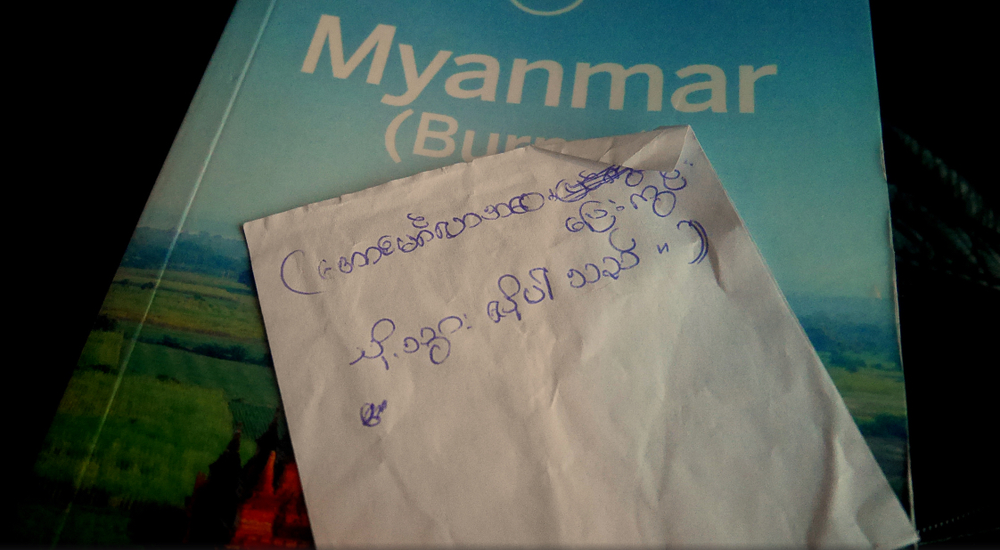

Myanmar is an exceptional place. We went there for 3 weeks (with a short stop in Bangkok, Thailand) and I want to share with you some of the moments we've had there. If you search for any story of someone that went there I bet you won't find a negative experience and there is a reason for that. Nothing can go wrong with Myanmar.

We first arrived at Bangkok Suvarnabhumi airport, after nearly 12 hours by plane, with the goal of reaching <b>Khao San Road</b> by any means without taking a taxi to avoid the crazy traffic and potential scams. We had read that if we took the sky train to the Makkasan station there would be a bus that would take us almost to Khao San so we decided to do that only to arrive there and find that there was no bus for us. And thanks for that because else we would not have taken the river boat to get there. We only had to decrypt the following text that a sympathetic woman wrote for us:

<figure>
	
	<figcaption>The goal was "Asok Pier".</figcaption>
</figure>

When we got there we just had time to let the backpacks at the hostel and head to Khao San were we spent the afternoon. We didn't have much time since our flight to Myanmar was on the following day so we just hang there until night where we had a marvelous Pad Thai.

<figure>
	
	<figcaption>The obvious place to have a drink.</figcaption>
</figure>

I will get back to Khao San on another post. Now let's head to <b>Yangon</b> the capital of Myanmar. The first impression when we arrived turned out to be so misleading that is almost funny. The airport is in good condition and as we were heading to downtown there were large roads in good condition, the traffic was OK and we were seeing big houses. For moments we thought we arrived at the wrong country.

All this was dismystified when we arrived downtown. Houses degradating, several cables hanging above our heads, but the best one is that there are holes in the street that may lead you directly to the sewers. Sometimes they've something above them for people to pass but other times the holes are just open that turns quite funny at night when there's little public lights turned on.

<figure>
	
	<figcaption>Random street in Yangon.</figcaption>
</figure>

We decided to stay at Yangon for that day and the day after when we would take a night bus to <b>Inle Lake</b>. We were going to get back to Yangon during the <b>Thingyan</b> water festival but as we were short in time before the festival and we wanted to avoid large crowds, we decided to head right away to the most important place of worship in Myanmar, the big and marvelous <b>Shwedagon Pagoda</b> at a <i>generous</i> fee of 9$ per tourist. 

<figure>
	
	<figcaption>Monks taking pictures to a soon-to-be monk.</figcaption>
</figure>

A ceremony is held for all the soon-to-be monks. They're with their family and are held almost as a trophy by their parents. For all we know almost all people go to a monastery somewhere along their lives and that is a great pleasure for the family (for some at least, but we'll get there in another post).

<figure>
	
	<figcaption>Monk praying to Buddha.</figcaption>
</figure>

<figure>
	
	<figcaption>Excentric Buddha.</figcaption>
</figure>

If you search a little bit you'll find many different Buddhas, but in Myanmar they are even more excentric. Almost all of them have neon's behind their heads (the attainment of enlightenment sign), some have blankets (because with 37ºC, who knows...) and some have black/red/golden clothes...

<figure>
	
	<figcaption>The Shwedagon Pagoda at night.</figcaption>
</figure>

After that we went back to downtown and before returning to our room we decided to go to the chinatown. The city had almost no lights (random power cuts can happen) and the holes to the sewers that I talked about earlier were now a big problem and the streets were full of garbage so it was only normal to see some rats running around in front of our feets. When we got back to our room we found two beautiful cockroaches on our bathroom, and I'll leave it like that.

On the second day we were catching a night bus to Inle Lake so we just wandered in the city. We needed to go to the bus station so we tried to get all the information regarding transportation to there. Of course everybody pointed us to the taxi because we're tourists and the taxi in fact is really cheap when compared to Europe, but why get a taxi for 8$ when you can get a local bus for 0.8$ two people and hang around with other local people? That's what we decided to do, search for the golden 43 bus that would take us to <b>Aung Mingalar</b> station. We waited for about 30 minutes but we got in the bus 2 hours before our departure time, however the trip took more than expected because there are no rules and the bus stops whenever the driver wants. At every stop there's a guy that leaves the bus and starts yelling and waving at people for them to go into that bus. The rule is, if there are people waiting on the side of the street, the bus stops and the yelling starts.

When we arrived we only had (once again) a little written paper that had our bus company name so we went on a frenzy rampage of questions to people because nobody could point us to the right direction and we only had about 30 minutes. When we finally got to the bus there were only 10 minutes left, so we hop'd in to our next adventure, Inle Lake.

<figure>
	
	<figcaption>The information we had to get to the bus.</figcaption>
</figure>