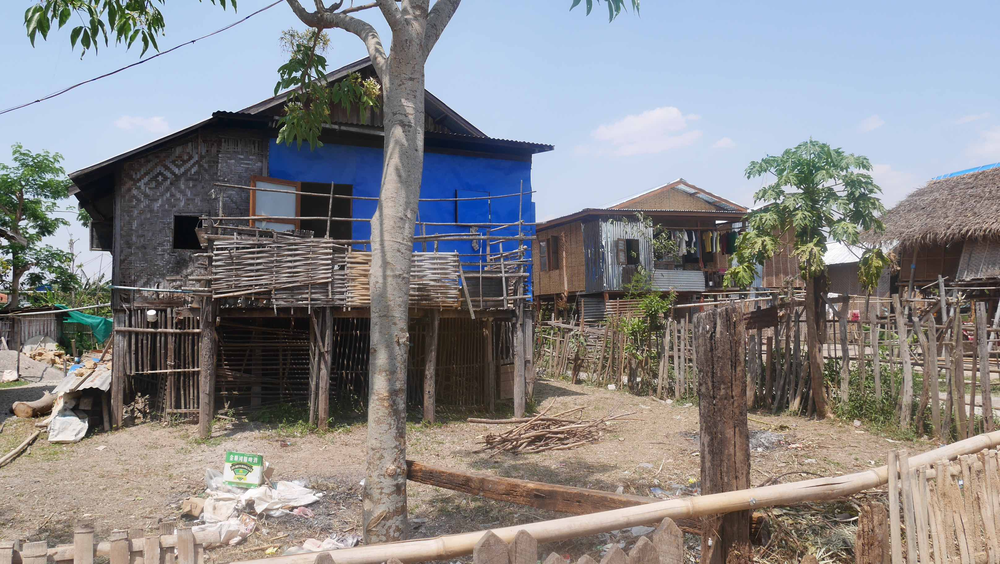
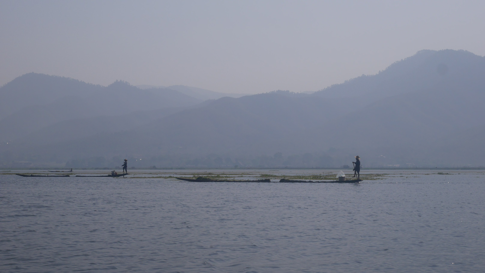
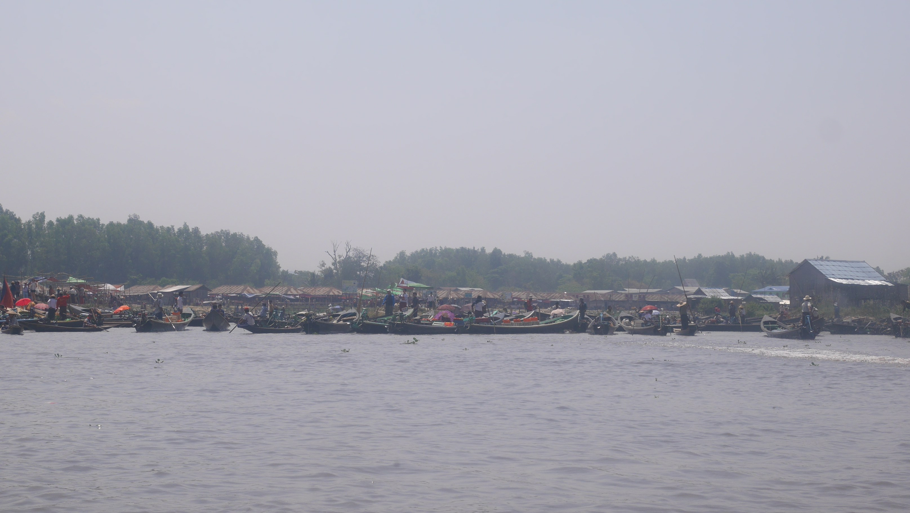

If by now you think that Myanmar is a poor country with poor infrastructures you're right, but this doesn't apply to their bus companies. The long course ones are brand new and look like a <i>luxurious</i> way to get around the country. The one we got had 2 TVs on board with loud mantras (I guess) being echoed by some monk with various images of important religious sites around the country. At first we were afraid that the TVs wouldn't be turned off (as we read online) but this didn't happen and the ride went smoothly.

We got to the Nyaung Shwe Junction at around 4/5am and obviously there was a crowd of people waiting for someone that would drop off at that point to offer their taxi/rickshaw/bike services. On the other side of the road there was a little stand with people having drinks and snacks so we decided to eat something first. Eventually a man approached us with a reasonable offer that we decided to take. Half way through our ride the car stopped and it was the first time we had to pay a <i>reasonable amount</i> of 10$ each for a tourist ticket. Don't get me wrong, we were not paying to visit anything, it's just a ticket to get to the village. It's like going to your parents house, but first paying a fee to the government just because they want. You got the idea, right?

<figure>
	
	<figcaption>Little stand by the road.</figcaption>
</figure>

The guest house where we stayed in was the only place in Myanmar where an air conditioned room wasn't mandatory, maybe because the mild climate caused by the lake. The owner was a football addict, betting through SMS with his bookie. I had the chance to talk with him and got the impression that he made a lot of money just by betting on every favourite team because the people love football but aren't yet conscious of the strength of any teams across Europe. But, well, that's not what we're here for.

It's impossible not to feel instantly calm and relaxed when you wander around Nyaung Shwe. Yes, there are busy streets with all kinds of vehicles, no traffic rules whatsoever except for two traffic lights on the main street, but if you come from Yangon then there's no possible comparison in the feelings you get. We decided to rent a couple bikes to explore the area on the first day with an itinerary of about ~14km.

The first detour we took led us to a little rural <i>village</i> where there was only one hand made road for people and bikes to cross. It's in these kind of places where you find the most curious people that stare at you as you're some kind of Hollywood star (we would experience this more intensively couple of days after on the train to Kalaw). There was a man that approached us while at home just to maybe practice his English or just wanting to interact for the sake of it. People in Myanmar do that a lot.

<figure>
	
	<figcaption>The unknown village.</figcaption>
</figure>

<figure>
	
	<figcaption>More of the unknown village.</figcaption>
</figure>

<figure>
	
	<figcaption>Our bikes in great style.</figcaption>
</figure>

We continued our journey always cycling by the rice fields where people were working and kids playing. Our goal was to cycle alongside the lake and eventually we would reach a Pagoda with a nice view of the lake.

<figure>
	
	<figcaption>People working on the rice fields.</figcaption>
</figure>

When we reached our goal and, as always, there was a <i>surprise</i> waiting for us. A joyous climbing of stairs of about 3/5 minutes and this if you don't stop. I can't remember the last time I was breathing so heavily when I reached the top. You've a stunning view of the lake and its surroundings, that can't be denied, but what doesn't when you climb high enough? Unfortunately I don't have photos of the view we had because the camera ran out of battery as we were walking around the Pagoda, so the next one is the best I can show you.

<figure>
	
	<figcaption>Pagoda at top of the hill.</figcaption>
</figure>

Despite our tiredness, the way back to the guest house went smoothly apart for the gigantic snake we found on the road. As we were cycling we saw people ahead of us staring at something on the floor, but I could only figure out what it was when I got closer. What a surprise I had when I saw the giant snake and people looking at me in a funny way.

When we arrived at the guest house there was a football game on the TV (Liverpool vs Arsenal for the ones curious) so we decided to hang around a bit with the owner and some random people that were either waiting for the bus to go to another city or just hanging around. Mental note for all of us, be careful when talking on your native language wherever in the world. What was our surprise when a German guy started to talk us in fluent Portuguese? Turns out he went to Brazil when in college and could talk fluently in our native language understanding perfectly everything we said. It was quite a surprise and we would arrange our boat trip for the next day with him. If by any means you're reading this, hi Tim!

We woke up early for our boat trip around the lake as one of the <i>must do things</i> in Inle Lake. When we got to the pier it was quite packed because everyone seemed to have started the tour at the same time.

<figure>
	
	<figcaption>The pier.</figcaption>
</figure>

The lake is HUGE. Its estimated surface area is 116 km2. There's all sorts of things that you can find in the lake like floating gardens, little villages, cigar making houses, jewellery stores (for tourists, of course), hand made clothing <i>industries</i> and monasteries where there's a myth where in one of them there are jumping cats trained by monks. I guess that those jumping cats must have jumped so high that we didn't have the opportunity to see them and even our boat driver laughed when we asked if the cats really jumped. Ah, and the people fishing in the river have an interesting way to ride the boat. While they need both hands to manage the ropes and baskets that they use to fish, the legs are used to steer the boat in wherever direction they want to go.

<figure>
	
	<figcaption>Sailing with feet.</figcaption>
</figure>

<figure>
	
	<figcaption>Houses on the river.</figcaption>
</figure>

Our first stop was just beside the floating gardens. Yes, people in the lake have a garden all designed above water where flowers grow. It was one of the nicest things that we saw on the river, no doubt.

<figure>
	
	<figcaption>Floating garden.</figcaption>
</figure>

After the gardens we went on a rampage of touristy places that the boat driver took us to (meh). First went to the hand made clothing where people show us all the process that their handmade clothes go through. There's also a little shop where you can buy a 'recuerdo' and the impressive thing for me is that in a country where power cuts happen in the main cities, the internet access is limited and you don't have mobile roaming available, in the middle of a gigantic lake you can buy clothes with your credit card. Yes.

Next we went to the <i>floating market</i> that wasn't floating because of the dry season. So instead people just had a stand on the road to sell their merchandise to tourists. However, there was a kind man that approached us while on the boat to sell me a generous sword. The funny part of the floating market was when we ran into a couple of Portuguese tourists travelling through the south east of Asia. I must confess, I wasn't expecting that.

<figure>
	
	<figcaption>The <i>floating market</i>.</figcaption>
</figure>

Our last stop before lunch was the cigar making house. They only used tobacco and a leaf to wrap it up, but still I must confess that I was quite impressed on how quickly they did all this. They even had some samples for us to try, which were very tasty.

<figure>
	
	<figcaption>Tobacco, tobacco and tobacco.</figcaption>
</figure>

We finally got to lunch time near the main Pagoda in the lake. There were a lot of pilgrims there, despite being only possible to get there by boat, but as we discovered along our journey, the faith that people in Myanmar have in Buddha goes beyond everyone's possibilities. Also, another interesting thing is that there's rice in almost every meal and even cats have to eat rice. True story.

<figure>
	
	<figcaption>Best. Water. Ever.</figcaption>
</figure>

<figure>
	
	<figcaption>Cats eating rice?!</figcaption>
</figure>

The last stop was the jumping cat monastery, but I already said enough about it, I guess. We then returned to the guest house where we would arrange our plan for the next day. We planned to go to Bagan as our next major destination, but we didn't want to take the day bus because that way we would lose half a day just to get there. We tried to arrange a trekking from Inle Lake to Kalaw that would take two days, but the guide asked a lot of money so we aborted that plan too. We ended up deciding that the best way to make this work was to go to Kalaw by train (despite all the bad stories that you read on the internet about Myanmar trains), spend the day there then take the night bus to Bagan.

So we went to sleep early, anxious for our next adventure to start.