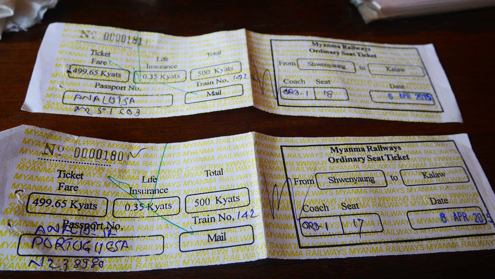

When we arrived at the Nyaung Shwe train station, we urged to the ticket booth to buy the tickets to Kalaw. It was going to be a 3 hour ride on one of the bumpiest trains in the world (according to some random people on the internet). We would only have the real experience on our ride from Mandalay to Yangon, but that is a story for another time. The ticket acquisition was relatively easy because there was a guy at the ticket booth that knew a bit of English, so we paid the modest amount of 499.65 Kyats (roughly 0.50€ each) for a 3 hour train ride which seemed very reasonable. We even had an <i>escort service</i> to our seats!

<figure>
	
	<figcaption>The train station.</figcaption>
</figure>

<figure>
	
	<figcaption>The train tickets.</figcaption>
</figure>

As we entered the train we almost instantly felt the look in peoples eyes towards us. I guess not many tourists take this train ride as most people seem to go to Kalaw first and either take a bus or do a trekking to Inle Lake. The train was what we expected: wooden flat harden seats and people carrying their <i>home</i> as baggage above their heads with no restrains whatsoever.

There was a young couple in the seats in front of us with a child that seemed very intrigued by our presence. At first we just exchange smiles and didn't give too much attention, but we could feel them fulminating us with their eyes. It's one of those things that you probably won't experience in many countries in the world, people <b>really</b> seem amazed to see one person that doesn't belong to their country so they just stare amazed at you.

<figure>
	
	<figcaption>Little girl.</figcaption>
</figure>

As the train started, we were almost instantly approached by an old man that did his best to speak all the English in his vocabulary. "<i>Where do you come from?</i>", "<i>What's your name</i>" and everything around these lines were being said, but I had to make a big effort to understand him. Turns out he was a military and now had retired. It's funny how all the people in our carriage started to look at us, most of them not understanding anything that was being said, but still smiling at the funny exchange of words happening between us. The couple in front of us seemed especially happy about all that happening and were laughing every time we and the old man failed in the communication and just stared at each other smiling without knowing what to expect next.

After this first moment the old man did, what we would find usual throughout our journey, what many people in Myanmar do. "<i>Take a photo!</i>" Turned out that people there like that tourists take photos of them, but don't be mistaken, the photo is to be taken with our camera so only we get it. And they've cell phones with cameras, that is something really unique that I can't understand.

<figure>
	
	<figcaption>The old man with a piece of me.</figcaption>
</figure>

The journey continued with the old man socialising with us, trying his best English to communicate and even offering me a cigarette (you can smoke everywhere, even inside trains) for me to join him in the seats next to us. Cordially I accessed his kindness and he started right away pointing to the outside naming different kinds of trees and telling me "<i>Big fire! Very big fire!</i>" as we continued through beautiful landscapes.

<figure>
	
	<figcaption>Some fields along the road.</figcaption>
</figure>

<figure>
	
	<figcaption>People seemed overwhelmed about a camera.</figcaption>
</figure>

Midway throughout the journey we had all the attention of the people in that carriage, there was no denying it. I was always switching seats, people already lost the shyness and were looking back above their seats and a kind guy on the seat behind me offered us two pieces of fruit that accompanied us almost to the end of our journey in Myanmar. The young couple in front of our seats had dismantled and now a friend of the girl was next to her because she was curious and wanted to interact with us as well.
Both of them couldn't speak a word of English, so our interactions were mainly smiles, laughing at us when we saw something unusual (at least for us) or when we tried to say anything in their native language. Trust me, it's not easy, they even smiled kindly when we said the station name we were going to. They taught us to count to ten in their native language and we retributed by doing the same in Portuguese. It was funny to see how difficult is for them and us to speak each others language as they're so different of what we're used to semantically. I hope someday one of you two find this and reach to me, it would be fun.

<figure>
	
	<figcaption>The beautiful young girls.</figcaption>
</figure>

We finally reach Kalaw and with great sadness we say goodbye to almost all the people on the train. We looked behind as we were leaving the station and there were the two girls with the arms up waving us goodbye. It was a warm feeling and so we left with smiles on our faces and tiredness in our heads because, after all, it was very tiring to have all the attention pointed at us for three hours straight.

<figure>
	
	<figcaption>Kalaw train station.</figcaption>
</figure>

Kalaw is really a small village, you shouldn't plan to stay there more than one day. After breakfast we just walked around the village and ended up in a small monastery on top of a hill where we had the opportunity to have a sneak peek through a window where monks were sitting in the floor in an organised way. My guess was that they were in some kind of class as they seemed to have papers in front of them.

<figure>
	
	<figcaption>Kalaw view from the monastery.</figcaption>
</figure>

After lunch we decided to do a trek that was suggested by Lonely Planet, where we'd get the change to reach a Pagoda that had caves with Buddhas inside. Since our bus to Bagan was scheduled for 20:30PM, we decided to do it. I guess that it's time to admit that GPS is a great thing. I don't know if we wouldn't still be in Myanmar by now if it wasn't for our GPS. We followed the indications provided by the Lonely Planet guide, got a bit lost, but still managed to get to the Pagoda.
Another thing that we noticed is that there were a lot of local people that were in some kind of excursions there to visit and pray at the Pagodas even at a week day.

<figure>
	
	<figcaption>Some unusual Buddhas.</figcaption>
</figure>

<figure>
	
	<figcaption>Inside the caves.</figcaption>
</figure>

As we were leaving the Pagoda to continue our journey, we were once again approached, but this time by a young girl that was a bit shy at first and even seemed nervous when talking to us. Basically, she asked what we expected, "<i>Can I take a photo with you</i>"? Only this time someone asked us to take a photo to actually keep it. She immediately called her sister, introduced us to her parents, and when we looked there was a crowd of people smiling and looking at a young girl socialising with foreigners. After this the girl thanked us for the photo, and we were mesmerized by what just happened. After that, a random guy asked us where we came from. For our surprise he said "oh! I was there in Lisbon for the carnival!". We're talking to a Burmese guy, that was on an excursion to a random Pagoda in Kalaw that went to Lisbon. It was mind blowing.

<figure>
	
	<figcaption>The two shy but courageous sisters.</figcaption>
</figure>

We followed our path now with the goal to visit and ancient wooden Buddha that was supposed to be near the place where we were. Soon after the encounter with the girls, we saw a lot of people walking in our direction in an orderly way. We saw horses too, and heard music. We stopped to watch the parade because we had the luck to run into the ritual of the Monk initiation. I must confess that I thought that the families accompanying their children would be more happy about that. After all, their child was going to be a Monk, living in a monastery. But, supposedly, it is a blessing, so I rest my case here.

<figure>
	
	<figcaption>Monks ritual #1.</figcaption>
</figure>

<figure>
	
	<figcaption>Monks ritual #2.</figcaption>
</figure>

We reached the ancient wooden Buddha ahead of schedule, and had some time to kill before the bus to Bagan. We walked back slowly just in time to have a generous dinner and head straight away to the bus stop. We were so tired. Yet, so happy with everything that happened. Bagan, here we go.

<figure>
	
	<figcaption>Ancient wooden Buddha.</figcaption>
</figure>