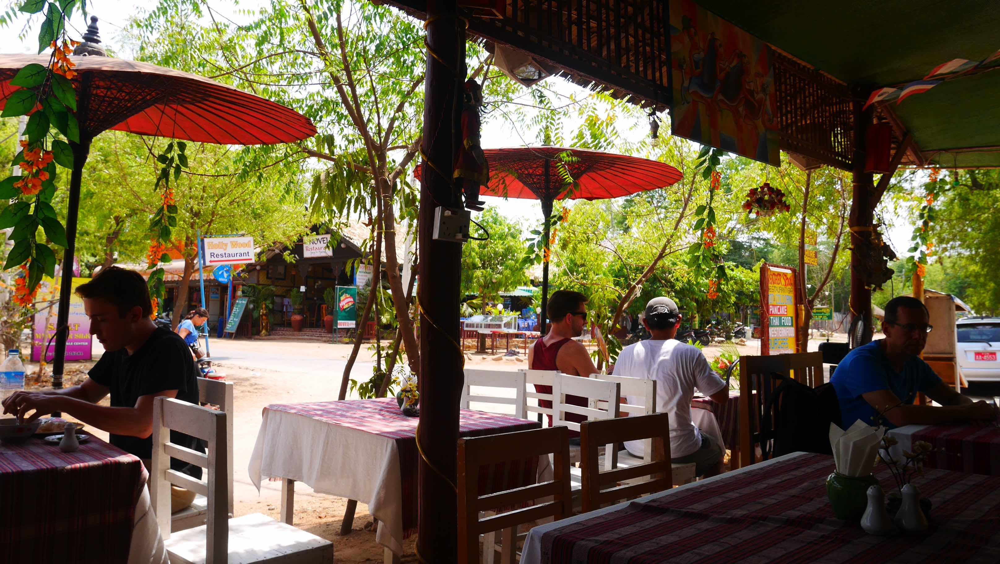
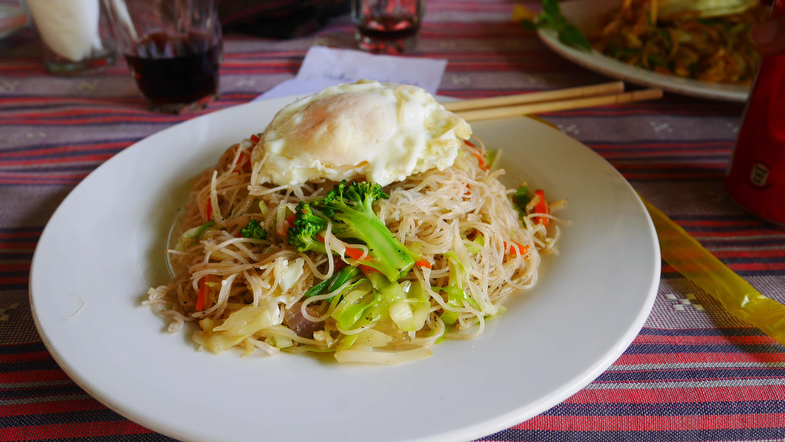
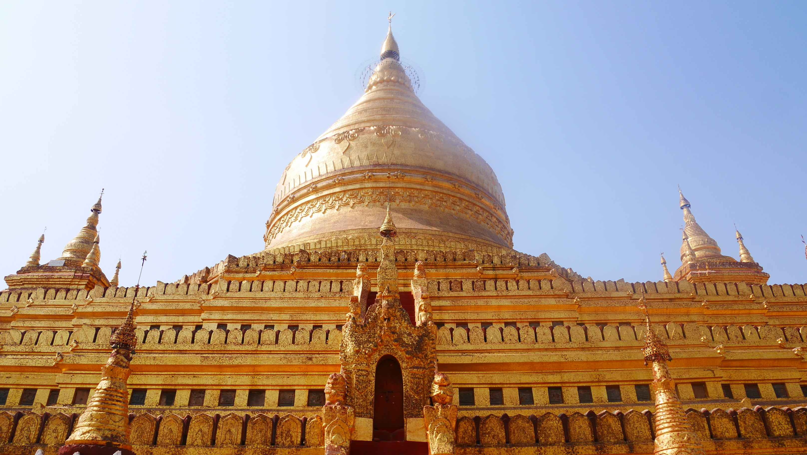
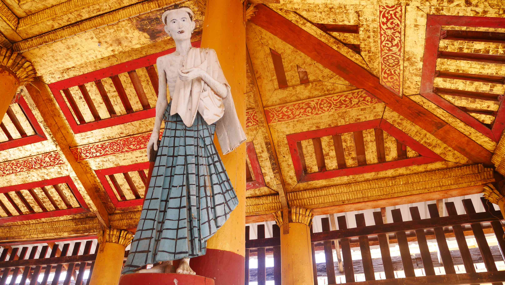
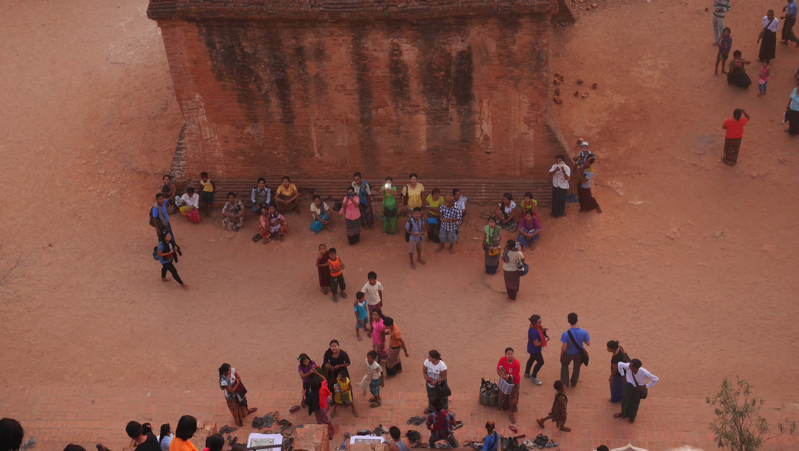
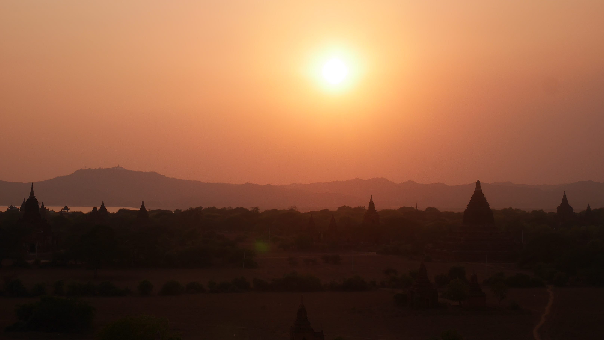

Bagan! Land of 2000+ temples!

This time the bus ride was shorter and we arrived at Nyaung-U around 3/4AM. This is one of the most annoying things when travelling in Myanmar, buses don't ever let you in the center of the place you want to go, it's always +5km away, so you have no choice but to take a local transportation and go through the annoyance of negotiating the price with the people that are offering you the service.

Once again, as we were leaving the bus, all kinds of offers started to appear. "<i>Taxi! Taxi!</i>", "<i>Rickshaw!</i>" etc. This time we were not alone and there were several people leaving the bus in the same situation as we, so it was a bit better to negotiate because each one of them wanted to get the maximum number of people they could. The first offer that came to us was 12 000 Kyats (aprox. 12$) for a 10 minute ride. We quickly turned that down and heard an honest proposal of a guy that wanted 2 000 Kyats per person (aprox. 2$, you got the idea, right?) in a van that could take about 10 people. He said that he would take us to the "<i>city</i>" center so we decided to hop in.

The van was packed and we knew that midway we would stop again because the government request yet another fee to get to Bagan. Only this time the ticket was to have access to the Archeological Site, which I can understand to a certain point, but they'll charge you when you enter the city because you're a tourist, you <i>have to go there</i>. It's a really good way to make some money, I'll give you that, and I don't really know if you can go past that point if you refuse to pay and say that you won't go to the Temples.
It seemed that most people weren't prepared for this. Some were just surprised and others found it atrocious, but the interesting one was an Asian guy that was sitting next to me that had already been in Bagan the week before but simply wanted to go there again. They charged him once more because his ticket was only valid for 5 days. He had to pay another 20$. Yes, they charge 20$ per person.

We didn't have any place reserved to stay in Bagan, but had a couple of them in mind. The driver <i>conveniently</i> stopped right in front of a guest house that he proposed for us to stay in. Some refused because they had reservations in other guest houses, others wanted to see the place, but we wanted to go even further to try to get the places we had in mind. The guy wanted 1 000 Kyats more per person to take us there. That was not what we had agreed before and the farthest place was only 3Km away so we packed up and walked down the road.
The first place was opened, but they wanted a little more money that we wanted to pay. The second place was what we expected and a little more affordable, so we decided to stay there (also, it was near the temples, that we would find to be an advantage). It was already 5 AM and we wanted to get some sleep, but the unexpected happened once again. As we were walking to our room we saw a familiar face already up, brushing his teeth to go see the sunset. It was Tim, the German guy. Of all places, we would be staying in the same place 2 days after our goodbye.

We ended up sleeping for a while and half day was already over. We had read that there was a very good place to eat downtown called '<i>The Weather Spoon</i>' so we decided to try that right away. The place is very <i>western-ish</i> and we found only tourists eating there. The food was indeed good, but I would only try the Hamburger that made the place known couple of days later.

<figure>
	
	<figcaption>The Weather Spoon restaurant.</figcaption>
</figure>

<figure>
	
	<figcaption>The delicious meal!</figcaption>
</figure>

We still had some time until the sunset, which we were planning to see on top of a temple, so we headed back to the guest house, stopping first on the <i>Shwe Zi Gon Pagoda</i>.

<figure>
	
	<figcaption>Shwe Zi Gon Pagoda.</figcaption>
</figure>

<figure>
	
	<figcaption>I don't know the story behind this statue, but it sure makes an impact on you.</figcaption>
</figure>

When we got to the guest house we wanted to rent a bicycle for the rest of the day, because we really wanted to start exploring the beautiful landscapes of Bagan. The heat was immense, but it was already <i>late</i> for us to go on feet (thank God we never really did that) so we got a pretty good deal for 0.5$ each, for half a day bicycles.

God, the heat was terrible. Can you imagine yourself cycling with +35ºC with no shadows whatsoever? On a dusty road? On vacations?!

We decided to stop at the most famous temple of Bagan, <i>That Byin Nyu Temple</i>. It's impossible for you not to feel that you're on the most famous temple of Bagan when you get there. Not only packed with tourists, but also with vendors trying sell everything from t-shirts, jewelry to postcards. There was a funny kid that came to us asking where we came from and proceeding to ask if we didn't have any money from Portugal. He then showed us an entire collection of bills from all around the world. I found it odd that he didn't have any Euro or Dollars, but I can understand that giving someone the lowest valuable Euro bill is too high. Nevertheless, it was funny because we didn't know that it would be a 'thing' there. Also, it was the <b>only</b> place in Bagan where there was someone asking us for the tickets we've bought earlier.

The sunset came fast, but it wasn't what we were really expecting. The sky was clouded, so the sun disappeared too soon. However, it was nice to feel the relaxed atmosphere that Bagan gives you.

<figure>
	
	<figcaption>People, from above.</figcaption>
</figure>

<figure>
	
	<figcaption>The beautiful view we had for the sunset.</figcaption>
</figure>

After the sunset the only thing left was to go back to the guest house, but the night came faster than we expected. In a country where public electricity is almost a luxury, you've to imagine us both with our bicycles, in the middle of nowhere, cycling with almost only the lights that the cars and motorcycles provided us when they were passing. It was kinda fun, but stressful at times. Halfway I turned on my phone's tourch so the cars could see us, and of course helping us not falling into a ditch. In the end it was quite an adventurous and fun ride, something we still laugh about, so I guess these moments are always worth it. (Thank God my tourch didn't <i>find</i> any snake on the road...)

At the end of the night we decided to get a couple of beers to relax from the stressful bicycle ride. I must say that the guest house (Winner guest house, for reference) turned up really nice. The room was ok, and the fact that it was one of the nearest places to the temples was a huge boost. Also, it was right next the main road (I don't think there is another one where cars can circulate), and had tables and chairs available for us to chill and hang around at night while calmly watching the local people just passing by.

We had also rented an E-Bike for the next day to go see the sunrise on top of a temple, so we scheduled to pick it up at around 5AM. As you can imagine soon after we finished the beer, we went to get some sleep, because a new exciting day was waiting for us!