We woke up <b>very</b> early because we planned to go see the sunrise. This time we did not rent the bike and decided to rent an E-Bike instead. Yes, you read it right, an E-Bike. Turns out that it is a great piece of business for them because it is, by far, the best way to glide through the temples in a fast and <i>funny</i> way and I really don't think that anyone will complain about the 8$ for a full day.

I forgot to write that on the day before we asked around prices for a full day E-Bike, and on the second guy we went to we found a fair price (8$) and said to him that on the next day we would be there between 5:00/5:30AM. It wasn't anything formal, written on paper, just something we said. We even considered searching around for better prices, but we didn't. When we got there the guy was <i>alone in the dark</i>, sitting on a chair with the E-Bike next to him, religiously believing in what we've said to him on the day before. He could have stayed in bed and give us his phone number or arranged any other way for us to ping him to get the vehicles, but no. I don't really know for how long he was there but it is one of those <i>small</i> things that people in Myanmar are capable of doing for you that you should appreciate. You can call it naivity, I think it's pure kindness.

We had to ride fast to the temple, but I don't have much experience regarding bikes. Actually, I only had ridden one many years ago, so I had to adjust quickly to the vehicle (yes, I'm talking about an E-Bike, I know, but still...), with one person on the back, the dusty and rocky road... It wasn't smooth and we almost fell down on the way to the temple, but we finally made it.

The temple was a little <i>off the beaten track</i>, but had a great view and there were only about three guys when we got there. I must confess that the sunrise didn't go as I had imagined. Once again the sky was cloudy and when we got a good view of the sun he was already far up.

<figure>
	<a href="../images/myanmar/5Bagan/sunrise1.jpg">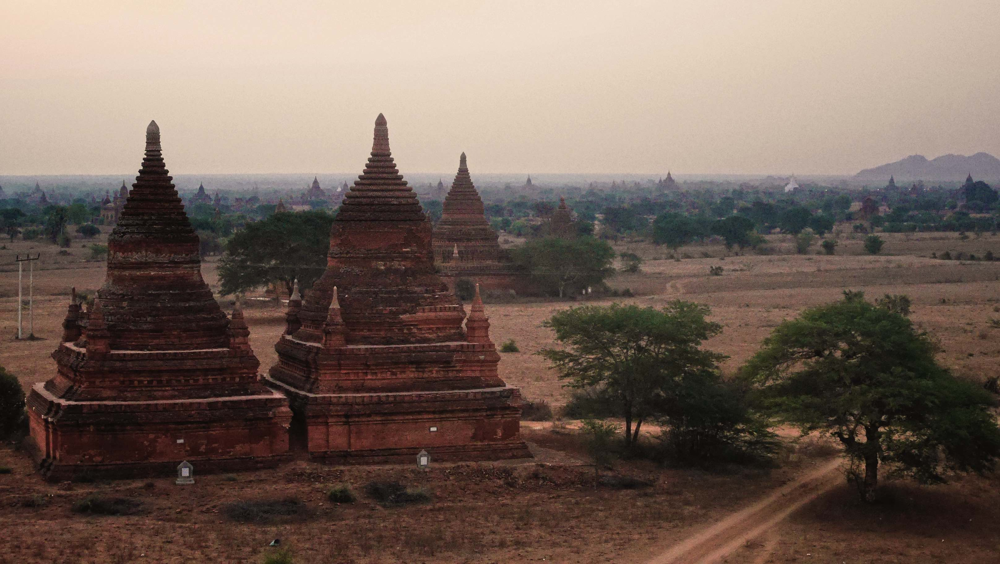</a>
	<figcaption>The view from the temple.</figcaption>
</figure>

Soon after we settled there, a pair of hot air balloons was rising to the sky above us. We did some research beforehand, but the ticket prices for a ride were not for our pockets. I'm talking about $300+ for a 0.45-1 hour ride. We couldn't do it in Cappadocia, Turkey for 100€ because of bad weather, but I think that it's more worth it than in Bagan.

<figure>
	<a href="../images/myanmar/5Bagan/sunrise2.jpg">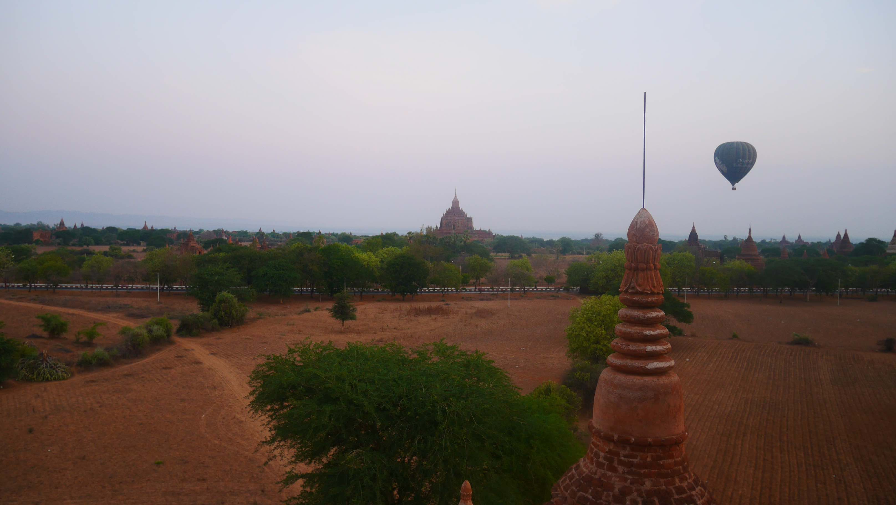</a>
	<figcaption>Hot Air Balloon.</figcaption>
</figure>

<figure>
	<a href="../images/myanmar/5Bagan/sunrise3.jpg">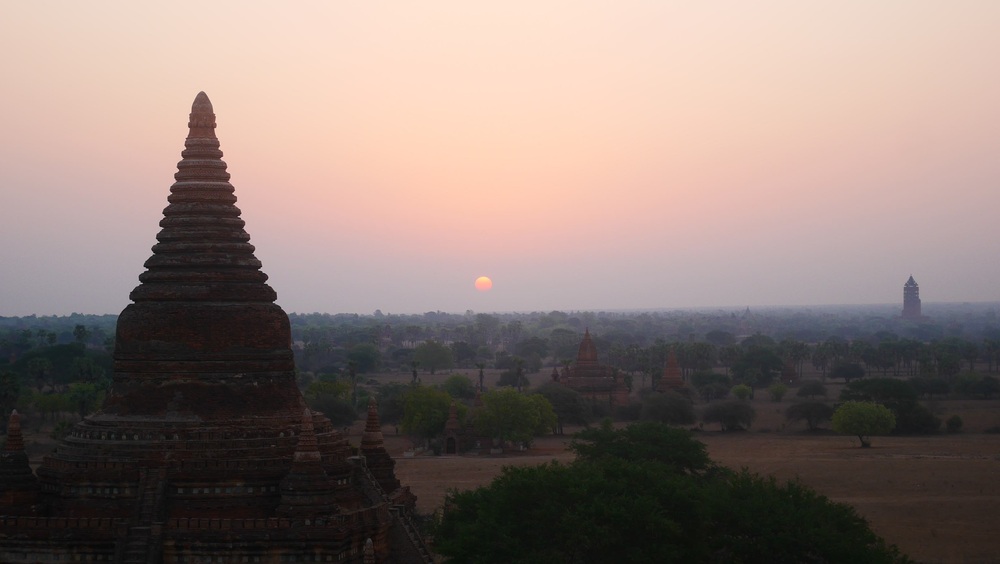</a>
	<figcaption>The sun rising from the mist.</figcaption>
</figure>

<figure>
	<a href="../images/myanmar/5Bagan/sunrise4.jpg">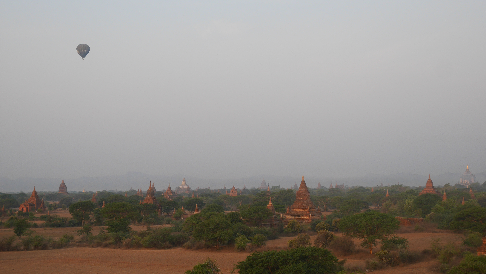</a>
	<figcaption>Bagan, in all its glory.</figcaption>
</figure>

When the sun was already above our heads, we decided to go to the Ayeyarwady River north of the temples. It must have been around 7AM when we were heading there, stopping on the way because we heard loud music almost as if there was a party going on. Quickly a group of three kids came to us with all the curiosity visible in their eyes. "<i>Where are you from? What is your name?</i>", the group already knew the basic English and I'm talking about kids with 9/10 years at most. We asked what was the music about and quickly they responded with "<i>It's a wedding! You can go eat. Come, come!</i>". That struck us as a lighting bolt, weddings that were already in progress at 7AM? Just Myanmar stuff, I guess...

We declined their offer to go to the wedding so the older kid of the gang said "<i>This is my village! You want to come to my house? Come!</i>". I swear, it was the sweetest thing on earth.

The river stop was short, but not short enough to not have people offering us their boats to go somewhere. Soon after we were arriving in a Buddhist monastery walking by 2 monks that said it was OK for us to go inside. They also knew Portugal because of Figo, the football player. I have said this, and I'll say it again, people in Myanmar where in closed doors not a long time ago, they know very little about the world outside, but if there's something they really know it's football.

<figure>
	<a href="../images/myanmar/5Bagan/river1.jpg">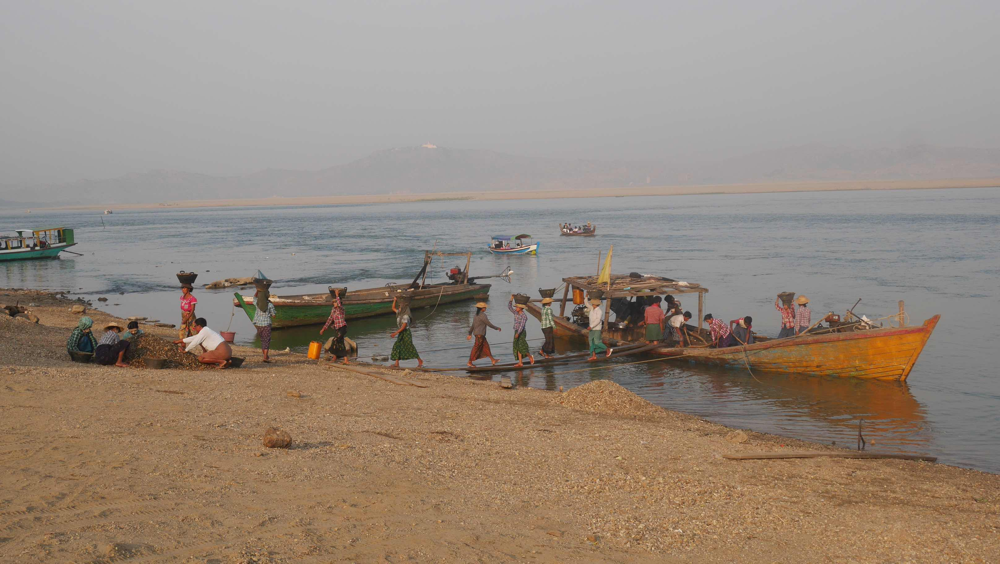</a>
	<figcaption>Ayeyarwady River bay, from Bagan.</figcaption>
</figure>

<figure>
	<a href="../images/myanmar/5Bagan/river2.jpg">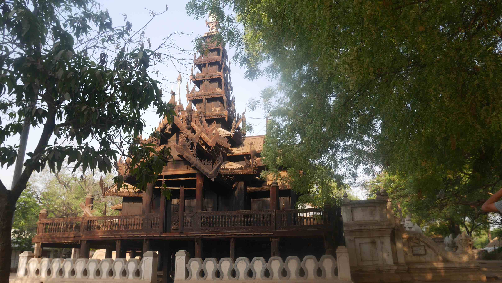</a>
	<figcaption>The front of the monastery.</figcaption>
</figure>

<figure>
	<a href="../images/myanmar/5Bagan/river3.jpg">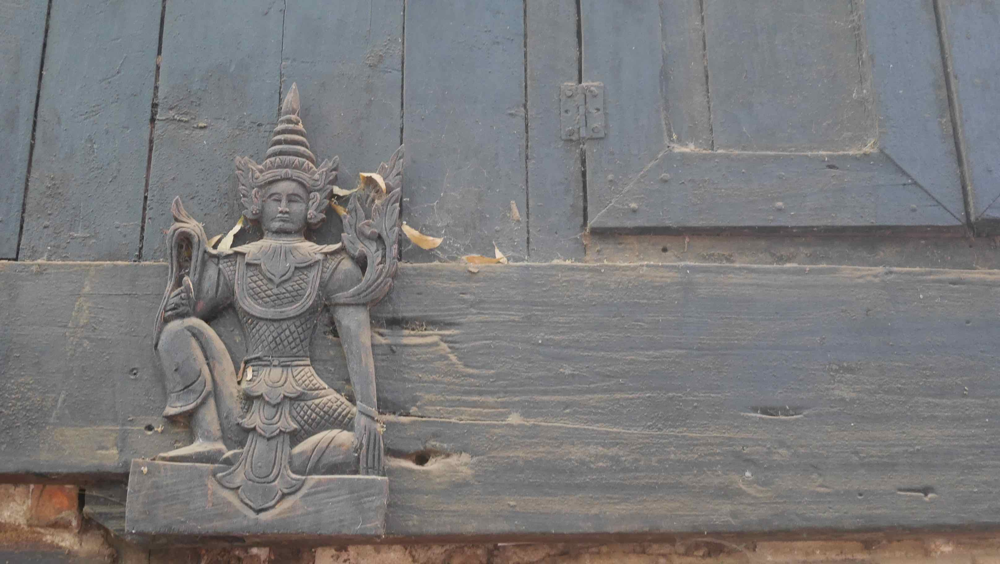</a>
	<figcaption>Beautiful wood carving detail.</figcaption>
</figure>

<figure>
	<a href="../images/myanmar/5Bagan/river4.JPG">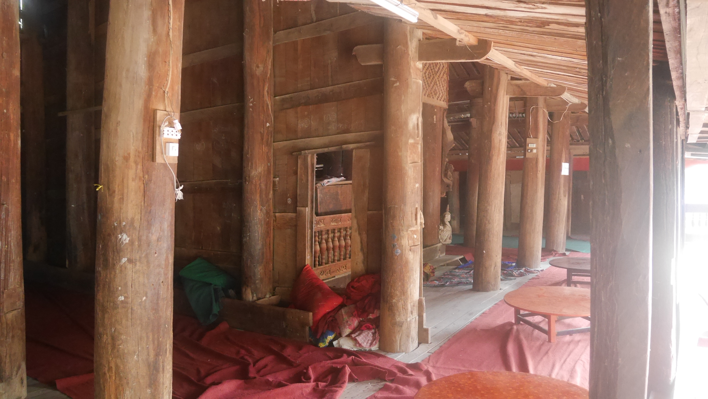</a>
	<figcaption>The interior of the monastery.</figcaption>
</figure>

When we were heading off to our next stop, we noticed two kids playing, looking and laughing between them when they noticed that we were heading in their direction. Almost immediately they stopped whatever they were doing and grabbed each other expecting us to take them a photo. It's again one of those things that will happen to you 10000 times if you visit Myanmar, people are just lovely.

<figure>
	<a href="../images/myanmar/5Bagan/kids1.jpg">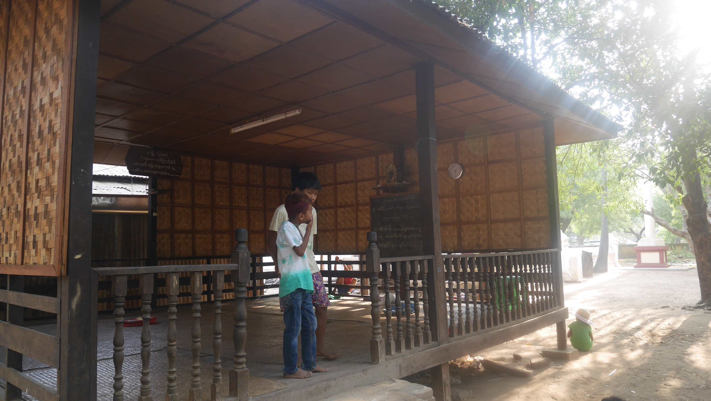</a>
	<figcaption>The kids laughing to each other, waiting for us.</figcaption>
</figure>

<figure>
	<a href="../images/myanmar/5Bagan/kids2.jpg">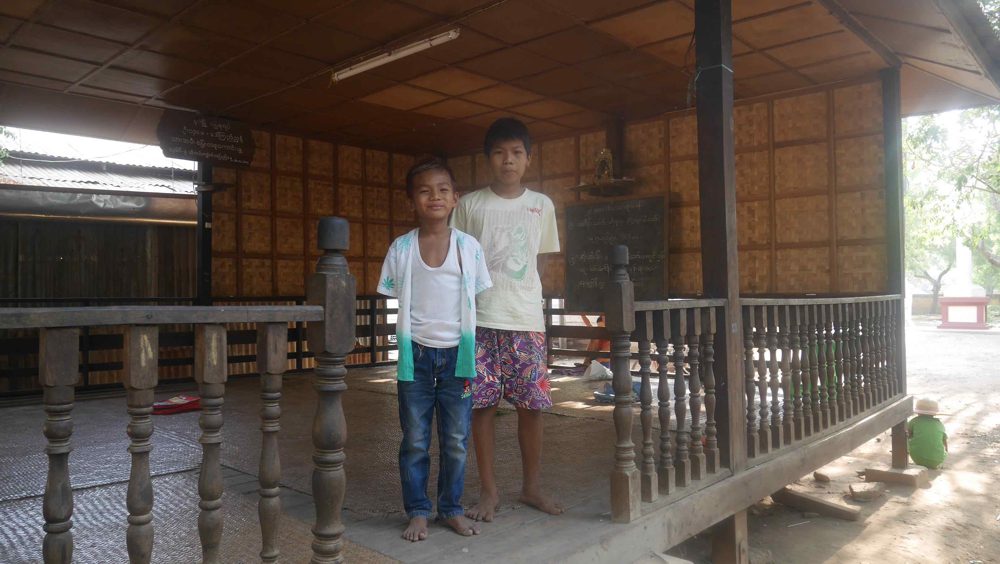</a>
	<figcaption>Adorable.</figcaption>
</figure>

After this short encounter, we went on a rampage with our E-Bike visiting all the temples we could in the zone. As we were on the street heading to a temple there was a nice guy with a motorcycle that approached us as we were riding. We stopped and talked to him for a little while until he promptly offered a visit to a temple with <i>unique</i> Buddhas. He said that we wasn't  any kind of tour guy and just wanted to show us an <i>hidden gem</i> so we followed him without hesitations.

<figure>
	<a href="../images/myanmar/5Bagan/guy.jpg">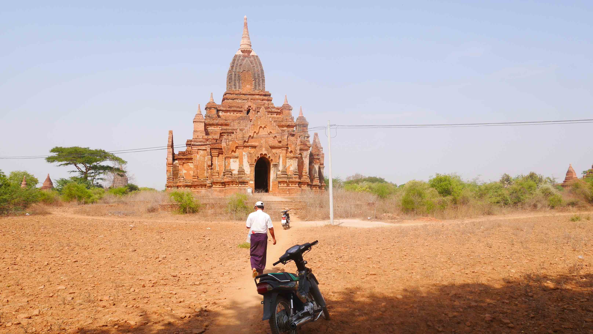</a>
	<figcaption>Our new <i>friend</i> leading the way.</figcaption>
</figure>

The Buddhas we saw inside were unique, because we had never seen anyone dressed in red, but what really struck us was the view that you can get from the top.

<figure>
	<a href="../images/myanmar/5Bagan/buddha1.jpg">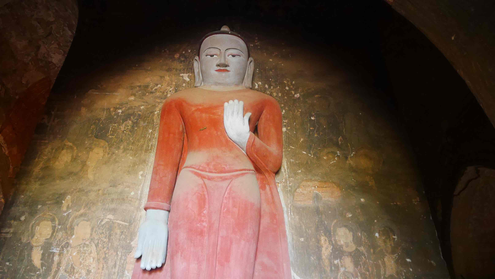</a>
	<figcaption>The red standing Buddha.</figcaption>
</figure>

<figure>
	<a href="../images/myanmar/5Bagan/top1.jpg">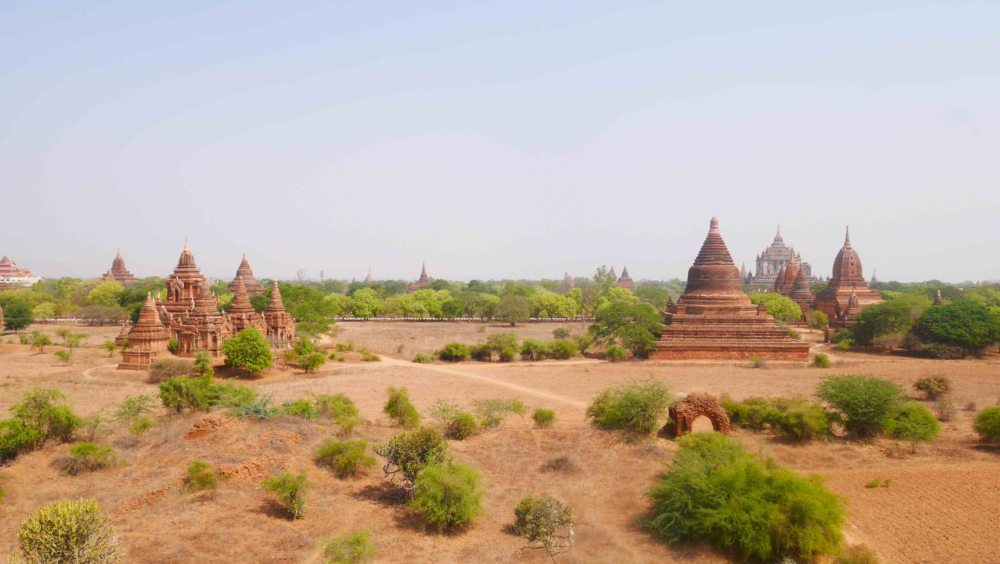</a>
	<figcaption>The view from the top.</figcaption>
</figure>

As we were going back to our journey, the guy said that he was an artist and had some of his paintings with him. He really wanted to show us his work and we couldn't say no to such a nice guy. He had some <b>amazing</b> paintings and we couldn't help to buy one of them.

<figure>
	<a href="../images/myanmar/5Bagan/photo.jpg">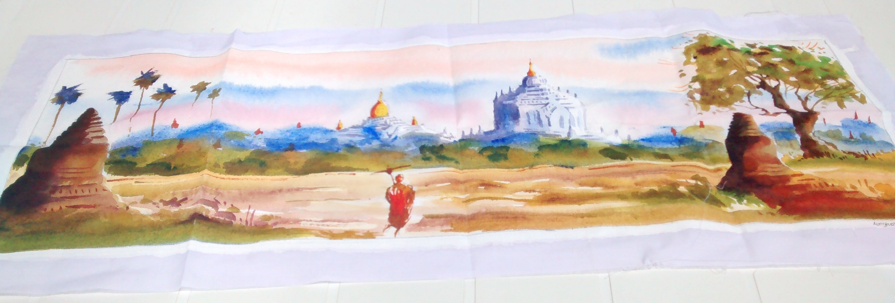</a>
	<figcaption>The paiting we bought.</figcaption>
</figure>

<figure>
	<a href="../images/myanmar/5Bagan/guy1.jpg">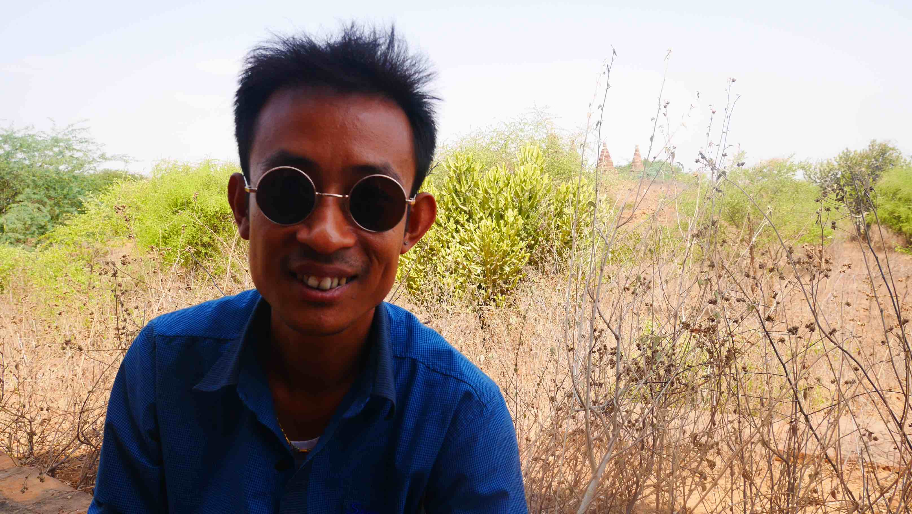</a>
	<figcaption>The painter with my sunglasses, kinda spooky.</figcaption>
</figure>

If you're thinking that our morning was already busy, it doesn't stop here. We went back to the most famous temple in Bagan (<i>That Byin Nyu Temple</i>) to see the big sleeping Buddha with more light. Now there was a group of kids with two adult Monks exploring the area that initially approached me. "<i>Where you come from? Can I take a photo with you and the kids?</i>" The result was my favourite picture of the whole trip!

<figure>
	<a href="../images/myanmar/5Bagan/love.jpg">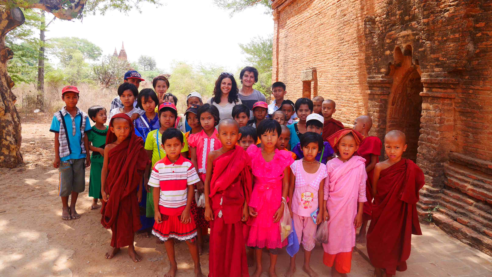</a>
	<figcaption>Lovely.</figcaption>
</figure>

The rest of our day was spent visiting all the temples we could. One thing we saw, like in Kalaw, was that there was a <b>lot</b> of religious tourism within the country. People are always on buses moving from place to place to give their prayers to Buddha. Of course that this also brought a lot of interesting moments between them and us, because these were the people more curious about us.

<figure>
	<a href="../images/myanmar/5Bagan/various1.jpg">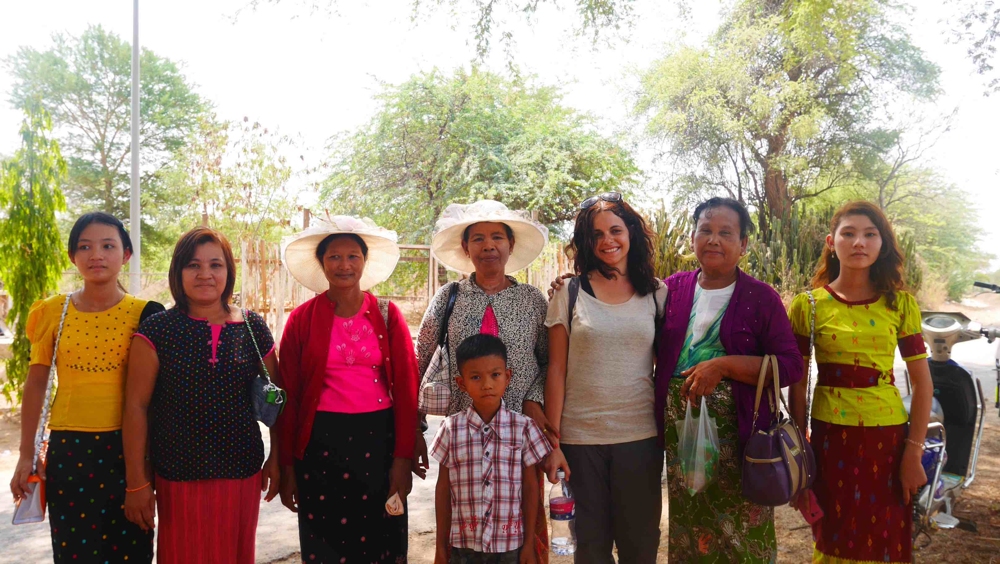</a>
	<figcaption>The older lady said that she didn't want me with the girls on the photo. She even made a disgusted face when pushin me away. She was kidding, of course.</figcaption>
</figure>

<figure>
	<a href="../images/myanmar/5Bagan/various2.jpg">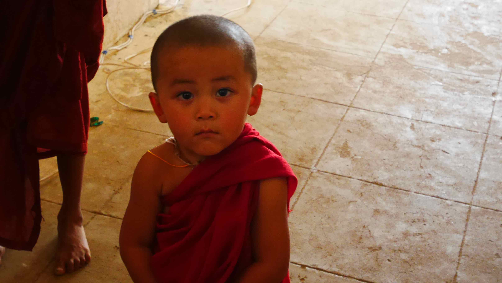</a>
	<figcaption>He was the younger Monk we saw in Myanmar, so adorable.</figcaption>
</figure>

<figure>
	<a href="../images/myanmar/5Bagan/various3.jpg">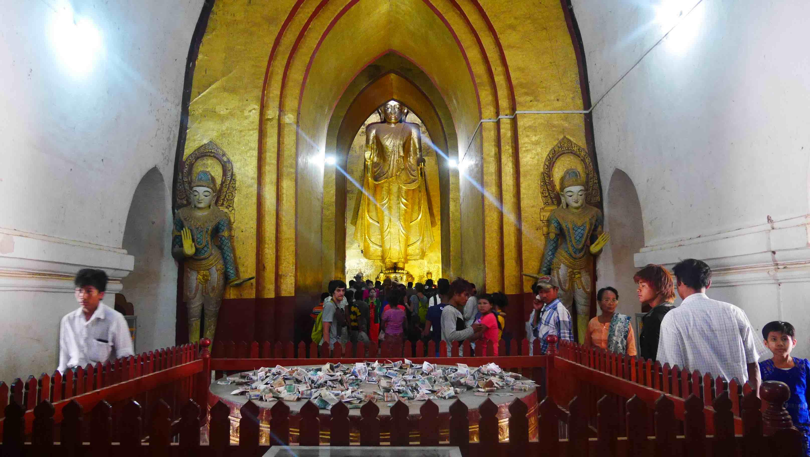</a>
	<figcaption>Offerings to Buddha.</figcaption>
</figure>

<figure>
	<a href="../images/myanmar/5Bagan/various4.jpg">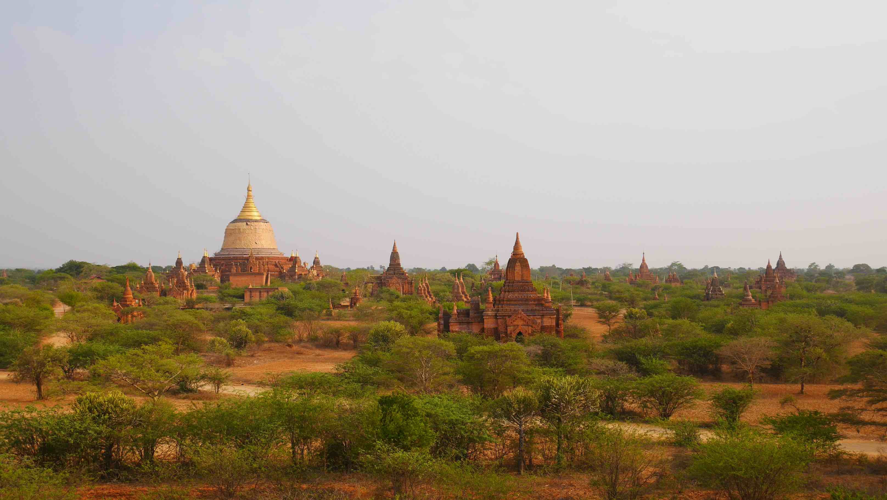</a>
	<figcaption>Another great view from the top of a temple.</figcaption>
</figure>

<figure>
	<a href="../images/myanmar/5Bagan/various5.jpg">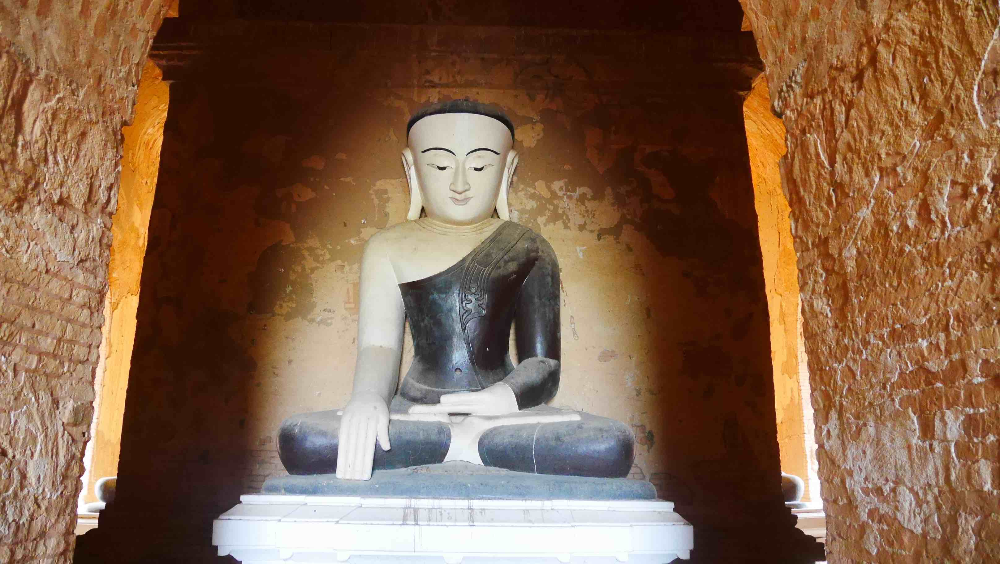</a>
	<figcaption>A unique Buddha dressed in black.</figcaption>
</figure>

<figure>
	<a href="../images/myanmar/5Bagan/various6.jpg">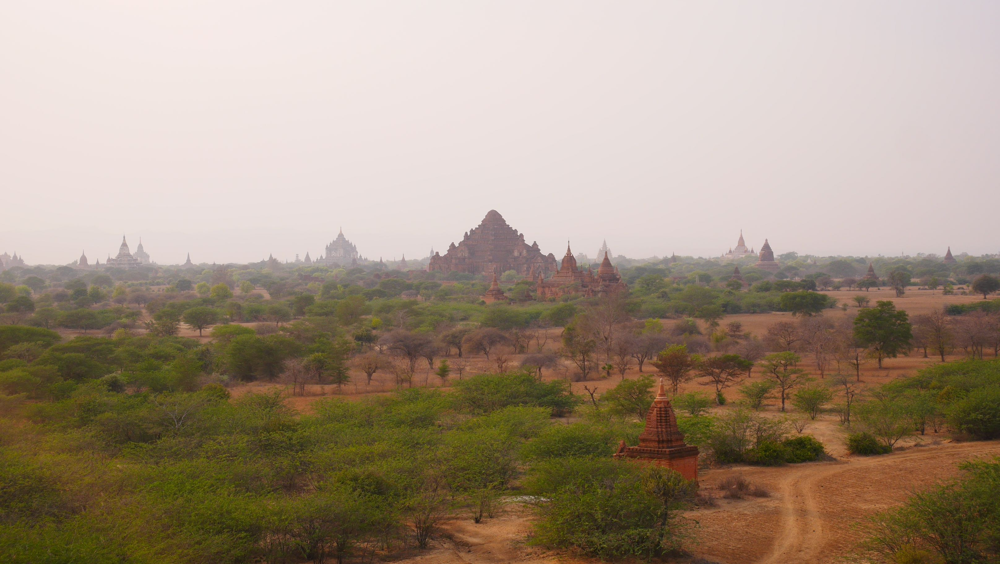</a>
	<figcaption>Just another crazy sight.</figcaption>
</figure>

<figure>
	<a href="../images/myanmar/5Bagan/various7.jpg">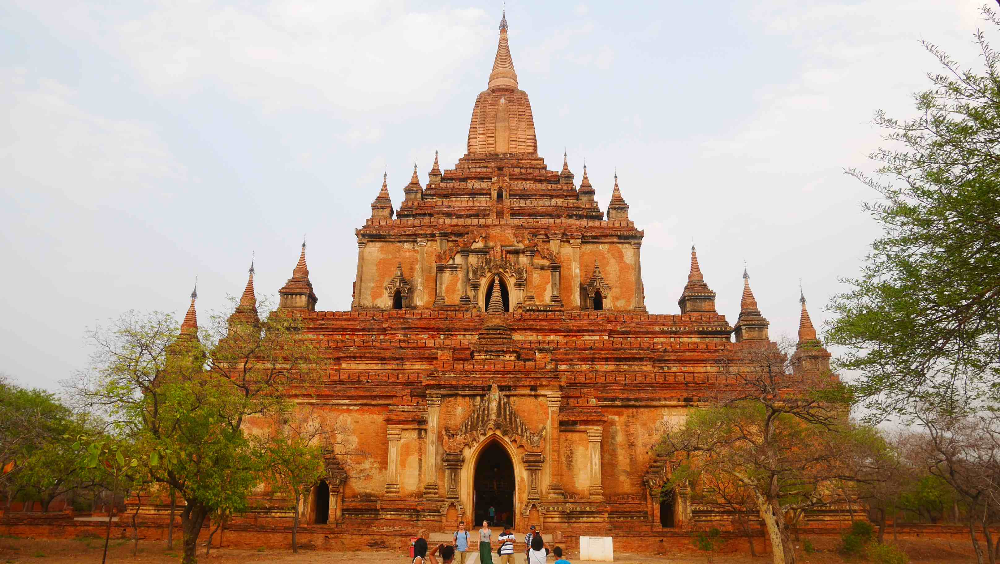</a>
	<figcaption>If you know the Lonely Planet cover from this year, you'll recognise this majestic temple.</figcaption>
</figure>

The day was almost over, we were tired, and we decided to watch another sunset. This time we choose a more <i>underground</i> temple to have a different experience. Sure, it was impossible to be alone in a temple with a good view, but this one had a lot less people that the one on the day before.

The problem was that once again the sky was too cloudy and the sun was hidden from us.

<figure>
	<a href="../images/myanmar/5Bagan/sunset21.jpg">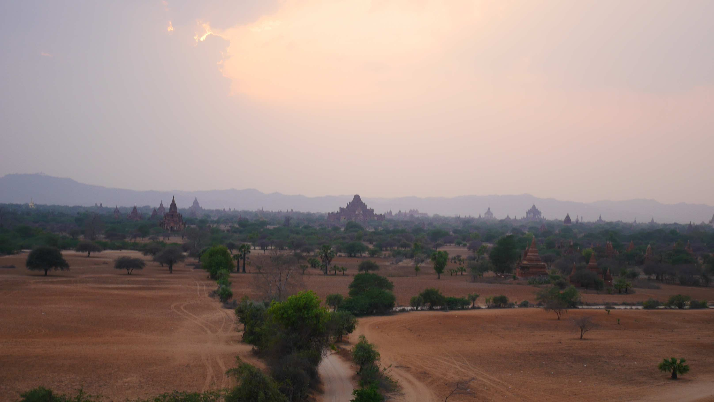</a>
	<figcaption>The almost sunset.</figcaption>
</figure>

After one more failed sunset, as we were heading off to the guest house, we noticed some music going on near us. When we reached the source, we saw a group of people, maybe a family, enjoying, singing and clapping as one of them was leading the performance with a guitar singing western songs. Some tourists, like us, just sat above them enjoying their joy and happiness, and we could see that they were happy too for us to be there watching them.

At some point the leader announced that he was going to play a classic <i>Thingyan</i> song and they went crazy. They girls immediately stood up and started to do their weird dance (you should really check this out, it's very strange and unique) with some of them filming their acting. They also offered food to us!

<figure>
	<a href="../images/myanmar/5Bagan/dance1.jpg">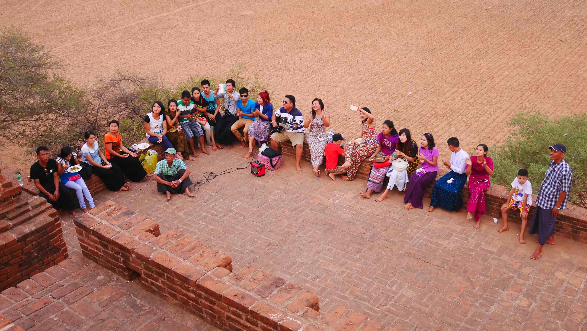</a>
	<figcaption>People rocking.</figcaption>
</figure>

The day is over, but stay with us, because tomorrow is our last day in Bagan and we will visit Mt. Poppa!