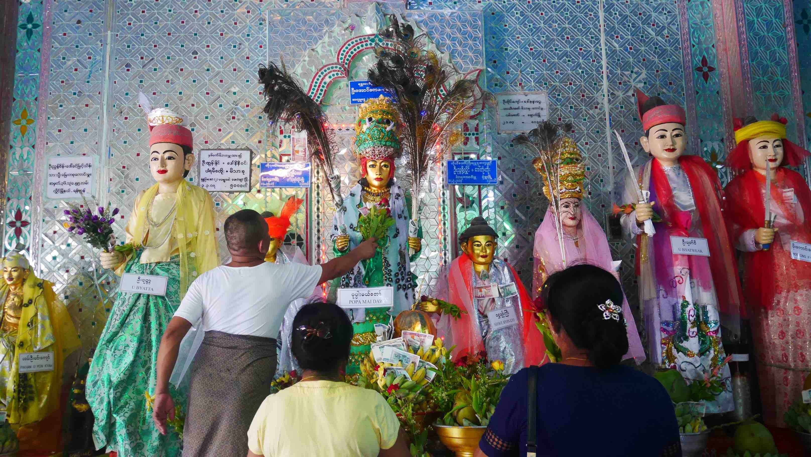

Today was our last day in Bagan and we had arranged a morning trip to Mt. Poppa, a sheer-sided volcanic plug, which rises 737 metres above the sea level. There is a Buddhist monastery at the summit that can be reached through 777 steps. It is also known for the NATs, spirits that had an horrible death and are worshipped in Myanmar. The view of the mount is really astonishing.

Although the trip was arranged to 9AM we woke up earlier because we wanted to see the moment where Monks woke up and go through the villages with their bowl asking for food. We had been told by the guy we met yesterday that they would pass through the Tharabar Gate in the morning so we made arrangements to get there in time.

Our first stop was at a local market that had all kinds of daily products for people. It is curious how certain things are not (unfortunately) different wherever you go, because there were only women there.

<figure>
	
	<figcaption>Local market.</figcaption>
</figure>

After this quick stop, we headed right away to the Tharabar Gate, but we lost our faith as soon as we got there. The only thing we saw was little Monks heading back to their monastery with their bowls full of stuff. I don't know if we got there late or if that is really the place where they go through to get to the villages, and I guess that now I'll never know.

<figure>
	
	<figcaption>Little monks heading back to the temple.</figcaption>
</figure>

The trip to Mt. Poppa went smoothly, but we had to have one <i>little</i> stop on the way to watch some local people working making some sort of liquor that I didn't even bothered to know about. It's one of those things that you have to go through in Myanmar, because the driver <b>will</b> stop in these kind of places for people to buy stuff to them. We were kind of forced to watch all this show that had a cow walking in circles, while being whipped, in a 40ºC morning, not having access to water. The sad thing is that people (that were in the same shared taxi) seem amazed by this kind of things and sponsored this kind of behaviour, so it's not something we'll have abolished in the near future.

<figure>
	
	<figcaption>A group of monk women on their daily routine.</figcaption>
</figure>

<figure>
	
	<figcaption>A little kid working where we stopped.</figcaption>
</figure>

As soon as we got to Mt. Poppa, we were instantly overwhelmed by the astonishing view of it. When we got to the town below the Mount, as expected, there was a lot of commerce especially for the tourists. Oh, and some monkeys live there, so be careful with your things, you never know...

We immediately started our climbing through the 777 stairs, which had workers cleaning them all the way to the top and asking people for money. You can't climb them with shoes on, as with any other sacred place in Myanmar, so it makes sense to always have people cleaning, however, some of them can make you feel horrified by how dirty they are.

<figure>
	
	<figcaption>Our first sight of Mt. Poppa.</figcaption>
</figure>

<figure>
	
	<figcaption>Some Buddhas along NATs.</figcaption>
</figure>

As soon as we started climbing there was a very kind young monk that was also visiting the sacred place, but he mustn't have seen many tourists in his life because he kindly smiled to me and tried to make contact. So every place we would visit, he always smiled at me and even started playing by touching me and turning his back as if it wasn't him. He would then turn around and laugh with me. It was super cute, and I even got the chance to take a picture with him and his friend.

<figure>
	
	<figcaption>Here he is in the middle.</figcaption>
</figure>

The worship to NATs is quite different from the Buddhist one. People still offer them money, putting it in their clothes for everyone to see, but also offer them baskets of fruit. Since the NATs had a terrible death, it is said that their spirits still live alongside us, and the offers from people have the intent to calm them down. Usually there is somebody that will take the baskets, say a little prayer, and then give the offering to the NAT.

<figure>
	
	<figcaption>Some people worshipping the NATs.</figcaption>
</figure>

<figure>
	
	<figcaption>A NAT proudly showing some money.</figcaption>
</figure>

The trip was short, but there isn't really much to see that would take you more than 2 hours, including all the way up and down. We head back to our Guest House, but this time with no stops along the way.
We went to lunch once again to the Weather's Spoon so I could try the <i>amazing</i> hamburger that everyone was talking about, and guess what, it was not that amazing. I can only understand that people find it <i>amazing</i>, because the hamburger is like an Oasis in the desert for westerns.

Midway through the lunch something funny happened. There we were, having lunch in Bagan with maybe 40ºC and it started raining. It's not surprising in such a tropical country, but it felt funny to be there watching the rain falling down for about 5 minutes.

Once again, we decided to make our afternoon a new journey through the temples to see some that we didn't see the day before. The first one was very unique because it had a lot of Buddhas paintings on the walls, something we only saw in that temple.

<figure>
	
	<figcaption>Ancient Buddha painting #1.</figcaption>
</figure>

<figure>
	
	<figcaption>Ancient Buddha painting #2.</figcaption>
</figure>

<figure>
	
	<figcaption>Quite exquisite, this one.</figcaption>
</figure>

The next one is very well known to all of you that saw the Lonely Planet's Myanmar cover of this year. Tha Beik Hmauk Pahto temple is really beautiful and imperial, maybe my personal favourite.
The temple is also known for being the house of the twin Buddha statues, two figures of Buddha sitting next to each other, something that you won't see in any other place in Myanmar.

<figure>
	
	<figcaption>Tha Beik Hmauk Pahto temple.</figcaption>
</figure>

<figure>
	
	<figcaption>The Twins Buddhas.</figcaption>
</figure>

At the end of the day, once again, we climbed a temple for the sunset, however this time it was nicer. It was still cloudy, however the sun was bleeding red.
On the way back to the Guest House, what we have feared since the first day had finally happened. Our E-Bike ran out of battery in the middle of the night...! We had little or non existent lights apart from our cell phones, and we had to cycle with the bike through sand. It wasn't an easy task, but we can now look back and laugh about it. It was bound to happen sometime, and it happened on the last night.

Tomorrow we will go on with our journey to <b>Mandalay</b>!

<figure>
	
	<figcaption>Something strange along the way back.</figcaption>
</figure>

<figure>
	
	<figcaption>The final sunset in Bagan.</figcaption>
</figure>