Today we're heading to Mandalay, the second biggest city in Myanmar, and also home to the craziest celebrations of the <b>Thingyan</b> festival in the country. This festival happens every year and is celebrated over a period of four to five days, culminating in the New Year.

We caught an early bus from Bagan that would take us there, on a journey that should not take longer than 3 hours. We were the only tourists on this bus, and when this happens in Myanmar, there is always something funny waiting to happen. This time was a lady that was doing the same trip as we, and kindly "borrowed" her son to us during the trip. Of course that she couldn't speak a word of english, but who needs that, right?

<figure>
	<a href="../images/myanmar/6Mandalay/boy.JPG">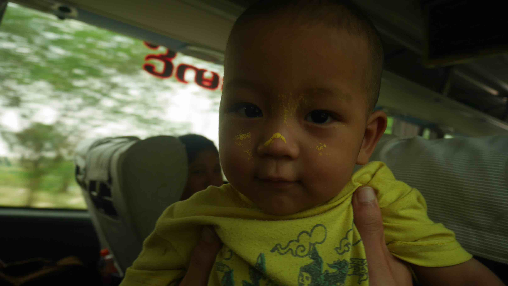</a>
	<figcaption>The little boy.</figcaption>
</figure>

As soon as we arrived, we noticed that the taxi drivers were all packed up at the entrance of the bus, hoping to offer their services to anyone on that bus that needed them, but something funny happened. As we approached the exit, silence... They were not expecting any foreign passengers at all and were kinda struck by it. They just stood there looking at us as we passed through them. The truth is that we weren't at the center of Mandalay (if you've been reading this story, you should know by now that all the buses stop outside the city) and needed to get there somehow. We had a place in mind where we wanted to stay (one of the cheapest available on the Lonely Planet) but we needed to get there first.

"Hey, hey!" someone was shouting behind us. It was a young boy that had a piece of cardboard with him the guest house's name written on it. It was such a coincidence that we decided to take his ride to the guest house. When we got there we made a terrible mistake of choosing a room in the last floor where the sun was hitting all day.

We enjoyed the afternoon by just walking around the city. The big difference between Mandalay and Yangon, traffic wise, is that motorcycles are allowed to ride in the city center and this is the cause of a gigantic mess. It's kinda hard to cross a street without needing to stop midway, with all the cars and motorcycles riding around, before reaching the other side.

<figure>
	<a href="../images/myanmar/6Mandalay/castle.JPG">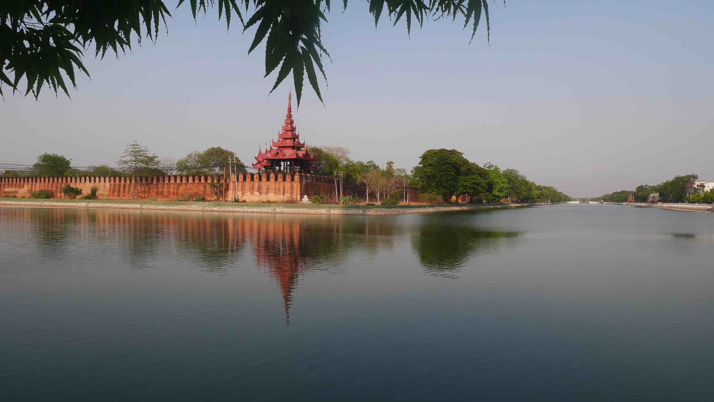</a>
	<figcaption>The Mandalay Palace.</figcaption>
</figure>

<figure>
	<a href="../images/myanmar/6Mandalay/sun.JPG">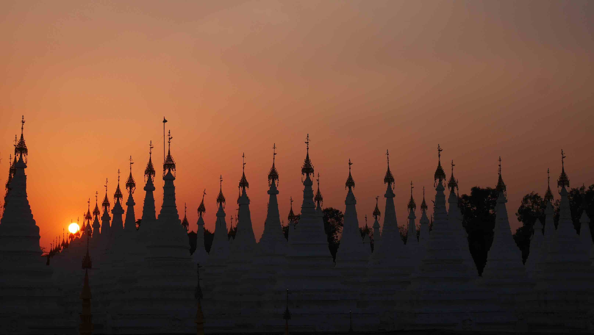</a>
	<figcaption>Beautiful sun.</figcaption>
</figure>

At night, we made the mistake of having dinner at a suspicious place that presented their food as the canteens do. If you're travelling through this part of the world and you don't feel like risking, never do it. I got food poisoned and had to spend a terrible night in a room where we'd to sleep with more than 25ºC all night. It was hell.

First thing in the morning, I went to talk to the owner of the guest house and explained my situation. Fortunately, he was kind enough to give us a much better room for only 5 more Dollars a night. I accepted it right away, because the thought of spending another night in hell is not appealing.

As the <b>Thingyan</b> approaches, we really needed to secure our train tickets to get back to Yangon because we had a plane to catch a few days later and all the transportation during the festival is kinda hard to get. When we got to the train station we found it hard to find any information in English, so we went to the cabins where we hoped we could speak to someone that knew English. When they saw us there waiting, we were taken to a small room where there was a man that knew a few words in English. It was rough, but we eventually got the information that our tickets would be ready tomorrow. A full day to prepare a ticket... Oh well, at least we got there early and booked a cabin with a bed on it. Not bad, right? (At least that'	s what we thought initially...)

We decided to go to the U Bein Bridge in the afternoon. This bridge has 1.2km and was built around 1850, believed to be the oldest and longest teakwood bridge in the world.

<figure>
	<a href="../images/myanmar/6Mandalay/bridge1.JPG">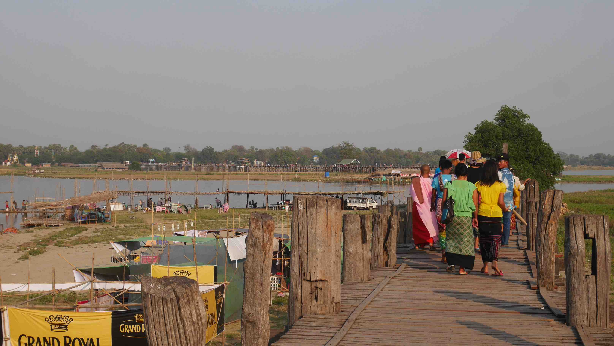</a>
	<figcaption>The start of the U Bein Bridge.</figcaption>
</figure>

<figure>
	<a href="../images/myanmar/6Mandalay/bridge2.JPG">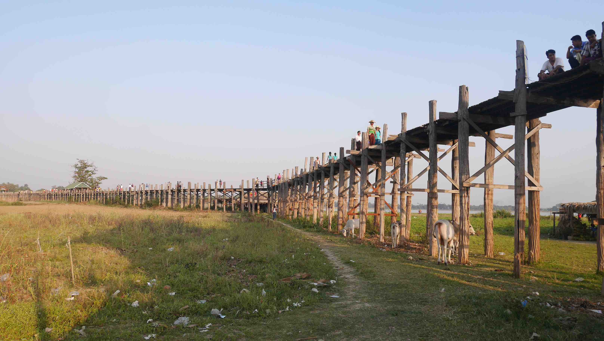</a>
	<figcaption>The start of the U Bein Bridge.</figcaption>
</figure>

<figure>
	<a href="../images/myanmar/6Mandalay/bridge3.JPG">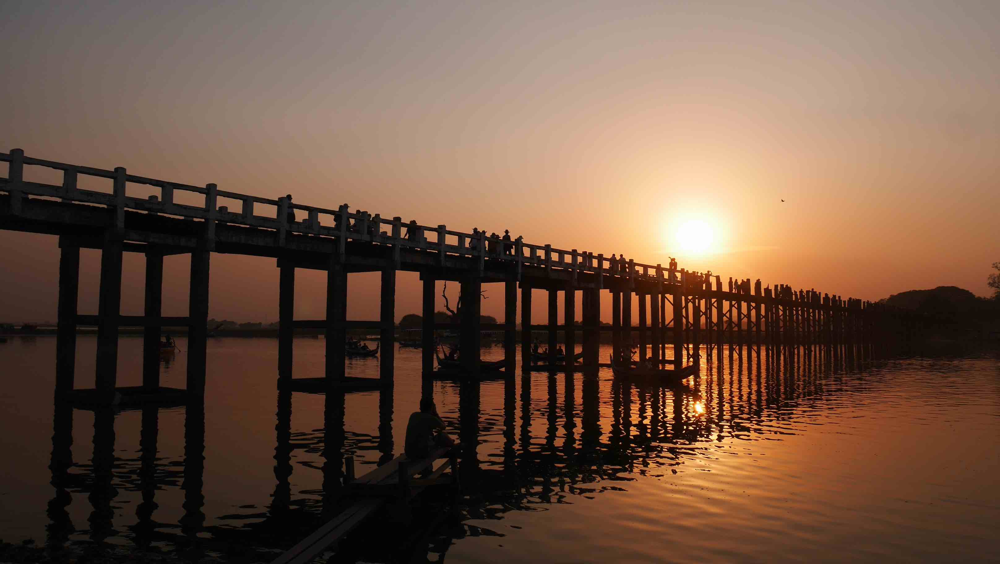</a>
	<figcaption>The sunset at U Bein Bridge.</figcaption>
</figure>

On the third day in Mandalay, after getting our train tickets, we decided to go to a little place near Mandalay called <b>Mingun</b> located on the other side of the Irauách river. <b>Mingun</b> has essentially 3 big sights that must not be missed. <b>Myatheindan pagoda</b>, a beautiful white and unique pagoda, <b>Mingun Pahtodawgyi</b>, a <i>stupa</i> that would be the largest in the world at 150 metres, if finished, and the 90 tons <b>Mingun Bell</b> which is the largest ringing bell in the world.

In the morning we headed to the port where we knew the boats would depart to <b>Mingun</b>. We asked around and eventually got out tickets to the local boat headed there. There's also a touristic boat that goes there, that we got when comming back because we couldn't get another alternative.
The advantage of using a local boat, besides being cheaper and you're helping the local economy, is that you can interact easily with the local, and even smoke with them. One of the guys sitting next to me offered me one of his cigars, but I couldn't finish it because it was really bad. Nevertheless, kindness all around.

<figure>
	<a href="../images/myanmar/6Mandalay/mingun1.JPG">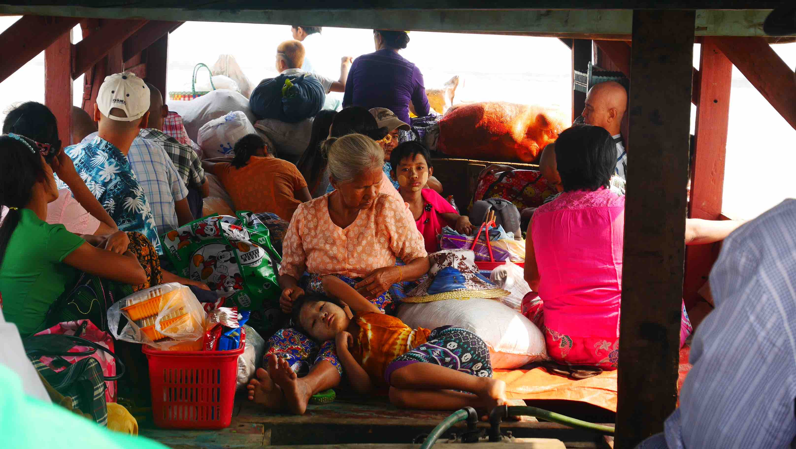</a>
	<figcaption>The local boat towards Mingun.</figcaption>
</figure>

<figure>
	<a href="../images/myanmar/6Mandalay/mingun2.JPG">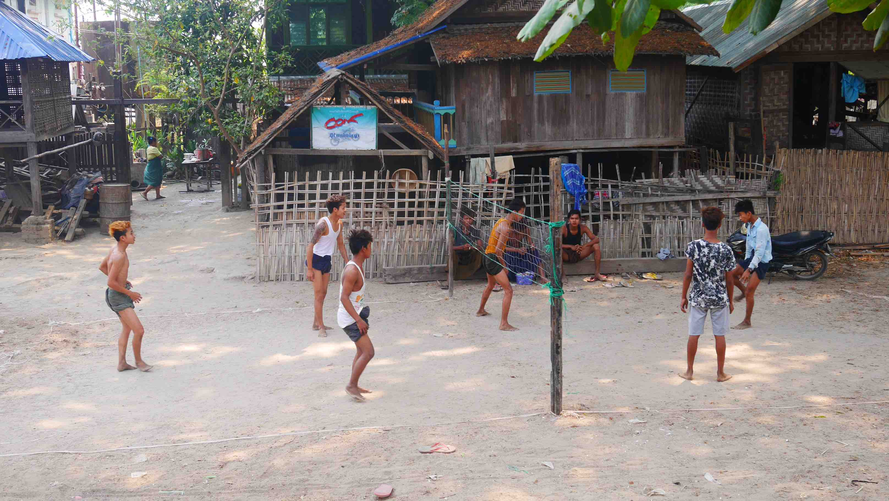</a>
	<figcaption>Some footvolley.</figcaption>
</figure>

<figure>
	<a href="../images/myanmar/6Mandalay/mingun3.JPG">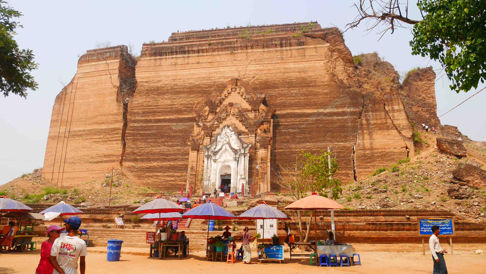</a>
	<figcaption>Pahtodawgyi.</figcaption>
</figure>

<figure>
	<a href="../images/myanmar/6Mandalay/mingun4.JPG">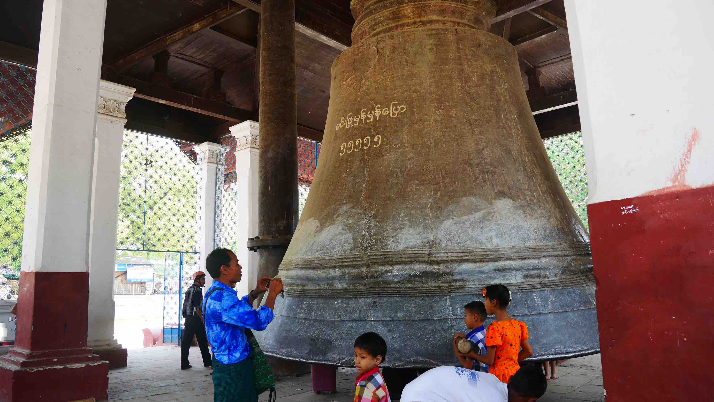</a>
	<figcaption>The largest ringing bell in the world.</figcaption>
</figure>

<figure>
	<a href="../images/myanmar/6Mandalay/mingun5.JPG">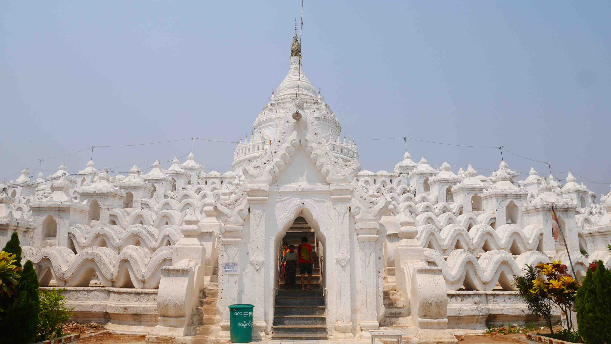</a>
	<figcaption>Myatheindan pagoda.</figcaption>
</figure>

The rest of the day was once again spent wandering around the streets of Mandalay. Tomorrow is the first day of the <b>Thyngian</b> festival and we couldn't expect what is about to happen.

<figure>
	<a href="../images/myanmar/6Mandalay/mandalay.JPG">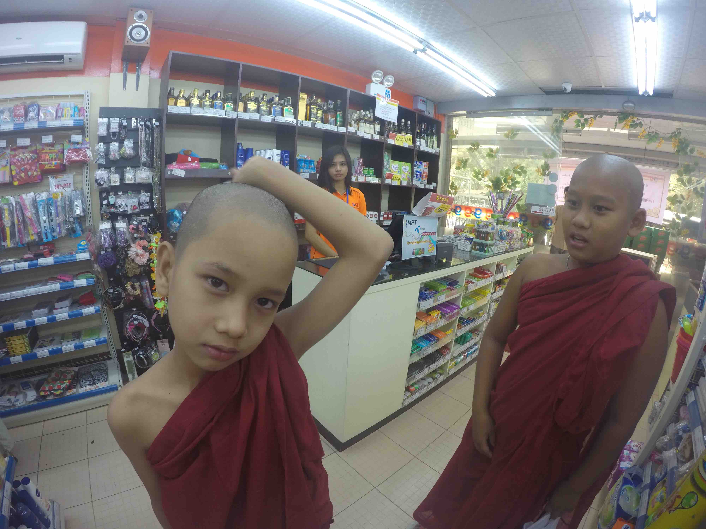</a>
	<figcaption>The second monk seems a bit worried, I don't know why...</figcaption>
</figure>

The first day of the <b>Thyngian</b> comes and we were expecting a lot of water being thrown on the streets, but nothing compared to the real experience. There are TONS of water being thrown, people have hoses connected to inside their home throwing water to whoever that comes by, people have gigantic bowls ready to throw at you, etc. There is enough water being thrown around that the first 200m that we walked when leaving the guest house were enough to get full wet, from head to toes. Unfortunately we don't have many photos with good quality from this 2 days left in Mandalay, only some videos that I'll publish later.

And then finally the time has come to return to Yangon. The train should take about 10 hours to reach its destination, but being an overnight train with a suite just for was, what could possibly go wrong?

Everything.

That was the WORSE travel experience I had in my entire life. The railways do not have maintenance since the World War II, you can't sleep because of the noise that the train does, and the fact that when you lay down on the "bed" you'll surely be thrown around. It's just essentially impossible to stand still on that train. 12 hours later, we arrived at the capital once again, tired as hell, without sleep.

<figure>
	<a href="../images/myanmar/6Mandalay/train.JPG">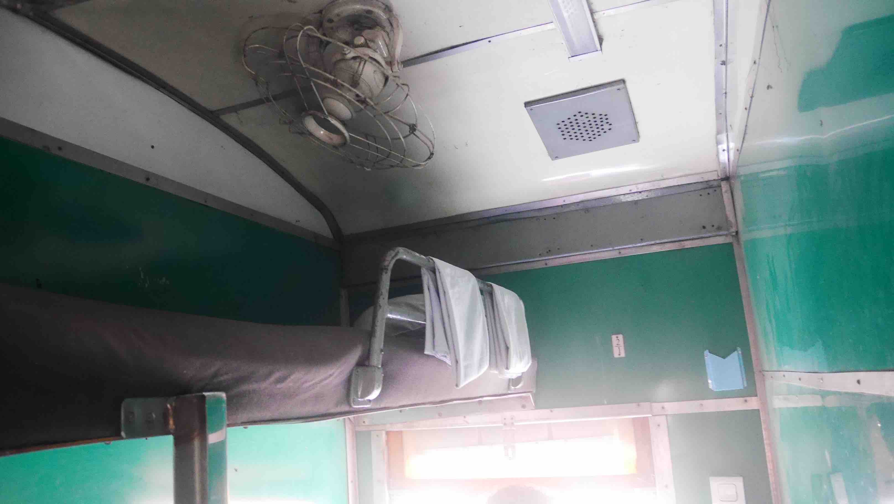</a>
	<figcaption>Sneak peak of our cabin.</figcaption>
</figure>

Now I look back and laugh about it. It's something you can only experience there.