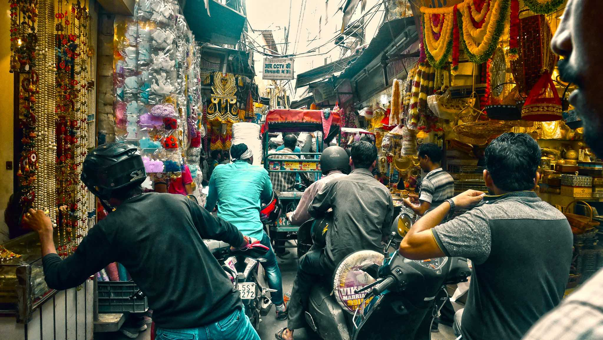
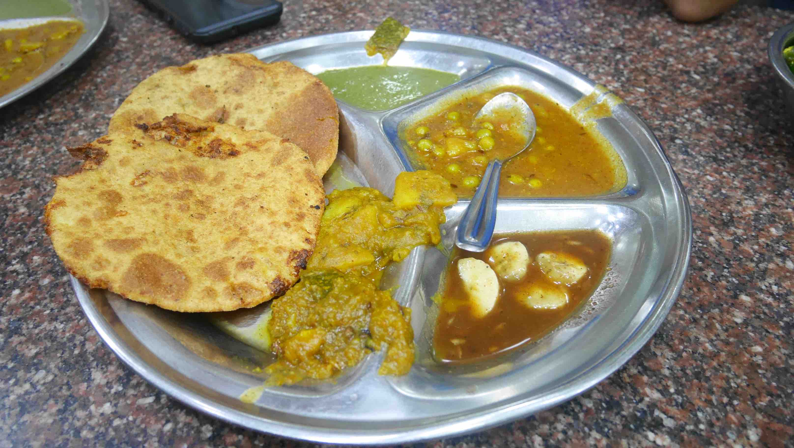
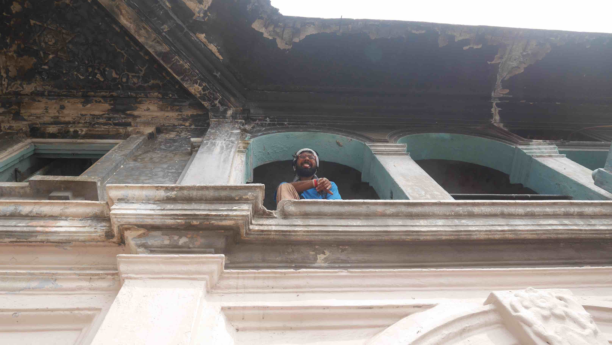
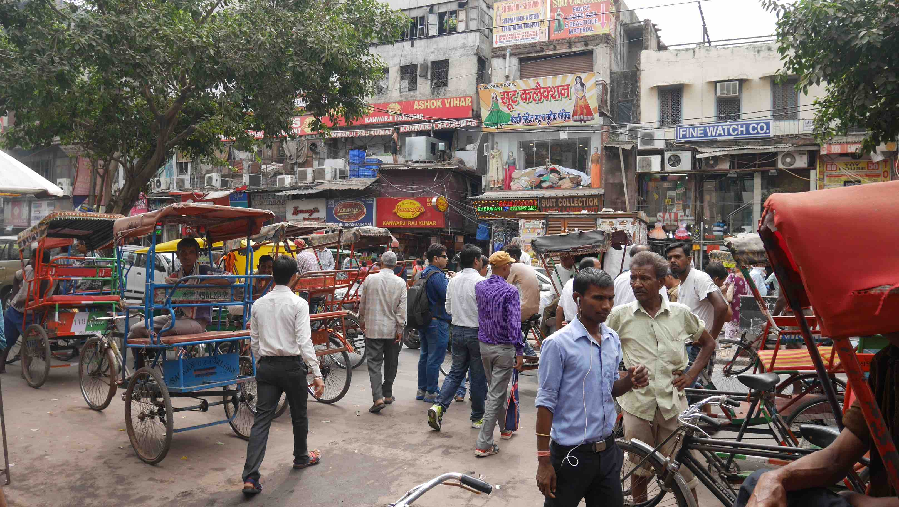

New Delhi, the capital of India, was our first stop in our 3 month journey through Asia. We planned to stay in India for a whole month, so New Delhi ended up being our gateway of entry and exit from the country. A good advice that I can give you when travelling in India is to book your train tickets <b>well in advance</b>. Like 2 months before, seriously. Since the train is the most reliable way to travel, AC Tier 2/3 tickets get sold really fast. They're not <b>that</b> expensive and you get a bed, pillow and sheets so you can sleep during your journey.

The first <i>taste</i> of India that I got was right after I left the plane. The weather was so <b>HOT</b> that was almost unbearable, but I guess that's what you get when you're on one of the most polluted cities in the world.

I had to get to South Delhi because I was staying in a place called <b>MadPackers Hostel</b> (which I highly recommend despite being very expensive for my budget), so the first thing to do in the airport was to get a subway ticket to there. This may not seem like a big deal, but India is always there to surprise you. In my country we have a saying that goes like this; <i>"stand in an Indian line"</i>, which means stand in an orderly line. I don't know who said this, but surely that person never went to India, because there's no such thing there and that's your first challenge. You have to go and shove people off to get your ticket because that's how they do it. Forget what your <i>personal space</i> means to you because if you don't you'll get really annoyed while travelling there.

New Delhi is an overwhelming city in every aspect that you can think of. There are people <b>everywhere</b> (population of about 18.5 millions in 2016), the cows/dogs/pigs/monkeys and occasional goats are at every corner (they have no owner whatsoever), there are tons of cars/motorbikes/tuk tuks/rickshaws and so many more that I get tired just thinking about it. Having said that, we got quite lucky to enroll in one of the MadPackers daily tours to the city with our awesome guide <b>Baddu</b> (when I got there on my way to Hanoi I heard that he doesn't do the tours anymore). The trip lasted all day and the best was that there was no plan. We all sat around the table and decided what we wanted to visit together there.

This meant that all the touristy stuff like museums/red fort/mosques were left out. In fact, we went to the Red Fort and Jama Masjid mosque but didn't go in. We mostly followed Baddu as he went through the city while having to cope with the daily routines of those that live there.

<figure>
	
	<figcaption>In the heart of Old Delhi where you can find everything for sale.</figcaption>
</figure>

<figure>
	
	<figcaption>A little snack on the way.</figcaption>
</figure>

<figure>
	
	<figcaption>Baddu!</figcaption>
</figure>

<figure>
	
	<figcaption>Streets of Old Delhi.</figcaption>
</figure>

I would return to Delhi on my last 2 days of the month that I spent in India, but I don't have anything to add on because when I came back I was so tired that I ended up spending the day on the hostel. If you're interested in monuments/museums then you should spend another day just to sightseeing. If you don't, then don't spend more than 1/2 days there, because as every big city, there isn't really much to do.