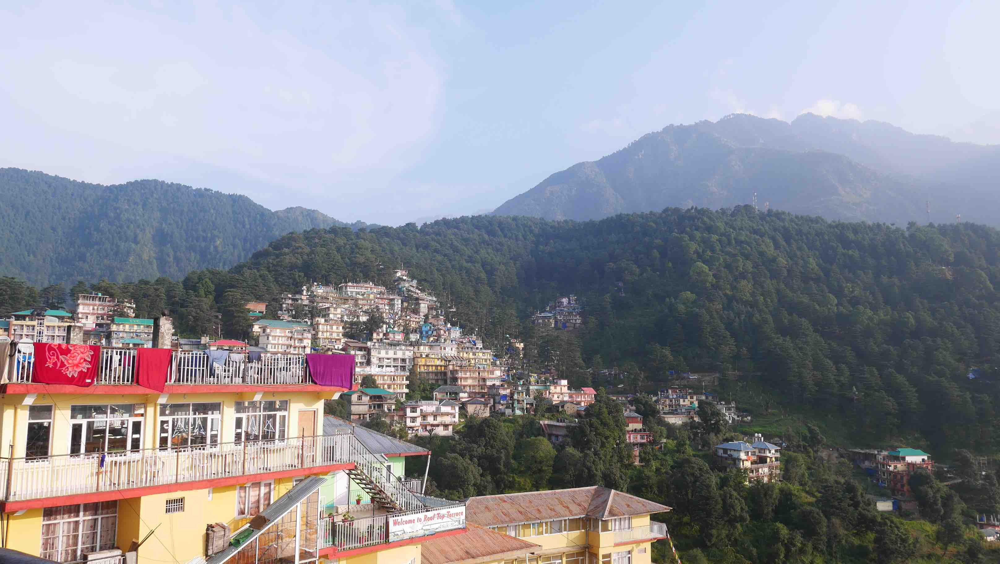

McLeodGanj, also known as "Little Lhasa", is a little village with an altitude of 2,082 metres in the Himalayan region. It became very famous because it's the home of the Tibetan government-in-exile.

The way we got there from Amritsar is not for the fainted hearted, but it's cheap and it's kind of an adventure. We took 1 full day from early morning until night since we left the Golden Temple until arriving in McLeod Ganj. What we did was a local bus from Amritsar to Pathankot, then another one to Dharamshala and finally another bus to McLeod Ganj. This should take you about 8 hours in transit and should cost no more than 5$. We didn't have any reservation on buses since we're talking about local buses, but there are VIP services on this route that I'm sure you can pre buy trips if you feel more confortable this way.

First thing we did when leaving the Golden Temple was to find a rickshaw to get to the bus station. We caught a cycle rickshaw because it was not too far and it shouldn't cost you more than 30-50 rupees (given you bargain a bit). After this you don't need to bother with moving between bus stations or something, the next bus you have to catch will be on the place that the last one left you. If you're not used to the drivers in Asia I'm not sure that India is the best place for you to... They're absolutely crazy, the kind of crazy that pushes other cars off the road or driving at 80km/h and clearly you shouldn't be riding more than 20km/h. For real, I'm not exaggerating. Just look at the next photos and imagine this piece of crap, on an unfinished road, being driven by a crazy Indian with a side door that doesn't close too well.

<figure>
	
	<figcaption>One of the buses on our way to McLeod Ganj.</figcaption>
</figure>

<figure>
	
	<figcaption>Let's just say that 4 hours on this buses it's not the most confortable thing in the world.</figcaption>
</figure>

When we finally arrived in McLeod Ganj, as usual, our first thought was to get to the place where we were going to sleep. We stayed in a place called <b>Tibet World</b>, an NGO ran by and for the Tibetan people. There are daily English lessons, talks, shows, etc. for anyone that wants to attend, being the majority Tibetan Monks. It's a cool place, but be sure to get a room with mountain view, because the first we got before asking to change had a lot of humidity and <i>"windows"</i> with an amazing view of a wall.

<figure>
	
	<figcaption>The village of McLeod Ganj.</figcaption>
</figure>

The best thing you can do in McLeod Ganj is to chill out and enjoy the amazing view. Every day we just walked around the village while visiting the Dalai Lama temple (where he actually lives). There are prayers all day happening there and you even have the chance to have lunch/tea for free because they happily share it with visitors and pilgrims.

Another thing that you can't miss there is the museum in the temple complex. It is free and they do daily talks for a small compensation. When we visited it had a chronological photo exhibition about the country of Tibet from their independence days until now with China invasion. It was <b>really</b> interesting as well as the talk. I can really recommend this experience, it was really inspiring and informative.

<figure>
	
	<figcaption>Prayers in the Dalai Lamas' temple.</figcaption>
</figure>

<figure>
	
	<figcaption>Raising awareness.</figcaption>
</figure>

We stayed for 5 days but I think that 3/4 is enough so get the feeling of the village and to see it all. There are also 2 places where you can stay near McLeod Ganj, Dharamkot and Bhagsu. We went to Bhagsu by foot on one of the days to see a waterfall there, but we didn't like the village so much as we liked McLeod Ganj. It is full of Israelis (not that it is a bad thing) and even the restaurants are translated in Israeli given the number of people there. It doesn't have the same authentic feeling and the waterfall is not really worth it, so I don't recommend you to stay there. I can't talk about Dharamkot because I didn't go there.

Our next destination was Rishikesh so we needed to get a bus from McLeod Ganj to Pathankot and then catch the night train from there to Rishikesh. The bus tickets can be bought in the main square in McLeod Ganj and the <i>bus station</i> is walkable distance from there.

<figure>
	
	<figcaption>Our bus out of McLeod Ganj.</figcaption>
</figure>

<figure>
	
	<figcaption>The inside was also not flattering.</figcaption>
</figure>