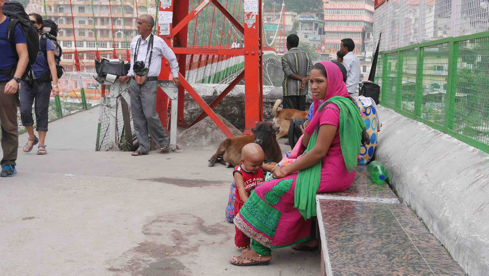

A full long day awaited us in our way to Rishikesh. We had to take the local bus to Pathankot and then a night train directly to Rishikesh. It seems that people usually go to Haridwar, which is roughly 30min bus ride from Rishikesh, but you don't really need to.

This was the first time that we took the night train in India. We travelled in 2AC and I find this option awesome because you'll have a bed, blanket and pillow just for yourself on a very comfortable train.

We arrived in the morning at the Rishikesh train station, which is far from where we planned to stay, Laxman Jhula. We had to try about 5 different tuk tuk drivers to get the price we wanted. First one asked for 200 rupees, second asked for 100 rupees, etc... When one of them, that had already few people inside, called for us we got on for 20 rupees each.

Laxman Jhula is the main area for people visiting Rishikesh due to the vast options regarding food/hostels/ashrams/main attractions. Alternatively you can stay in Ram Jhula if you prefer peacefulness (by Indian standards). I only know that these bridges were named after two brothers named Laxman and Ram, members of the Hindu relligion. Just be careful with monkeys on the bridge. They're not afraid of you and will attack if you've food.

<figure>
	
	<figcaption>Laxman Jhula, one of the attractions in Rishikesh.</figcaption>
</figure>

One thing to note is how clean the Ganges river is in here. I ended up seeing it again in Varanasi and it has nothing to do with its state in here, but that will be another story for later.

<figure>
	
	<figcaption>The Ganges river with one of the main Ashrams in Rishikesh.</figcaption>
</figure>

Accomodation wise, I can't recommend the place I stayed in. It is called <b>Bonfire Hostels</b> and is run by dubious people that will try to overcharge you if you're not in their "circle" which means not joining their childish parties. Rishikesh is known to be a sacred city for the Hindu people, so alcohol, for example, is officially banned from the city. However, in this hostel you'll be able to join them on the terrace to smoke some joints and drink alcohol. This sounds a lot a fun if you're into that and don't have the perception, like me, that you're going to Rishikesh, a truly holy city renowned by its yoga ashrams, where the <b>Beatles</b> went to in the 60s' (they still have the <i>Beatles Ashram</i> for tourism purposes). All things considered, I was overcharged, I know about that, and I didn't like it!

One cool thing we did while there was catching the <b>Ganges Aarti</b>, a Hindu religious ritual of worship, a part of puja, in which light from wicks soaked in <i>ghee</i> (purified butter) or <i>camphor</i> is offered to one or more deities. This ritual happens daily in the holy cities of India where the Ganges flows. We would watch this ritual again in <b>Varanasi</b>.

<figure>
	
	<figcaption>Before the Aarti on the Ganges bank.</figcaption>
</figure>

<figure>
	
	<figcaption>During the Aarti celebrations.</figcaption>
</figure>

In the remaining time that we had in Rishikesh we went to a waterfall located a little bit far away from Laxman Jhula, where there were a lot of locals as amazed as we by the waterfall. They bathe while dressed, and we found this to be the norm in all India because of religious and cultural reasons. Also we walked all the way from Laxman Jhula to Ram Jhula, it is a short walk and its very relaxing and it is a good way to see the local life as it is.

When we got to Ram Jhula we were amazed by the beauty of this neighborhood and its cleanliness for Indian standards! It is clearly a British colonial area where all the houses/ashrams and streets are all aligned in an oddly beautiful way. If you're planning to go on a yoga retreat I would easily recommend this area for you to stay.

<figure>
	
	<figcaption>Local girls at the waterfall.</figcaption>
</figure>

<figure>
	
	<figcaption>Somewhere between the 2 Jhulas.</figcaption>
</figure>

<figure>
	
	<figcaption>Harmony between species.</figcaption>
</figure>

If you want to try some <i>thali</i> I recommend you to eat on the restaurants at your right given that you're coming from the main road to Laxman. They are cheap (you can get a <i>thali</i> for about 60-80 rupees) and safe to eat. I must have eaten there 3 times and didn't have any problem whatsoever with the food.

From Rishikesh we walked to the local bus station (quite a walk, but for some reason there was not 1 tuk tuk on the road that day...) to get a bus to <b>Haridwar</b> where we were supposed to get a train to <b>Ajmer</b> and finally another bus to <b>Pushkar</b>, our next stop for 2 days.

<figure>
	
	<figcaption>For every problem, there is a solution.</figcaption>
</figure>

<figure>
	
	<figcaption>Once again, harmony...</figcaption>
</figure>