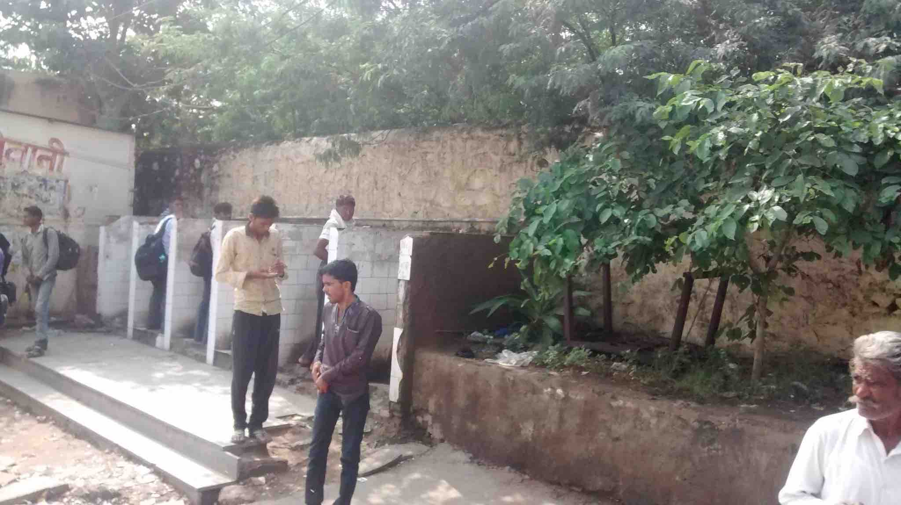
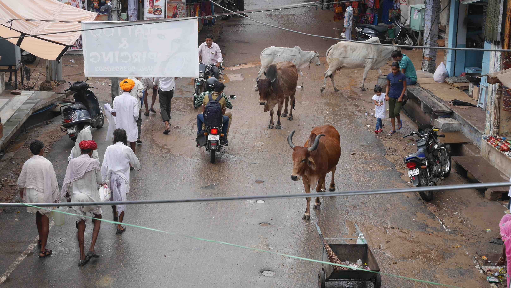
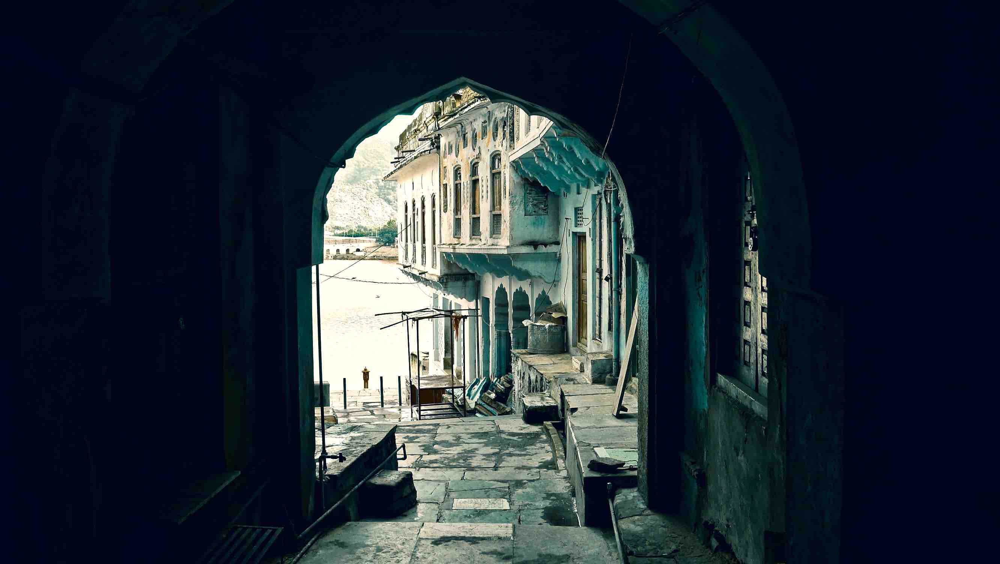
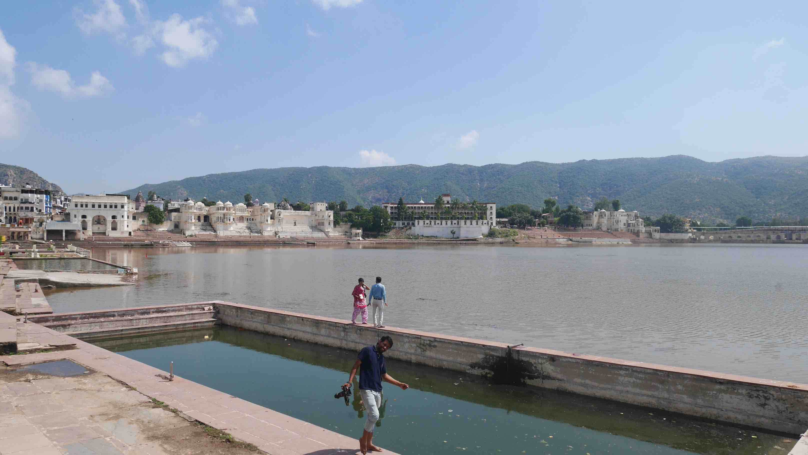
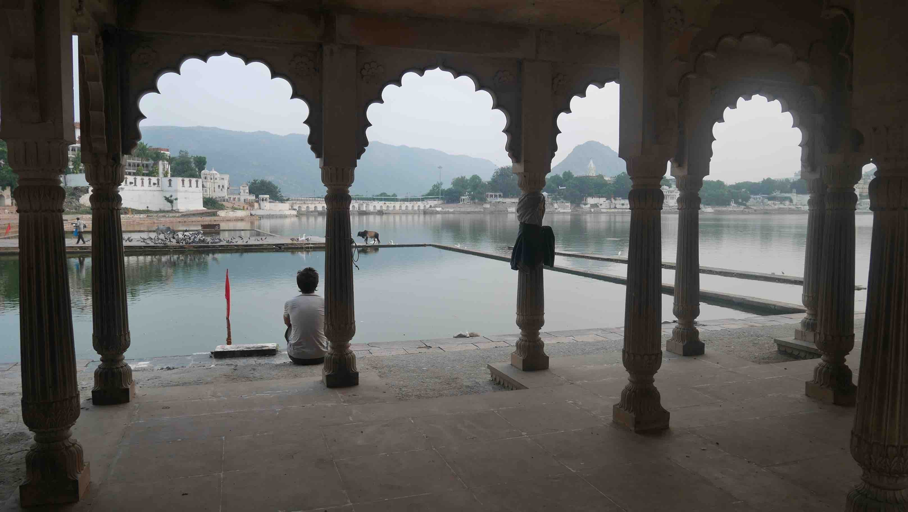

Rahjhastan!

Our arrival in Ajmer was a troubled one. We knew that once we got out of the train we needed to get to the local bus station 2km away. Usually we would just walk, but since it was raining <b>a lot</b> we had to catch a tuk tuk. There were a lot of drivers inside the station that tried to get us into their car but, as a rule of thumb, these guys always overprice so we headed out of the station and got one that had already some people inside (this is always a good option if you want to pay as less as possible).

We had to wait a little bit for the bus while in the station, where we also had to use for the first time our first aid kit because of a fall on the rain. Everything worked fine in the end and we finally went on the bus to a couple of days in Pushkar.

<figure>
	
	<figcaption>While waiting for the bus in Ajmer station, a variety of public urinals.</figcaption>
</figure>

When we arrived in Pushkar the rain gave us a chance and we moved right away to the place where we were staying. <b>Atithi Guest House</b> is a nice family run guest house with plenty of room and a very nice owner. Once we got there he welcomed us in a very warm way and even offered us a raincoat. About the room, I must say that it had probably the best bathroom that we saw in India and the wifi was good (for India standards).

Pushkar is one of the oldest cities in India. The prime attraction of Pushkar is the <b>Pushkar Lake</b> which is considered sacred. Pushkar has become a place of Hindu pilgrimage because of this holy lake. Legend has it that this lake was consecrated to Lord Brahma, the creator of the universe when a lotus dropped from his hand into the vale and a lake emerged in that place. Pushkar is also famous for its annual fair (<b>Pushkar Camel Fair</b>) held in November.

<figure>
	
	<figcaption>First impression of Pushkars street after the rain stopped.</figcaption>
</figure>

<figure>
	
	<figcaption>An interesting view to the Pushkar Lake.</figcaption>
</figure>

Be very careful about the scams around the lake. While it is normal for Indians to do some offerings to the lake through a spiritual ritual, there are many touts trying to lure tourists to do the same while getting ridiculous amounts of money from them. If someone around the lake approaches you in this regard, or with flower petals, kindly just refuse or you'll be caught in the scam.

<figure>
	
	<figcaption>A full view of the Pushkar Lake with a funny photographer.</figcaption>
</figure>

While we were there we just hung around the town and I'm not sure that you can do much more than that, so I don't advise you to plan for more than 1/2 days there. If you're travelling between <b>Jaipur</b> and <b>Jodhpur</b> then I think that its good to stop in <b>Pushkar</b> for 1 day to chill and enjoy the lake.

<figure>
	
	<figcaption>Enjoying the calmness of the lake.</figcaption>
</figure>

 
<h1>How to get there and away</h1>
<ul>
<li>We got there by local bus from Ajmer. Buses are frequent, just ask around for someone to point you to the right bus.</li>
<li>We went by local bus from Pushkar to Jaipur. The bus station is near the entrance of the town if you come from Ajmer.</li>
</ul>

 
<h1>What to do/see</h1>
<ul>
<li>Just relax by the lake and enjoy the view. If you're into shopping this is a good place to buy some souvenirs.</li>
</ul>