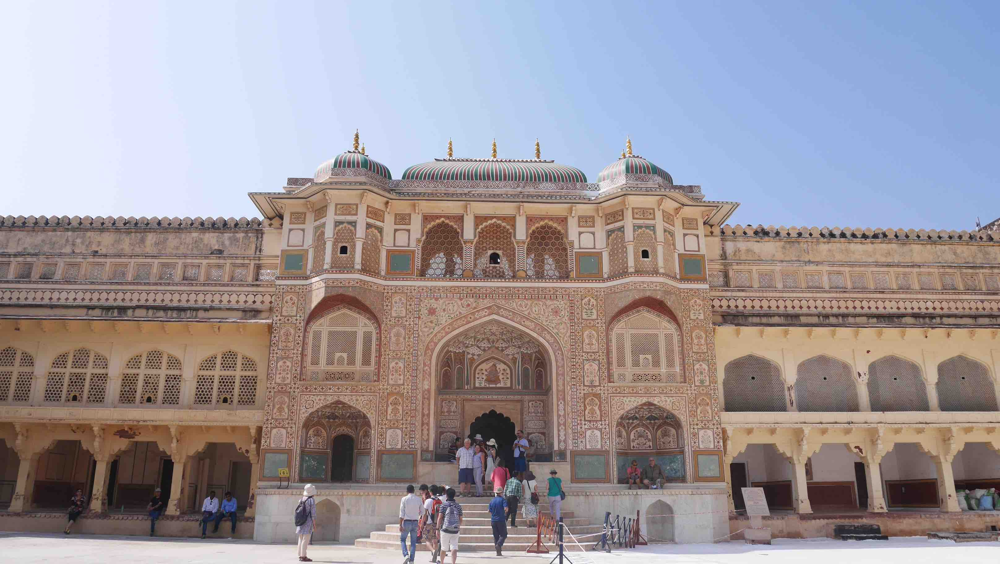
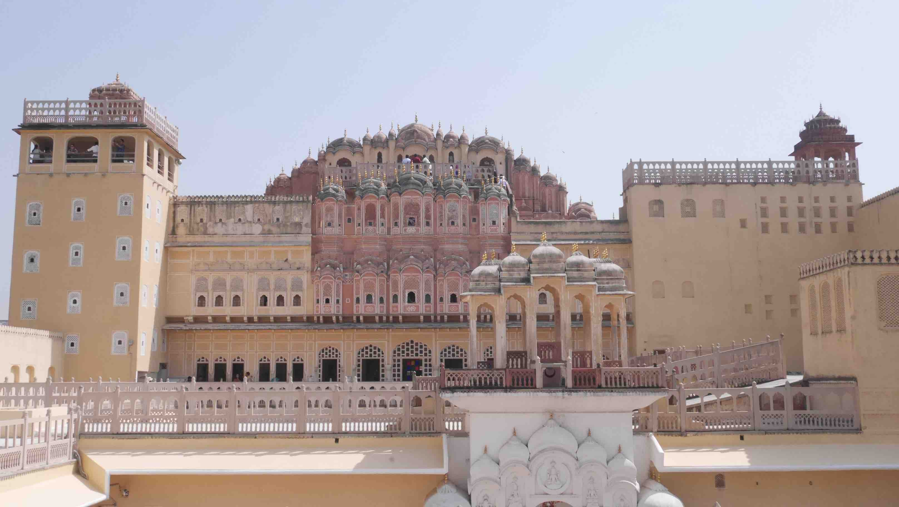

The bus ride from Pushkar to Jaipur wasn't a long one, but the first part of it was arduous mainly because we wouldn't have a seat available until maybe 1 hour into it. Despite the bus being very <i>cozy</i> (because Indians have a different concept of personal space from the one in the western world), the seats were sticky and you were always in distress because of the driving in that country. In the end everything went well and the driver was kind enough to leave us in the middle of the road just because our place was near.

We chose to come to Jaipur because we wanted to have a little taste of Rahjhastan by visiting its capital and largest city (in terms of size). Jaipur is also known as the <b>Pink City</b> of India and is one of the three cities of the Indian <b>Golden Triangle</b> (alongside <b>New Delhi</b> and <b>Agra</b>). It is also a gateway to other tourist destinations in Rahjhastan such as <b>Jodhpur</b>, <b>Jaisalmer</b> and <b>Udaipur</b> (I didn't visit any of these, but will definitely consider them for the next time). This region seem a bit more conservative than the other places we went to. Women usually cover their faces with the sarees when with men or strange people.

<figure>
	
	<figcaption>On the local bus from Pushkar to Jaipur.</figcaption>
</figure>

We ended up staying in a place called <b>Hathroi Palace Guest House</b> near Ajmer/Jaipur Rd. We chose to stay in a room with fan (non AC) on the first floor and I must say that the room felt pretty hot during the day and even sometimes with the fan on, because our only window was to the corridor near the front desk of the guest house. However, I loved this place because of their rooftop and their kitchen. Despite having a very young cook, their food was fabulous and we ended up having all our dinner while in Jaipur there.

We had only 2 days until our trip to <b>Varanasi</b>, so we wanted to do as many things as we could. With this in mind, we decided to take a tour around Jaipur that the guest house offered, with a small hope that it could be as good as the one in New Delhi (it wasn't). This tour started really early with sunrise on a hill near <b>Nahargarh Fort</b> (with view to <b>Jal Mahal</b>, a beautiful palace in the middle of <b>Man Sagar</b> lake), a visit to a Hindu Temple (<b>Badrinath Temple</b>), the most famous attraction of Jaipur the <b>Amer Fort</b> and a visit to a small <i>elephant village</i> that I truly hated. The second day was scheduled to be done by foot at our own rhythm. Of course the chaotic roads can be a challenge, but since it was Sunday the streets were mostly empty.

<figure>
	
	<figcaption>Starting the day with a sunrise with view to the Jal Mahal.</figcaption>
</figure>

So, the first day started really early because if you want to catch the sunrise you can't get out of bed past 5:30/6:00am. We had a really good view of the <b>Jal Mahal</b> from the top of the hill and that was also the last time that we saw it because you actually can't go inside so we didn't bother to visit it again.

When we had enough sun to light up our day, we went to the van only to be taken to some places (including the <b>Badrinath Temple</b>) before the stopping on the famous <b>Amer Fort</b>. At this point it was obvious that the tour was a bit amateur<i>ish</i> when compared to the one in New Delhi Madpacker's Hostel. Our guide, despite being very nice and friendly, was shy and clearly he just started doing this tour very recently. In the end he understood and agreed with the feedback and I really hope that they get better at this!

<figure>
	
	<figcaption>Somewhere near the <b>Amer Fort</b>.</figcaption>
</figure>

<figure>
	
	<figcaption><i>Stairway to heaven</i>.</figcaption>
</figure>

<figure>
	
	<figcaption>The entrance to the <b>Badrinath Temple</b>.</figcaption>
</figure>

<figure>
	
	<figcaption>Just chilling, hiding from the sun.</figcaption>
</figure>

When we finally reached the <b>Amer Fort</b> we first stopped in a local cafe to have a <i>paratha</i> for breakfast. <i>Paratha</i> can have various ingredients and vegetables (either grated or boiled and mashed) in them. They are usually paired with homemade ghee or yogurt based dips or pickles. It's a really good and cheap breakfast each one costing around 10 rupees.

After breakfast we headed to the <b>Amer Fort</b> for the next 2 hours. Constructed of red sandstone and marble, the palace is laid out on four levels, each with a courtyard. The palace was the residence of the Rajput Maharajas and their families. At the entrance to the palace near the fort's Ganesh Gate, there is a temple dedicated to Sila Devi, a goddess of the Chaitanya cult. In 2013, <b>Amer Fort</b> was declared a UNESCO World Heritage Site as part of the group Hill Forts of Rahjhastan.

Be sure to allow at least 2 hours to slowly appreciate the fort and its magnificent views over the city of Jaipur. While if you're into architecture I'm sure you'll love the Hindu influences and the beautiful marble, I think it's the view from there that will steal your breath. Be also prepared to have a lot of tourists around because it's one of the major tourist attractions in all India and there is no way around it. If you're into elephant rides, you can take one to the top of the fort (I'm not supporting this).

<figure>
	
	<figcaption>Ganesh Pol of Amer Fort.</figcaption>
</figure>

<figure>
	
	<figcaption>The view over Jaipur.</figcaption>
</figure>

<figure>
	
	<figcaption>The Maota Lake and Kesar Kyari (Saffron Garden).</figcaption>
</figure>

When we got out of the fort we were supposed to find the guys to go to our last stop, but this turned out disastrous because we were lost for about 30 minutes. This last stop was disappointing because the <i>elephant village</i> wasn't what I imagined. It's just a bunch of elephants for the tourist amusement (they said that they were treated very nicely and everything, but...) and we could <i>ride</i> them if we wanted (for a sum of money of course). In the end I said to the guy from the guest house that this should be optional, but he said that tourists like this kind of stuff and we went there because people want to see this. Oh well...

This is not the kind of stuff that I like to do, going into tours, but I was so amused by the one I had in Delhi that I decided to take another one. It's not horrible, don't get me wrong, it's just that my expectations were wrongfully set from the beginning.

On the second day we set to explore the city by foot, my personal favourite way to explore any place. There is a metro under construction, so some streets are a bit chaotic, but it's still really easy to navigate by foot. You can find a lot of shadows in the buildings and all the touristic places are not really far from each other. On our way to <b>Hawa Mahal</b>, we first stopped at the <b>Sanganeri Gate</b> which is one of the 8 gates to the old town. It was build in 1727 when the city was founded.

<figure>
	
	<figcaption>The Sanganeri Gate.</figcaption>
</figure>

So, here comes a funny one. If you ever searched photos of the <b>Hawa Mahal</b> you'll always see a beautiful <i>façade</i> (which was what we really wanted to see), but we didn't researched enough and ended up on the other side of the complex where you have the ticket counter to go in. Since we thought we were supposed to go inside we bought the tickets only to realise that what we actually wanted to see was right outside. We ended up inside the <b>Hawa Mahal</b> looking jealousy to the people on the other side enjoying their magnificent view.

It was sad....

<figure>
	
	<figcaption>Inside the Hawa Mahal, you can see the <i>façade</i> from behind.</figcaption>
</figure>

<figure>
	
	<figcaption>Now the real thing.</figcaption>
</figure>

For the rest of the day we just wandered around the streets ending up in the <b>Albert Hall Museum</b> (we didn't go inside). This is the oldest museum of the state of Rahjhastan and it is named after King Edward VII (Albert Edward). We didn't have a lot more time to spend in Jaipur because we scheduled a ~17h train (true story...) to <b>Varanasi</b> on the same day. From our guest house we just walked to the train station since it was only 1km away and boarded the longest train ride ever. At least it was <b>totally worth</b> because <b>Varanasi</b> turned out to be, probably, the most amazing place in my entire trip.

<figure>
	
	<figcaption>Beautiful and colorful sarees all around Jaipur.</figcaption>
</figure>

 
<h1>How to get there and away</h1>
<ul>
<li>We got there by local bus from <b><a href="{{site.url}}/Pushkar" target="_blank">Pushkar</a></b>. We asked for the driver to leave us in the middle of the road as we were near our guest house. I don't really know where the bus ends its journey.</li>
<li>We got a overnight sleeper train to <b><a href="{{site.url}}/Varanasi" target="_blank">Varanasi</a></b>. Long, long journey.</li>
</ul>

 
<h1>What to do/see</h1>
<ul>
<li>Amer Fort.</li>
<li>City wall of Jaipur.</li>
<li>Hawa Mahal.</li>
<li>Nahargarh Fort.</li>
<li>Jantar Mantar.</li>
<li>Badrinath Temple.</li>
</ul>