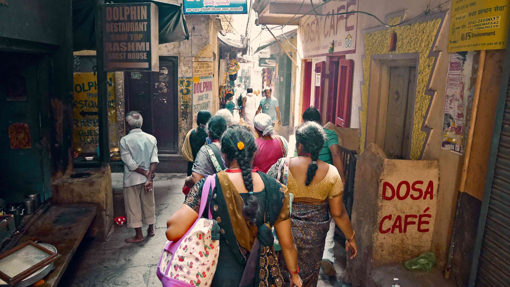

Welcome to Varanasi, where death meets life.

The spiritual capital of India, the holiest of the seven sacred cities in Hinduism and Jainism, and also played an important role in the development of Buddhism. Varanasi has been a spiritual centre of North India for several thousand years. Hindus believe that death in the city will bring salvation, making it a major centre for pilgrimage when people have just a few years remaining in their lives. The city is known worldwide for its many Ghats, embankments made in steps of stone slabs along the river bank where pilgrims perform ritual ablutions.

<b><highlight><middle>This is not a place for the faint-hearted. You can see everything here, from open air cremation sites in plain sight, to floating bodies on the Ganga.</middle></highlight></b>

We had arranged pick up from the train station since it saves you a lot of hassle with getting the tuk tuk for the guest house after a night of sleep on the train. This place is called <b>Banaras Paying Guest House</b> and I truly recommend if you're looking for a cheap place to stay in Varanasi. It is a family run business by two super friendly brothers and their lovely sister. For 6€ you get a double room with free delicious breakfast and shared bathroom (there are no rooms with private bathroom) and at the time they were installing hot water so it should be fine now.

<figure>
	
	<figcaption>Nice bath on the Ganga.</figcaption>
</figure>

So, when we finally got to Varanasi train station after a 2 hour delay, one of the brothers came to greet us and said we were supposed to get another costumer that came on the same train as us. Guess what, Naique the Dutch guy that we met in <a href="{{site.url}}/Amritsar" target="_blank">Amritsar</a> was there also staring at us with no words to describe such a coincidence. He had met 2 guys from the Philippines on the train that would eventually join us for the next day morning tour.

When we finally got to the guest house they promptly told us about the morning tour on the Ganga, which included a local guide (his neighbour that also had rooms to rent), the morning aarti, a boat ride on the Ganga during the sunrise to fully appreciate all the busy Ghats with all the people and their morning routines and finally a walking tour to some historical places including a Hindu temple in the town (this part was offered by his neighbour).

<figure>
	
	<figcaption>A very old painting in the Ghats.</figcaption>
</figure>

Everyone that goes to Varanasi should already know about the burning sites in there. In Hindu traditions, cremation is one of the rites of passage and the Ghats of Varanasi are considered one of the auspicious locations for this ritual. At the time of the cremation a <i>Puja</i> (prayer) is performed.
Hymns and mantras are recited during cremation to make the ritual. This ritual happens in the Manikarnika and Harishchandra Ghats.
Since the demand for cremation in this holy city is so high, these Ghats work 24/7 burning bodies, sometimes 2 or 3 at the same time in each Ghat. The <b>Harishchandra</b> Ghat is mostly to families with less money that aren't able to buy fine wood for the bodies to burn.

Hindus believe that the soul after living in the body for so long, they get attached to the body and if left to rot on its own or buried, will linger upon the vicinity. So, burning the body makes the soul depart to its rightful place sooner than burial. Hence, <b>sadhus</b>, <b>lepers</b>, <b>children under five</b>, <b>pregnant women</b>, and <b>snake-bite victims</b> are to be consigned directly to the sacred river. Their corpses, it is said, do not need further purification by fire, so they are taken in a boat to the middle of the Ganga while tied to a stone, thrown in there and becoming food for fishes.

<b><highlight><middle>However, I'm sure that despite knowing all of this, you will still be blown away once you get to one of this cremation sites.</middle></highlight></b>

<figure>
	
	<figcaption>People doing their morning prayers.</figcaption>
</figure>

When I was getting near the first burning Ghat, I started to feel the smell of dead bodies. 
That is something that I think I'll never forget in my life.
There was a big cloud of smoke around the site, and as I was getting closer I could see the dead body laying in a pyre, burning very slowly. Hindus believe that the longer the body takes to burn the more sins that person committed during lifetime. A body takes approximately 3-4 hours to burn.

This whole cremation ritual is very unique. The family carries body wrapped in a sail to one of the burning Ghats while saying <i><b>ram ram satya hai</b></i> ("God's name is truth"), and the tradition says that the oldest son has to shave his hair and assists throughout the funeral. The body is first dipped into the Ganga, then the funeral ceremony happens and the body is placed on the pyre to burn. In the end the ash is stored in a box and the oldest son throws it into the Ganga.

<figure>
	
	<figcaption>Washing the sins away.</figcaption>
</figure>

Besides the experience of being in an open-air crematorium, there are also 2 things you can't miss while in Varanasi which are the <b>aarti</b> ceremony and a morning boat ride on the Ganga to fully appreciate the light and life at the Ghats.

The <b>aarti</b> happens every day after sunrise/sunset in <b>Dashashwamedh</b> and <b>Assi</b> Ghat and consists in performing "Agni Pooja" (Worship of Fire) wherein a dedication is made to Lord Shiva, River Ganga, Agni (Fire), Surya (Sun), and the whole universe. Although I liked the one in <a href="{{site.url}}/Rishikesh" target="_blank">Haridwar</a> more, this one is also very worth it.

<figure>
	
	<figcaption>The aarti ceremony in Varanasi.</figcaption>
</figure>

The boat ride in the morning that we booked with our guest house, although if you prefer you can arrange it with someone in the Ghats because <b>everyone</b> will sell you that, its the best way to fully appreciate the morning rituals in the Ghats. You should go really early, in time for the morning aarti, and then get on the boat and wander around the Ghats. You'll see everything there, from people taking baths, washing their teeth, washing clothes, etc. (yes, in the same water used to throw the ashes and the dead bodies).

<b><highlight><middle>If you're into photography you will absolutely love it.</middle></highlight></b>

As I said before, after the boat ride we went to a Hindu temple and some more historical places around town, including <b>Lolarka Kund</b> which is a sacred place for those looking for fertility in their lives.

<figure>
	
	<figcaption>Morning rituals in the Ganga.</figcaption>
</figure>

<figure>
	
	<figcaption>Fun!</figcaption>
</figure>

<figure>
	
	<figcaption>People doing all different kinds of stuff in the Ganga.</figcaption>
</figure>

<figure>
	
	<figcaption>Kids playing with their kites.</figcaption>
</figure>

While still with our Dutch friend Naique, and now also with 2 Spanish girls that we met in the guest house, we had the opportunity to witness two of the most unique things I saw in my entire trip and even my life. The first one was a young father with his dead baby in his arms having to endure the hard time of tightening him with a rope to a stone and throw him into the Ganga. You could see that he was holding his pain inside and trying to keep a stone cold face all the time, but can you imagine having to do this to someone you really love?

The second thing it's a consequence of the first one. When you throw a dead body in the Ganga sometimes what will happen is that the body will swallow because of the water and then loose itself from the ropes. These bodies then come to the surface and are food for animals. The smell of the rotten and decayed body is <b>very</b> intense, and it was thanks to that that I noticed the body being eaten by flies...

<b><highlight><middle>Unforgettable.</middle></highlight></b>

<figure>
	
	<figcaption>Spiritual man on his morning routine.</figcaption>
</figure>

Since I was in the most sacred place in India, I tried to meet an <b>Aghori</b> but with no luck. People seemed really afraid of talking about these men believed to have black magic powers. These kind of <i>Sadhus</i>  are known to engage in post-mortem rituals. They often dwell in charnel grounds, have been witnessed smearing cremation ashes on their bodies, and have been known to use bones from human corpses for crafting <i>kapalas</i> (skullcups which <b>Shiva</b> and other Hindu deities are often iconically depicted holding or using).

There is a very good video about <b>Aghori</b> in Varanasi that I recommend <highlight><middle><b><a href="https://www.youtube.com/watch?v=WFzP7l__Qy4" target="_blank">HERE</a></b></middle></highlight>.

<figure>
	
	<figcaption>Delicious Lassi served in <b>Blue Lassi</b>.</figcaption>
</figure>

If you prefer sweeter things than these <b>Aghori Sadhus</b> you have a very unique and famous place called <b>Blue Lassi</b>. It is near the <b>Dashashwamedh Ghat</b> in a small alley, and they've a big variety of Lassis although they're not quite like the typical ones that you probably had until now.

Last but not least, can you believe a snake fell down from the sky while we were in our hostel's terrace? It was probably an eagle that had it and let it go by accident or something, but it adds up to how crazy <b>Varanasi</b> was to me.

<b><highlight><middle>If you have the chance to go to Varanasi please do so, but go with an open mind. You'll be blown away by this sacred place.</middle></highlight></b>

<figure>
	
	<figcaption>Bye <b>Varanasi</b>, I'm sure we'll meet sooner than you expect.</figcaption>
</figure>

 
<h1>How to get there and away</h1>
<ul>
<li>We got there by local train from Jaipur. Long long journey.</li>
<li>We got a overnight sleeper train to New Delhi.</li>
</ul>

 
<h1>What to do/see</h1>
<ul>
<li>Ghats.</li>
<li>Cremation sites.</li>
<li>Morning Ganga boat ride.</li>
<li>Blue Lassi.</li>
</ul>