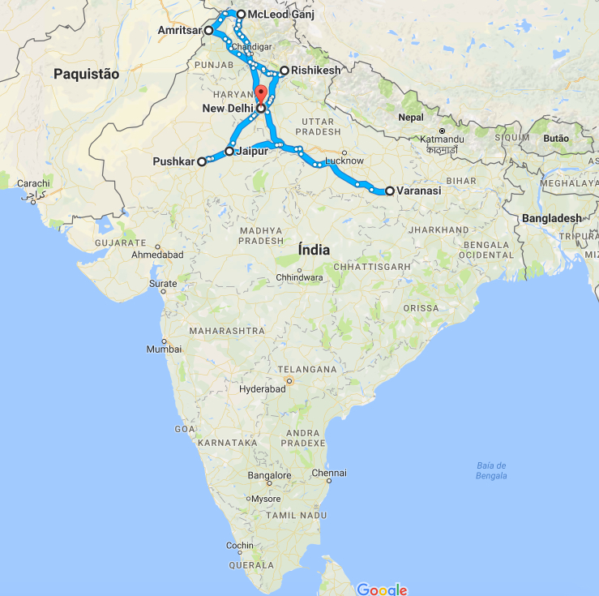

I spent 1 full month in India between 20th September and 19th October 2016. I travelled as a couple and always slept in Hostels/Trains.

This itinerary is my personal taste and I didn't use any kind of agency to book anything. I mostly used the internet to search for some logistics regarding transportation and also to book train tickets. I used the India's edition of Lonely Planet but I really can't recommend it because it's very outdated and I'm sure that you're better off with a more recent guide book.

<b><highlight>Itinerary and transportation:</highlight></b>

<ul>
<li><b><a href="{{site.url}}/Delhi" target="_blank">New Delhi </a></b>(3 days, morning train to Amritsar)</li>
<li><b><a href="{{site.url}}/Amritsar" target="_blank">Amritsar </a></b>(3 days + 1 day on the road, local bus to Pathankot + local bus to Dharamshala + local bus to McLeod Ganj)</li>
<li><b><a href="{{site.url}}/McLeodGanj" target="_blank">McLeod Ganj </a></b>(5 days + 1 day on the road, local bus to Pathankot + night train to Rishikesh)</li>
<li><b><a href="{{site.url}}/Rishikesh" target="_blank">Rishikesh </a></b>(3 days + 1 day on the road, local bus to Haridwar + train to Ajmer + local bus to Pushkar)</li>
<li><b><a href="{{site.url}}/Pushkar" target="_blank">Pushkar </a></b>(2 days, local bus to Jaipur)</li>
<li><b><a href="{{site.url}}/Jaipur" target="_blank">Jaipur </a></b>(2 days, night train to Varanasi)</li>
<li><b><a href="{{site.url}}/Varanasi" target="_blank">Varanasi </a></b>(6 days, night train to New Delhi)</li>
<li><b><a href="{{site.url}}/Agra" target="_blank">New Delhi / Agra </a></b>(3 days, flight out of the country)</li>
</ul>

<b><highlight>&emsp;Flight, train and bus...</highlight></b>

<ul>
	<li>
	<b>Flight:</b>
	<ul>
		<li>
		I bought my plane tickets in <b><a href="https://www.skyscanner.pt/" target="_blank">SkyScanner</a></b> from Porto to New Delhi and from New Delhi to Hanoi.
		</li>
	</ul>
	</li>
	 <li>
	<b>Train:</b>
	<ul>
		<li>I bought my 2AC train tickets in the <b><a href="https://www.irctc.co.in" target="_blank">Indian Railway Catering and Tourism Corporation (IRCTC)</a></b>. If you're not from India you need to send your passport copy by email to them for you to get your account enabled. When you have done that, you should be able to buy tickets with your credit card. Be careful with the train tickets, <b>some of the most famous routes get sold out months in advance.</b></li>
	</ul>
	</li>
	 <li>
	<b>Transportation:</b>
	<ul>
		<li><b>New Delhi:</b> the metro takes you to the train station where you can get from there to Amritsar on a direct train.</li>
		<li><b>Amritsar:</b> from the train station to the Golden Temple its about ~2km. You can just walk or take a rikshaw for 30-50 rupees. From there to the bus to Pathankot you need to take a tuk tuk/rickshaw, it should cost between 30-50eupees. From Pathankot you should have a bus to Dharamshala in the same bus station and once you reach Dharamshala just ask someone to point you the bus to MacLeod Ganj on the same station.</li>
		<li><b>McLeod Ganj:</b> the ticket booth for buses is kinda tricky to find, but it is located in the main square right at the entrance of the village. From there you get a bus to Haridwar. The bus should leave you close enough for you to walk to the train station.</li>
		<li><b>Rishikesh:</b> from Laxman Jhula take a tuk tuk to the bus station, it should cost between 20-40 rupees (I walked to the station so this price is my personal opinion about it). Take a bus from there to Haridwar where you can get a train to Ajmer. When you get to Ajmer I know that you can take a local bus to the bus station, but I took a shared tuk tuk for 10 rupees. The bus will leave you in walking distance of Pushkar village.</li>
		<li><b>Pushkar:</b> the bus station is in walking distance, just at the entrance of the village. From there you can take a local bus to Jaipur.</li>
		<li><b>Jaipur:</b> since the place where I was staying was close to the train station I just walked. From there I took a night train to Varanasi.</li>
		<li><b>Varanasi:</b> the train station is really far from where most hostels are, so you should take a tuk tuk to there for about 100 rupees.</li>
		<li><b>New Delhi / Agra:</b> I rented a driver for a full day from New Delhi to Agra and back. I shared with another travellers, it cost us 60€ for all of us.</li>
	</ul>
	</li>
</ul>

<figure>
	
	<figcaption>My India Itinerary.</figcaption>
</figure>

<b><highlight>&emsp;Costs:</highlight></b>
<ul>
<li><b>~15€ per day, all included.</b></li>
</ul>
&emsp;<b>This does not include flights,</b> but includes all kind of daily expenses, rooms (between 7-14€ double room except New Delhi), food (between 1-3€ local food mostly), entrance tickets, transportation (train, bus and occasional tuk tuk) etc...

<b><highlight>Visa:</highlight></b>
<ul>
<li>Online e-visa on the official <a href="https://indianvisaonline.gov.in/evisa/" target="_blank">Indian visa place</a>. It cost me 60€ for a 1 month visa. (Portuguese citizen)</li>
</ul>

<b><highlight>&emsp;Highlights:</highlight></b>
<ul>
<li><b>New Delhi</b>, MadPackers hostel city tour.</li>
<li><b>Amritsar</b>, walking around the incredible Golden Temple while watching peoples prayers.</li>
<li><b>McLeod Ganj</b>, the view is amazing and also the spiritual temple of the Dalai Lama.</li>
<li><b>Rishikesh</b>, Laxman Jhula.</li>
<li><b>Pushkar</b>, sitting and relaxing around the Pushkar Lake.</li>
<li><b>Jaipur</b>, the Amer Fort is quite nice and has an amazing view.</li>
<li><b>Varanasi</b>, the morning boat tour and walking on the Ghats. Also, the cremation sites are overwhelming and an once in a lifetime experience.</li>
<li><b>Agra</b>, obviously the mighty Taj Mahal.</li>
</ul>