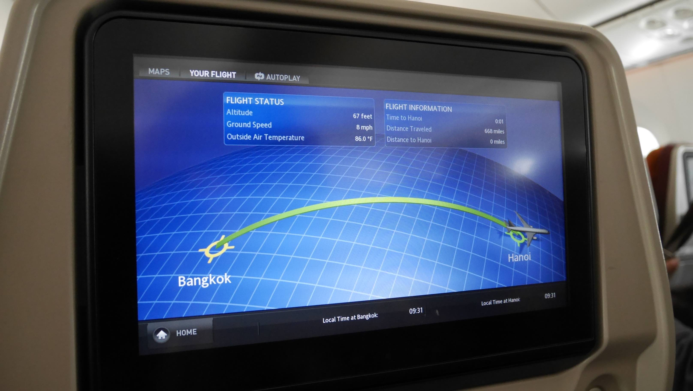

Hanoi has been the capital of Vietnam since the <i>French indochine</i> between 1902 and 1954. From 1954 to 1976, it was the capital of North Vietnam, and it became the capital of a reunified Vietnam in 1976, after the North's victory in the Vietnam War.

I arrived in Hanoi by flight from <b><a href="{{site.url}}/Delhi" target="_blank">New Delhi</a></b> (with a stopover in Bangkok), after a month travelling in <b><a href="{{site.url}}/IndiaItinerary" target="_blank">India </a></b>. If you're planning to go to Vietnam, you need to take care of your visa in advance. I recommend using <b><a href="http://vietnamvisapro.net/" target="_blank">Vietnamvisapro.net </a></b>because it is one of the cheaper options and I had no problems with them. You will get your approval letter with other people's name on it, but don't be scared, it's completely fine. Once you get to the airport you just hand this piece of paper along with 25$ to the immigration counter and thats it!

<figure>
	
	<figcaption>Almost there!</figcaption>
</figure>

As soon as I got out of the airport, I was determined to go to the city center the cheapest way possible. I read that there 2 buses that run from the airport to the Old Quarter, numbers <b>7</b> and <b>17</b>. As soon as I exited the terminal I turned left and headed to a small bus station where only a few people were waiting for the buses. I waited a bit and then finally decided to board the first one that came. The ticket costs only 5,000VND, but of course that something had to happen. I was always tracking the bus through <b>Maps.ME</b> application on my phone when suddenly, far away from the city center, the bus stopped and everybody had to get out of the bus.
I then asked a young guy on the station about how to get to the city center, but he seemed a little bit confused due to the linguistic barrier. Fortunately, he helped us getting into a bus that left us near to where we wanted to stay in.

<b><highlight><middle>It was my first taste about how poor is the English spoken by people in Vietnam.</middle></highlight></b>

We stayed in Hanoi for 2 nights and I think that is enough time to see the city. We stayed in 2 different <i>cheap</i> places, <b>Happy Moon Guest House</b> and <b>Hanoi Charming Hotel</b> because we had to change room as they didn't have a room available for the second night in the guest house, so we found a really good deal for the same day on the second place. Location wise they're both pretty central, in the middle of the <b>Old Quarter</b>, and we got each night for about 13$ double room.

<b><highlight><middle>However, I didn't like that much of the accommodation in Vietnam.</middle></highlight></b>

First of all, the people travelling in Vietnam and SE Asia in general, are not the same type of travellers as the ones that travel in India, for example, but that is completely fine. It is just that I think that I could relate and connect better with the people that travelled in India. Second, most of the guest houses/hostels don't have a common area and look like hotels with a receptionist and all, so it is hard to meet other fellow travellers. In the end it is all due to personal taste, and this is just my own opinion.

<figure>
	
	<figcaption>My favourite Bun Cha just near my hotel in Hanoi.</figcaption>
</figure>

It was near my place that I had the best <b><i>Bun Cha</i></b> that I would ever have while in Vietnam. <b><i>Bun Cha</i></b> is a typical dish made of grilled pork and noodle. I followed a recommendation from the reception girl at my place (<i>Happy Moon Guest House</i>) and just left the guest house and turned right. Just a few meters away there was the place with a lot of people sitting down, really easy to spot.

The <b>Old Quarter</b> is where everything happens. There are a lot of street shops, street sellers, food, etc. all the houses have an European feeling (because of the French influence) and the traffic if not as bad as in the rest of the city. It's really easy to walk around the <b>Old Quarter</b>.

<figure>
	
	<figcaption>Streets of Hanoi.</figcaption>
</figure>

<figure>
	
	<figcaption>Old Quarter of Hanoi.</figcaption>
</figure>

<figure>
	
	<figcaption><i>Cozy</i> street.</figcaption>
</figure>

Hanoi is also know for a very unique drink called <b>Egg Coffee</b>, a delicious drink that has egg yolks, sugar, condensed milk and Robusta coffee. I'm pretty sure that you can try it in almost every coffee shop in Hanoi. I can't remember the name of the place where I tried it, but it was really near the <b>Hoan Kiem Lake</b>.

<b><highlight><middle>I have to admit that I was kinda skeptical about trying it, but I have to say that it was a really good experience.</middle></highlight></b>

<figure>
	
	<figcaption>Hanoi's Egg Coffee is actually quite good.</figcaption>
</figure>

While in Hanoi another really interesting place to visit is the <b>Hoan Kiem Lake</b>, a focal point in Hanoi's public life. In the middle of the lake you can find the <b>Turtle Tower (Tháp Rùa)</b>, erected on the Turtle islet, the former fishing site under king Le Thanh Tong. Under the Restored Le Dynasty (17th and 18th centuries), the Trinh Lords had Ta Vong Temple built on the islet, which disappeared during the Nguyen Dynasty.

It was here that I had the opportunity to help some university students that usually go to the park to practice their English between classes. It was really nice and it was when I first learned that the Vietnamese actually <b>like</b> Americans. I always thought that because of war they hated America, but it is the opposite, and the Obama visit to the country sure helped it!

<figure>
	
	<figcaption>The <b>Turtle Tower (Tháp Rùa)</b> in the middle of the <b>Hoan Kiem Lake</b>.</figcaption>
</figure>

<figure>
	
	<figcaption>The beautiful <b>Hoan Kiem Lake</b> at night.</figcaption>
</figure>

A quick note about transportation in Vietnam: <b>it is sooooo easy</b>. You just have to say where you want to go to the receptionist where you're staying and you will have everything arranged 2 seconds later. Because every tourist goes to the same places, Vietnam has a really good internal network of transportation in motion.

 
<h1>How to get there and away</h1>
<ul>
<li>We had a flight from <b><a href="{{site.url}}/Delhi" target="_blank">New Delhi</a></b> to Hanoi. We then got to downtown by public bus number 7 or 17.</li>
<li>Arranged transportation from Hanoi Charming Hotel to <b><a href="{{site.url}}/CatBa" target="_blank">Cát Bà</a></b> island. It included a bus ride, a ferry and a final bus ride from the port to the village of Cat Ba.</li>
</ul>

 
<h1>What to do/see</h1>
<ul>
<li>Hanoi's Old Quarter.</li>
<li>Hoan Kiem Lake.</li>
<li>Women's museum.</li>
</ul>

 
<h1>Where to sleep</h1>
<ul>
<li><b>Happy Moon Guest House</b>. Really good price/quality relation with good staff and useful tips.</li>
<li><b>Hanoi Charming Hotel</b>. More like a Hotel kind of management but better room quality.</li>
</ul>