<b>Cát Bà</b> was our second destination in Vietnam after the capital <b><a href="{{site.url}}/Hanoi" target="_blank">Hanoi</a></b>. We got to the largest island in <b>Halong Bay</b> with the intent of joining a cruise to see the beautiful karsts of Lan Ha Bay. This is a cheap alternative when comparing to the ones offered in <b>Halong Bay</b> that can easily cost at least 100$ per person.

If you're coming from Hanoi as I did, it's really straightforward to get to the Island. Just say the word to the reception of wherever you're staying and you'll have everything scheduled for the next day. You can also ask around for prices because all the hostels/guest houses are kind of connected regarding transportation, and the chances that you'll end up in the same bus as someone staying in an expensive hotel are high. It is also one of the two most common destinations from Hanoi, <b>Sa Pa</b> being the other one. We got on the island with a bus ride, a ferry, and a final bus to the village.

We stayed in the <b>Cát Bà Langur Hostel</b> for an <i>exorbitant</i> amount of 5$ per night, double room. The location is very central, like almost all accommodation there, and the family that runs the place is very warm and welcoming. They can arrange everything you need like the <b>Lan Ha Bay</b> tour, bike rental, onward transportation, etc. and also have a family dinner where you can get to know them better.

<figure>
	
	<figcaption>Refreshing break on our arrival!</figcaption>
</figure>

In my opinion 2 days is enough to contemplate <b>Cát Bà</b> island, if you only plan to spend 1 day on the <b>Lan Ha Bay</b>. And that's exactly what we did. We booked through our hostel a day tour to the <b>Lan Ha Bay</b> that included lunch, 1 hour kayak, a stop for snorkeling and a stop on the <i>monkey island</i>.

<b><highlight><middle>This 8 hour boat ride in Lan Ha Bay costed us ~15$ per person, all included.</middle></highlight></b>

Again, this is the kind of <i>tour</i> that every hostel/guest house in Cát Bà offers, some more expensive than others, but all tourists will go on the same boat so don't be fooled when it comes to the price and ask around if you think that you're being ripped off. I must say that I really enjoyed this tour. Despite not being able to sleep on the boat I don't think that I missed that and the time that I had there was more than enough.

The first stop was the <i>so called</i> monkey island. I do believe that long time ago there must have been monkeys there, but the only 2 I saw looked like they were there to please tourists. While there, we just had time to hike to the highest point of the island (quite a hike), and then just hang for a little bit on the beach.

<figure>
	<a href="../images/vietnam/catba/catba2.JPG">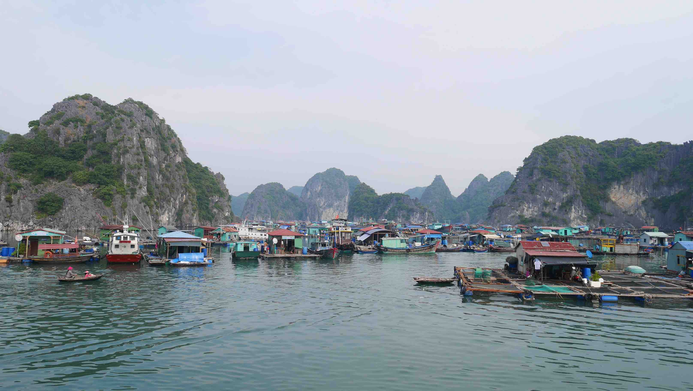</a>
	<figcaption>Cute little fishing village on our way to the monkey island.</figcaption>
</figure>

<figure>
	<a href="../images/vietnam/catba/catba3.JPG">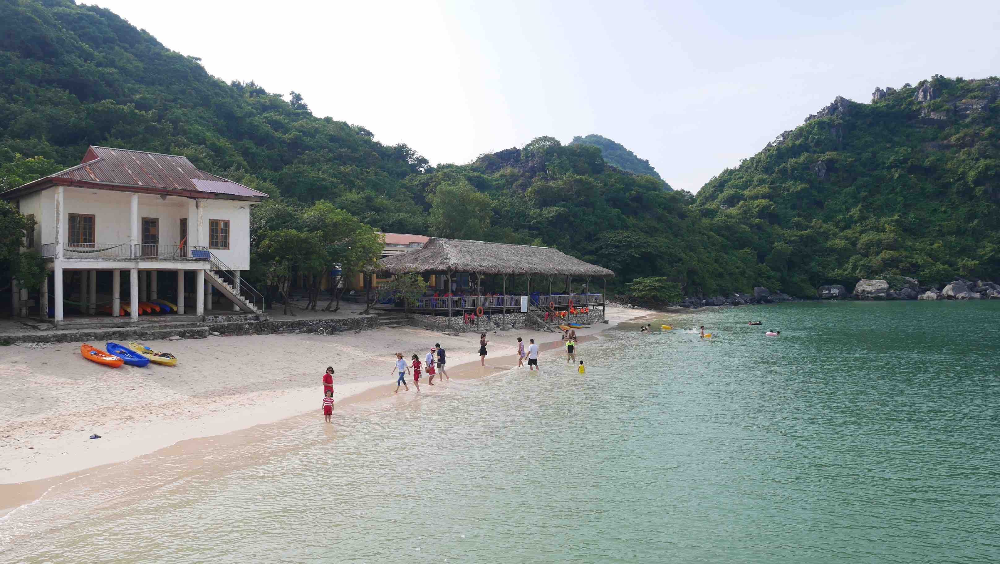</a>
	<figcaption>First glimpse of the monkey island.</figcaption>
</figure>

<figure>
	<a href="../images/vietnam/catba/catba4.JPG">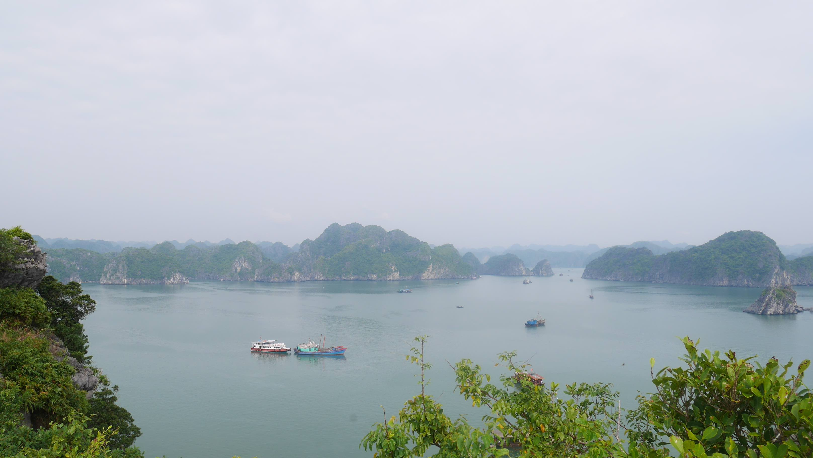</a>
	<figcaption>The view over the highest point.</figcaption>
</figure>

The rest of the morning will be spent navigating through the beautiful karsts with a small stop for snorkeling where you can enjoy the beautiful blue sea and warm water. The lunch is basic but enough and during the afternoon you will do some kayaking and enjoy the amazing scenery in front of you.

<b><highlight><middle>This UNESCO World Heritage Site is unique in the entire world and is well worth the visit for what you pay. The scenery here is truly mind blowing.</middle></highlight></b>

<figure>
	<a href="../images/vietnam/catba/catba5.JPG">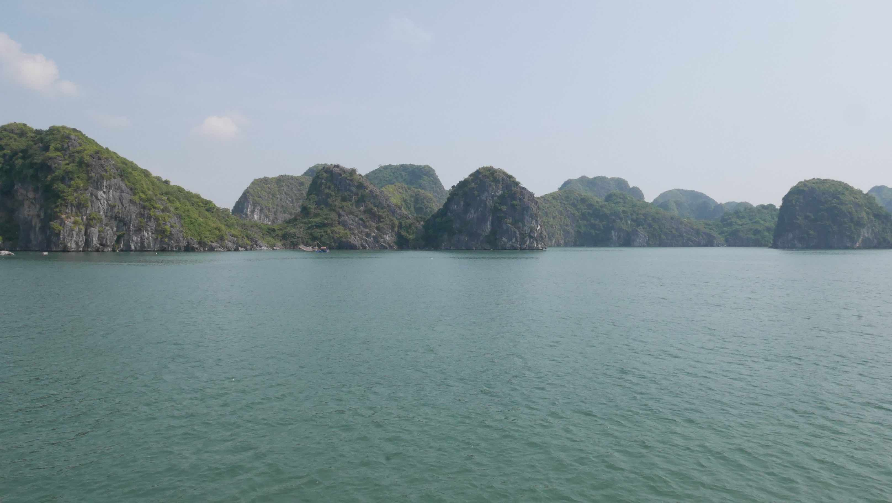</a>
	<figcaption>The beautiful karsts in Lan Ha Bay.</figcaption>
</figure>

<figure>
	<a href="../images/vietnam/catba/catba6.JPG">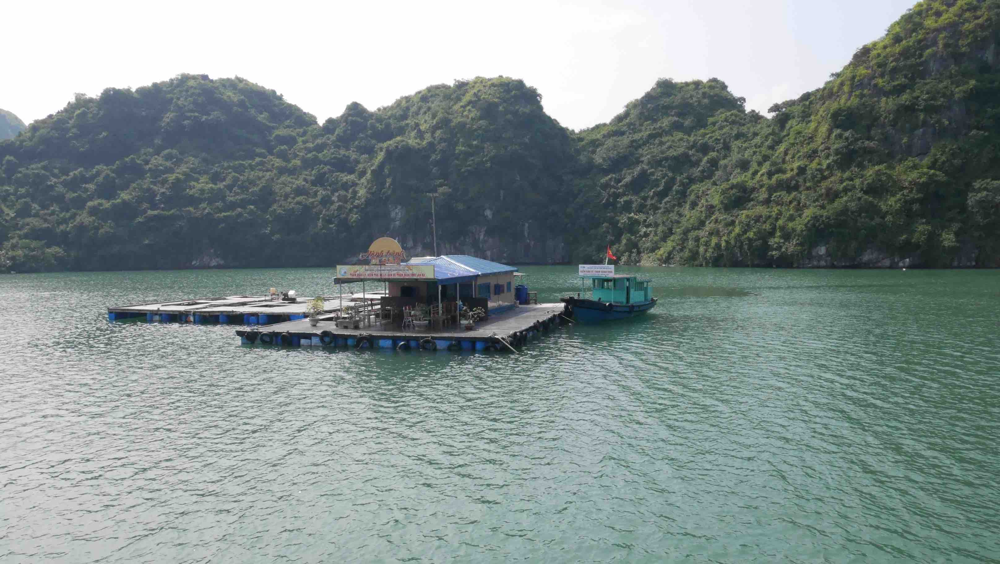</a>
	<figcaption>A small café/restaurant in the middle of Lan Ha Bay.</figcaption>
</figure>

<figure>
	<a href="../images/vietnam/catba/catba7.JPG">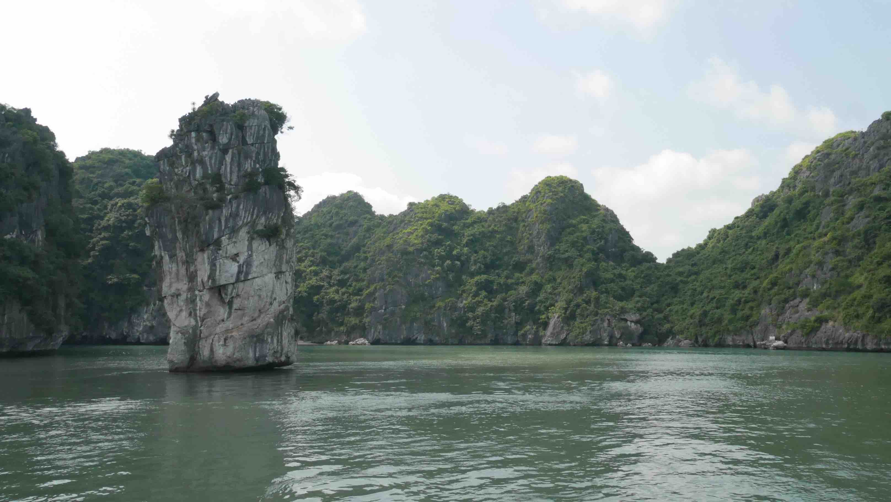</a>
	<figcaption>Simply breathtaking.</figcaption>
</figure>

<figure>
	<a href="../images/vietnam/catba/catba8.JPG">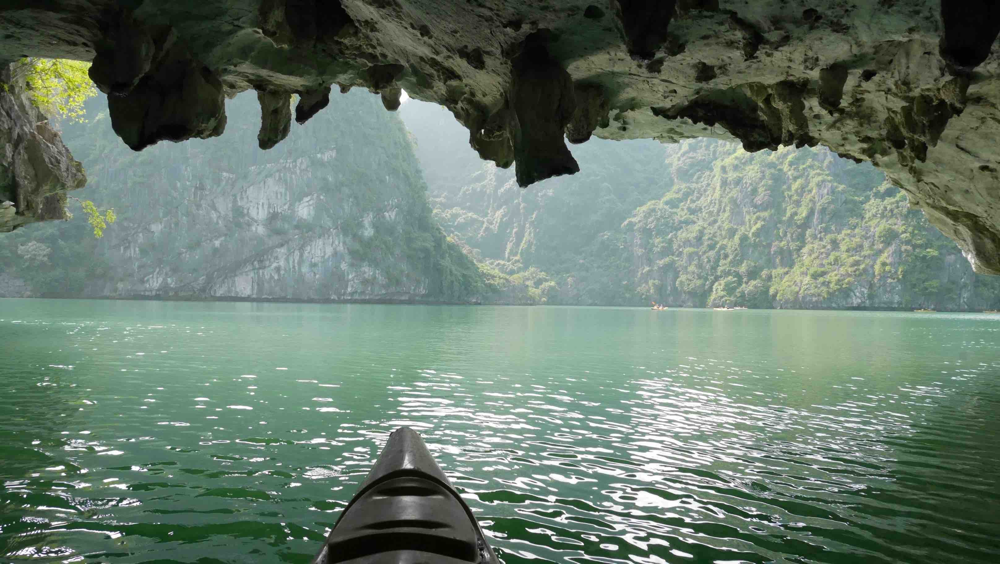</a>
	<figcaption>Feels amazing to kayak in these waters!</figcaption>
</figure>

<figure>
	<a href="../images/vietnam/catba/catba9.JPG">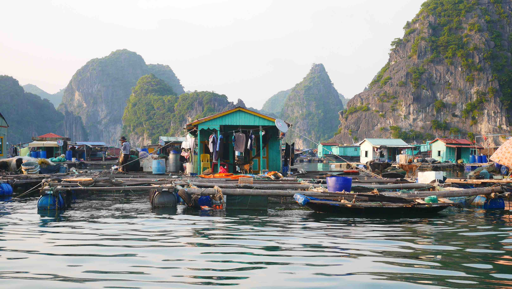</a>
	<figcaption>Fishing village on the waters of Lan Ha Bay.</figcaption>
</figure>

At the end of the day you will be exhausted but I can guarantee you that this will be totally worth it. When we got back we just relaxed a little bit before having dinner with the family that was running the hostel. The dinner was a good opportunity to chat and laugh with them despite the obvious linguistic barrier.

A really cool experience that I had was an English class that the local kids had with a Canadian girl that was volunteering in there. It was really nice to speak to 9-14 y/o kids and understand a little bit more about their culture and habits. I think they also enjoyed it due to the smiles and laughs being thrown all around!

We ended up spending another day in <b>Cát Bà</b> to explore the surroundings. If you're not used to ride a motorbike but want to, this is your best opportunity to do so. The traffic is almost non existent on the island and for <b>5$</b> you can rent the motorbike for the whole day. If you add <b>1-2$</b> for the Gasoline, you have a really good way to explore what otherwise you wouldn't be able to.
It was also my first time riding a motorbike. My other only experience was in <b><a href="{{site.url}}/Land-of-Smiles-4/" target="_blank">Bagan</a></b> in 2015 and it was an E-Bike which is a little bit different!

<b><highlight><middle>If you really want to explore any place in Vietnam by yourself, motorbike is your best option.</middle></highlight></b>

You don't need to worry about driver's license... Nobody will ever ask you for one.

<figure>
	<a href="../images/vietnam/catba/catba10.JPG">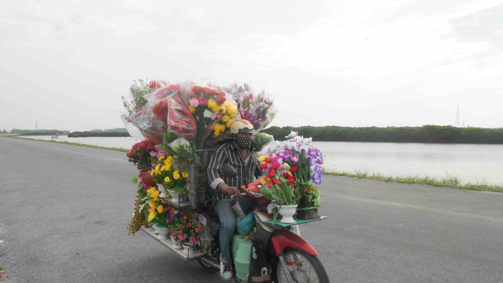</a>
	<figcaption>At least he is wearing helmet...</figcaption>
</figure>

Now that we had a motorbike for us, we could explore the island as we pleased. There are some places that are really far to get to without a motorbike, like the <b>Hospital Cave</b> and the <b>National Park</b>. We first visited the <b>Hospital Cave</b>, a secret bomb-proof hospital during the American War that was also used as a safe house for <b>Việt Cộng</b> leaders. In my opinion, this is <b>not really worth</b> to visit, because there's actually nothing to see inside besides empty chambers. It's a cool thing historically, but it's only that.

<figure>
	<a href="../images/vietnam/catba/catba11.JPG">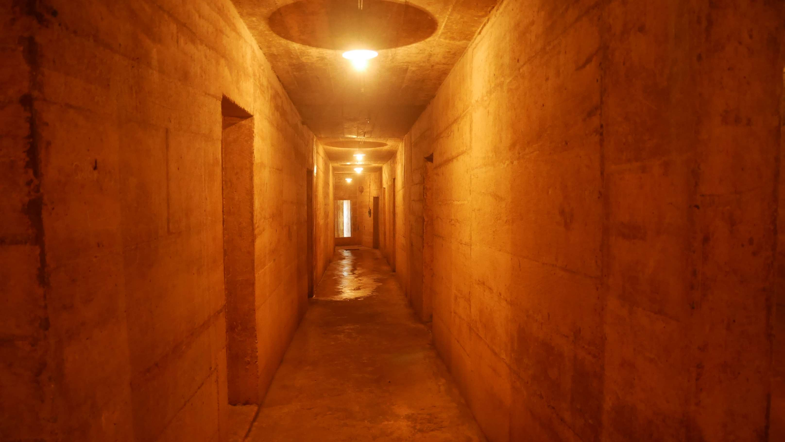</a>
	<figcaption>Inside the hospital cave.</figcaption>
</figure>

Now, the <b>National Park</b> is another story. This huge park has 109 km² of land area and an additional 52 km² of inshore waters and mangrove covered tidal zones. It is also the home to one of the most endangered primates in the world, the <b>Cat Ba Langur</b>. If you're up to a test of your endurance, I recommend you to climb to the highest point of this park. It is quite a hike, but I can guarantee you that it is totally worth it!

Other places that you can visit while on the island are the <b>3 beaches</b> near the town, the <b>Cannon Fort</b> for sunset, or simply <b>drive around</b> the island and contemplate the beautiful sights that I'm sure you'll have!

<figure>
	<a href="../images/vietnam/catba/catba12.JPG">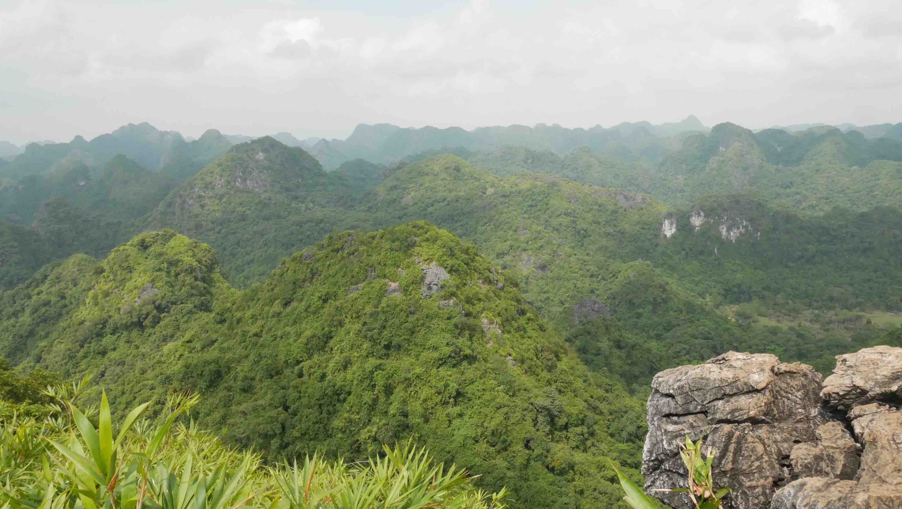</a>
	<figcaption>The view from the highest point in the National Park.</figcaption>
</figure>

<figure>
	<a href="../images/vietnam/catba/catba13.JPG">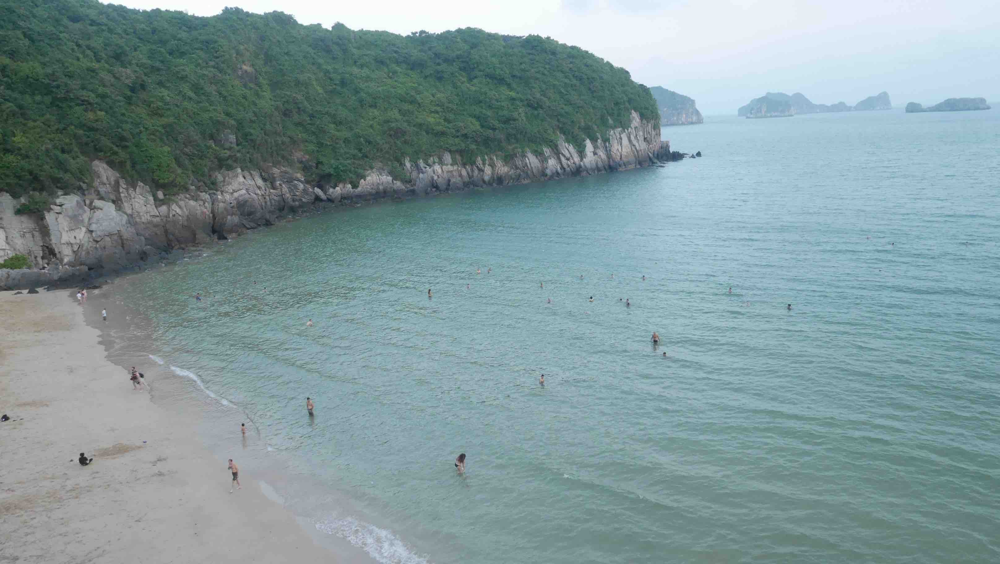</a>
	<figcaption>One of the beaches near town.</figcaption>
</figure>

 
<h1>How to get there and away</h1>
<ul>
<li>Arranged transportation from Hanoi Charming Hotel to Cat Ba island. It included a bus ride, a ferry and a final bus ride from the port to the village of Cat Ba.</li>
<li>Arranged transportation from Langur Hostel to <b><a href="{{site.url}}/TamCoc" target="_blank">Tam Coc</a></b>. It included a bus ride, a ferry and a final bus ride from the port to the city center of <b><a href="{{site.url}}/TamCoc" target="_blank">Tam Coc</a></b>.</li>
</ul>

 
<h1>What to do/see</h1>
<ul>
<li>Lan Han Bay.</li>
<li>Hospital Cave.</li>
<li>National Park.</li>
<li>Cannon Fort.</li>
<li>Beaches.</li>
</ul>

 
<h1>Where to sleep</h1>
<ul>
<li><b>Langur Hostel</b>. Really good service, nice room, good priced Lan Han tour and amazing family to welcome you.</li>
</ul>