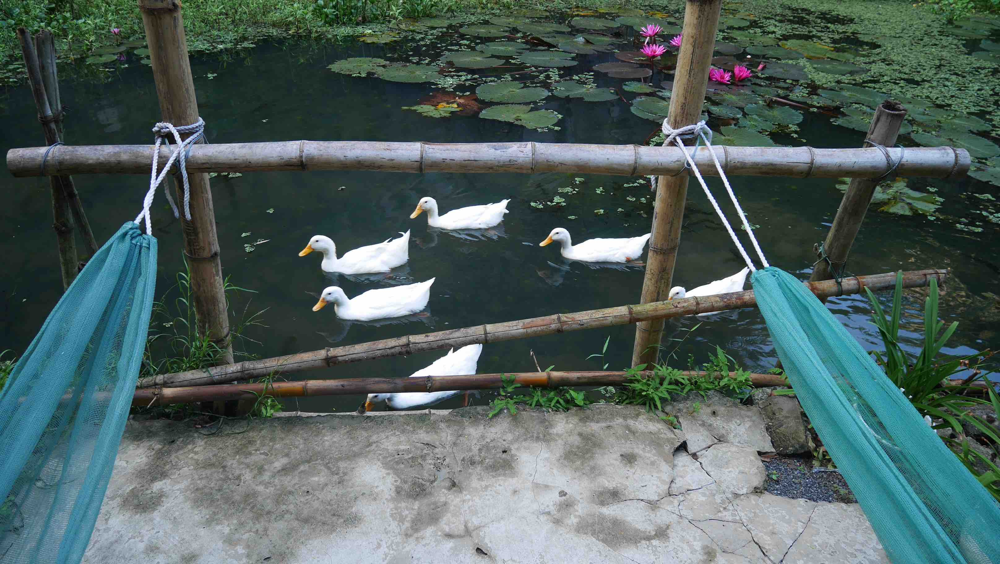

<b>Tam Coc</b> is best known for its boat rides between the cliffs of the river and through 3 tunnels dug by the river through the peaks. Usually tourists prefer to stay in <b>Ninh Binh</b> as it is bigger and has a wider range of options when it comes to accommodation and food, but after some consideration we decided to go straight to <b>Tam Coc</b> from <b><a href="{{site.url}}/CatBa" target="_blank">Cát Bà</a></b>, because we would be closer to the places we wanted to visit. However, if you decide to stay in <b>Ninh Binh</b> you'll only be 6km away, which is not really a big deal since you'll probably rent a scooter to move around anyway <i>(you really should!)</i>.

If you get to <b>Tam Coc</b> by bus, like we did, you'll most likely be left in front of the <b>Tamcoc Backpacker Hostel</b> near the lake. If you've travelled in this part of the world before, you'll be used to these <i>tricks</i> in order to get clients to sleep in places where some people have commissions. I don't trust them so I never stayed in those. If you want a really good Homestay for about ~18$ (double room) I can recommend <b>Chez Beo Homestay</b>, because that's where we stayed for the first 2 nights of our 3 in Tam Coc. This place is a little bit out of town, ~3km through some rice fields, but they have free bicycle retal to make up for it. The place is absolutely stunning, surrounded by huge karsts with a small lake where cute geese come to greet you in the morning! Free breakfast is included in the price, and their restaurant is also available for lunch or dinner.

<b><highlight><middle>The most beautiful place where I stayed in my 3 weeks in Vietnam.</middle></highlight></b>

<figure>
	
	<figcaption>Chez Beo Homestay at the end of the road!</figcaption>
</figure>

<figure>
	
	<figcaption>Good morning.</figcaption>
</figure>

<figure>
	
	<figcaption>Our cozy room.</figcaption>
</figure>

<figure>
	
	<figcaption>Our new neighborhood.</figcaption>
</figure>

The first thing that we decided to do, and probably the biggest reason why tourists come to <b>Tam Coc</b>, was to go to the famous boat rides, a very scenic activity through the beautiful karsts. We decided to skip the famous and touristy one in <b>Tam Coc</b> and headed to the less touristic one in <b>Trang An Grottoes</b>. You can find the place very easily if you go north on the main road. Maybe about ~6-7km from Tam Coc you'll find the place, you can't miss it. There will be restaurants and souvenir shops on the other side of the street.

<b><highlight><middle>If I could go back in time, I would not go there again.</middle></highlight></b>

When we got there, we had to wait for another couple because the boats only depart when they are full, unless you pay for the whole boat. Maybe we were just unlucky, but the couple that came with us was a little bit annoying, always in a rush at every stop we made. Sure, there are some nice sights, some beautiful caves and all, but after 30 minutes you've seen it all. I felt like being in a gigantic carousel, while the poor rower had to push us for the next 2 hours. You could clearly see that it is a hard job, and feel free to use the oars, they're available in the boat precisely for that purpose.

In October 2016 this ride was <b>150,000VND</b> per person.

<figure>
	
	<figcaption>This is where the Trang An Grottoes boat trip starts.</figcaption>
</figure>

<figure>
	
	<figcaption>These karsts look like the ones in <b><a href="{{site.url}}/CatBa" target="_blank">Cát Bà</a></b>.</figcaption>
</figure>

What I can really recommend though, is getting a bycicle and just get lost in the beautiful karsts and rice fields available near Tam Coc. You can combine this with some nice stops in the <b>Bich Dong Pagoda</b> or <b>Hang Mua Peak</b>, both easily acessible from Tam Coc center. Trust me, there isn't a lot of stuff to do in the Tam Coc center because it is really small, but I can guarantee you that if you just get a bicycle and get yourself lost you'll not regret. Just do like me, and as soon as you see a dirty small road, go for it. Get away from the concrete cement roads and be a little bit adventurous!

<b><highlight><middle>This bycicle adventures in Tam Coc remain as one of the best memories that I've of whole Vietnam!</middle></highlight></b>

In each site that you visit either by bycicle or motorbike you'll have to park it on the parking lot ran by a local guy. They're available at every entrance of every major monument. There isn't a regulated fee for it and the guy will ask you something between <b>1,000VND</b> and <b>10,000VND</b>.

<figure>
	
	<figcaption>If you can make friends along the way, just do it!</figcaption>
</figure>

<figure>
	
	<figcaption>The entrance to the Bich Dong Pagoda, just ~2km away from the Tam Coc center.</figcaption>
</figure>

If you decide to rent a motorbike, a nice but far (~20km away from Tam Coc) site that I can recommend you to visit, is the <b>Bai Dinh Temple</b>, the largest Buddhist complex in Vietnam. You'll not find many tourists there because it is far from the center of Tam Coc, but you'll not regret going there because the complex is huge!

<figure>
	
	<figcaption>In the Bai Dinh temple complex.</figcaption>
</figure>

<figure>
	
	<figcaption>Somewhere in the rice fields of Tam Coc.</figcaption>
</figure>

<figure>
	
	<figcaption>Get yourself lost!</figcaption>
</figure>

The other place where we stayed is called <b>Thai Thuong Hotel</b>, 15$ a night for a double, and is located ~1km from the Tam Coc center. This is a family run business with a lovely child to cheer you up every evening! They also serve lunch/dinner, but we seemed like the only ones using it. They are completely trustworthy, rented a motorbike for a fair price and also got us a train ticket from Ninh Binh to Hué. This is a convenient way to get to Hué because the train is <b>super</b> comfortable and you can sleep all night on your 4-bed carriage. The only downside is that it is far more expensive than the sleeping bus (almost double the price).

 
<h1>How to get there and away</h1>
<ul>
<li>Arranged transportation from Langur Hostel. It included a bus ride, a ferry and a final bus ride from the port to the city center of Tam Coc.</li>
<li>Train from Ninh Binh to <b><a href="{{site.url}}/Hue" target="_blank">Hué</a></b>.</li>
</ul>

 
<h1>What to do/see</h1>
<ul>
<li>Trang An Grottoes.</li>
<li>Bich Dong Pagoda.</li>
<li>Bai Dinh Temple.</li>
<li>Get a bycicle and get lost! It's the best way to explore Tam Coc, no doubt!</li>
</ul>

 
<h1>Where to sleep</h1>
<ul>
<li><b>Chez Beo Homestay</b>, 18$ for a double room. Free bike rental but a little bit far away from Tam Coc village center.</li>
<li><b>Thai Thuong Hotel</b> 15$. Family run place with restaurant service and ticket booking.</li>
</ul>