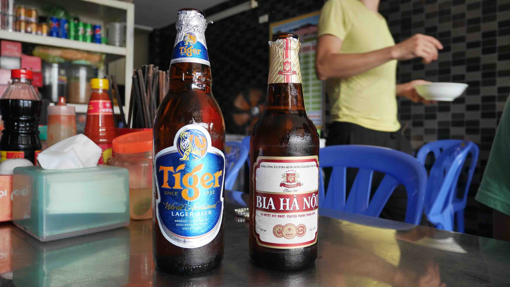

<b>Tam Coc</b> is best known for its boat rides between the cliffs of the river and through 3 tunnels dug by the river through the peaks. Usually tourists prefer to stay in <b>Ninh Binh</b> as it is bigger and has a wider range of options when it comes to accommodation and food, but after some thought we decided to go straight to <b>Tam Coc</b> from <b><a href="{{site.url}}/CatBa" target="_blank">Cát Bà</a></b>, because we would be closer to the places we wanted to visit. However, if you decide to stay in <b>Ninh Binh</b> you'll only be 6km away, which is not really a big deal since you'll probably rent a scooter to move around <i>(you really should!)</i>.

If you get to <b>Tam Coc</b> by bus, like we did, you'll most likely be left in front of the <b>Tamcoc Backpacker Hostel</b> near the lake. If you've travelled in this part of the world before, you'll be used to these <i>tricks</i> in order to get clients to sleep in commissioned places. I don't trust these kind of places so I never stayed in one of them. If you want a really good homestay for about ~18$

<figure>
	
	<figcaption>Refreshing break on our arrival!</figcaption>
</figure>

<b><highlight><middle>This 8 hour boat ride in Lan Ha Bay costed us ~15$ per person, all included.</middle></highlight></b>

 
<h1>How to get there and away</h1>
<ul>
<li>Arranged transportation from Langur Hostel. It included a bus ride, a ferry and a final bus ride from the port to the city center of Tam Coc.</li>
<li>Train to Hué.</li>
</ul>

 
<h1>What to do/see</h1>
<ul>
<li>Lan Han Bay.</li>
</ul>

 
<h1>Where to sleep</h1>
<ul>
<li><b>Chez Beo Homestay</b> 18$.</li>
<li><b>Thai Thuong Hotel</b> 15$.</li>
</ul>