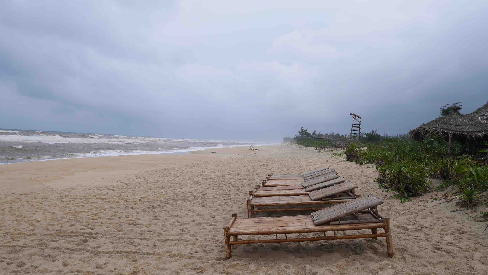

I arrived by train in <b>Hué</b> after my amazing journey in <b><a href="{{site.url}}/TamCoc" target="_blank">Tam Coc</a></b>. It was the only time that I travelled by night train in Vietnam and I must confess that the train is <b>very very</b> comfortable with a bed/sheets/pillow available. My cabin was for 4 people. It is quite expensive when compared with bus tough, almost double the price so the next night trips I decided to do them by bus despite all the fuzz about being dangerous. I was never afraid during any trip.

From the train station to the <b>Thanh An Guesthouse</b> it was only ~2km, so I decided to walk. The Guesthouse is located in a small alley in <i>Ngô Quyên</i> street and is one of the cheapest options in <b>Hué</b>. The location is good (just ~1.5km from the <b>Hué Citadel</b>), there is free coffee and bananas available at all times, motorbike rental and the receptionist could speak a very understandable English.

<b><highlight><middle>For the price I paid, 6$ for a double, I don't think that you can get any better in Hué.</middle></highlight></b>

<figure>
	
	<figcaption>The entrance to the Citadel.</figcaption>
</figure>

After I dropped my backpack at the Guesthouse, I went right away to the <b>Hué Citadel</b>, the major touristic attraction of Hué. It is the former imperial seat of government, consisting of temples, pavilions, gates, shops and galleries, featuring art and costumes from various periods of Vietnamese history. This complex is <b>huge</b>, so allow at least 2-3 hours to fully enjoy everything inside. The entrance fee is 150 000 Dong (~6$) per person.

The citadel was badly knocked about during various wars including the American one, and as a result some areas are now only empty fields. The were some buildings being restored at that time (it seems like this is going on for the last 20 years), but the ones available to visit are really beautiful.

<figure>
	
	<figcaption>Rehearsal for some show.</figcaption>
</figure>

<figure>
	
	<figcaption>Beautiful imperial art of the citadel.</figcaption>
</figure>

<figure>
	
	<figcaption>A chinese gate.</figcaption>
</figure>

<figure>
	
	<figcaption>Amazing and beautiful.</figcaption>
</figure>

After you visit the Imperial Citadel, another big tourist attraction in Hué is the Emperors Tombs located along the <b>Perfume River</b> south of the city. The tombs date from the late 19th century, when the Emperors had been reduces to figureheads under French colonial rule. I didn't go there because the effort to get there and honestly it didn't mean anything to me, so I ended up skipping it. Bear in mind that the Tombs are <b>not</b> located next to each other, meaning that you can't walk between them, and the entrance fee for each one ranges between <i>40.000VND</i> and <i>100.000VND</i> (1.5€-4€).

My second day in Hué was spent exploring the surroundings with a motorbike that I rented in my Guest House. Hué is a more challenging place to ride a motorbike due to the increased traffic (I had only experienced driving in <b><a href="{{site.url}}/CatBa" target="_blank">Cát Bà</a></b> and <b><a href="{{site.url}}/TamCoc" target="_blank">Tam Coc</a></b>, two places that are way easier to drive in...). I drove to the <b>Thuan An Beach</b>, located 15km north from Hué, but I didn't have any luck with the weather because it started raining, so I had to stop a lot of times. Also, it is never fun going to the beach in the rain despite the 30ºC, right?

<figure>
	
	<figcaption>A Vietnamese cemetery near Thuan An Beach.</figcaption>
</figure>

<figure>
	
	<figcaption>Lost in a local village.</figcaption>
</figure>

<figure>
	
	<figcaption>As you can see, the beach was not very pleasant.</figcaption>
</figure>

One last thing that I recommend you to visit in Hué is the <b>Thien Mu Pagoda</b>, located 4km away from the city center, on the other side of the Perfume river. The name of this Pagoda means <i>"elderly celestial woman"</i>, and refers to an old legend about the founding of the pagoda. It's also the unofficial symbol of the city.

<figure>
	
	<figcaption>The Thien Mu Pagoda.</figcaption>
</figure>

Overall Hué is a nice stop for 1/2 days but only if you have the time available for that. If you're coming from <b><a href="{{site.url}}/TamCoc" target="_blank">Tam Coc/Ninh Binh</a></b> and going to <b><a href="{{site.url}}/HoiAn" target="_blank">Hội An</a></b>, then you should stop in Hué, but with time constraints I would go directly to <b><a href="{{site.url}}/HoiAn" target="_blank">Hội An</a></b>.

 
<h1>How to get there and away</h1>
<ul>
<li>Train from <b><a href="{{site.url}}/TamCoc" target="_blank">Ninh Binh</a></b> to Hué.</li>
<li>Arranged transportation from our Guest House to <b><a href="{{site.url}}/HoiAn" target="_blank">Hội An</a></b> (~4 hour bus).</li>
</ul>

 
<h1>What to do/see</h1>
<ul>
<li>Imperial Citadel.</li>
<li>Emperors Tombs.</li>
<li>Thien Mu Pagoda.</li>
<li>Thuan An Beach</li>
</ul>

 
<h1>Where to sleep</h1>
<ul>
<li><b>Thanh An Guesthouse</b>, 6$ for a double room, a very nice receptionist and very reliable for transportation. For what you pay you get amazing value.</li>
</ul>