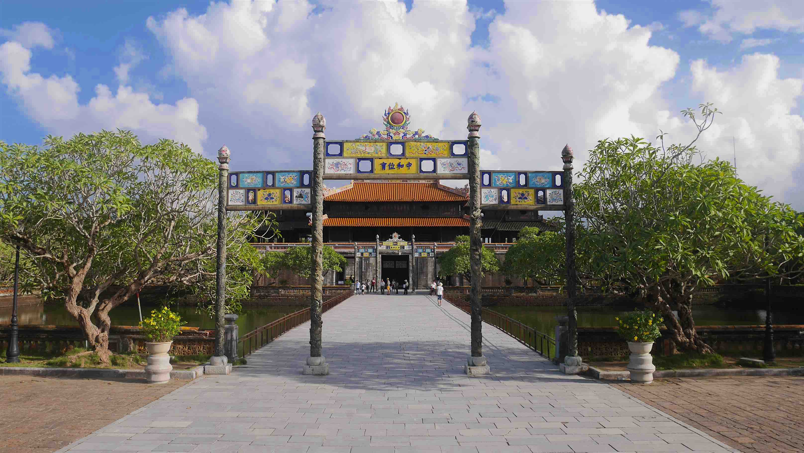
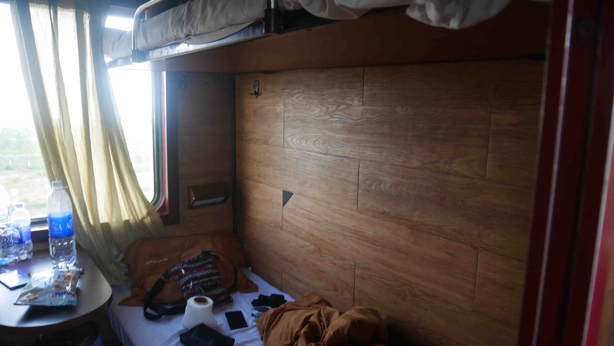
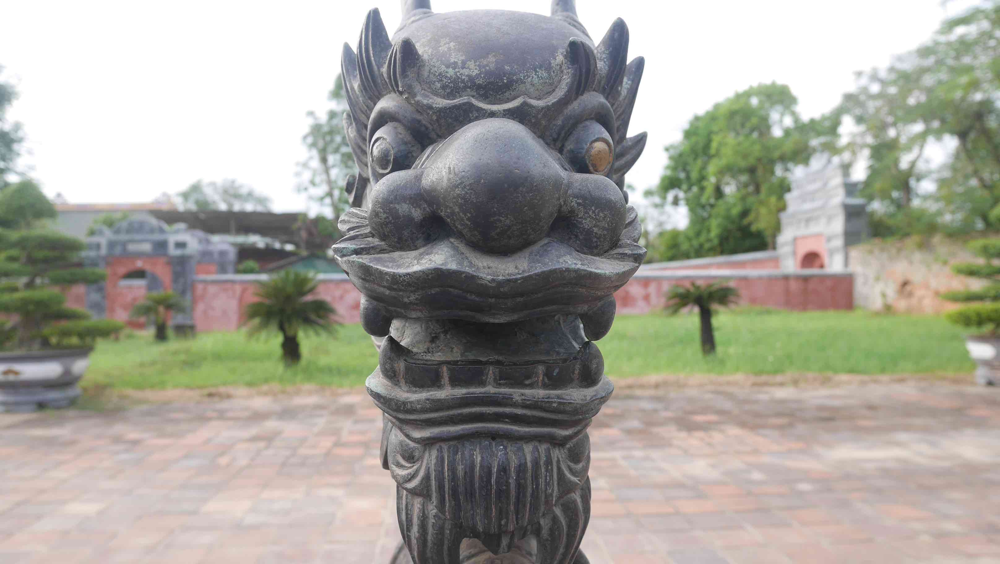
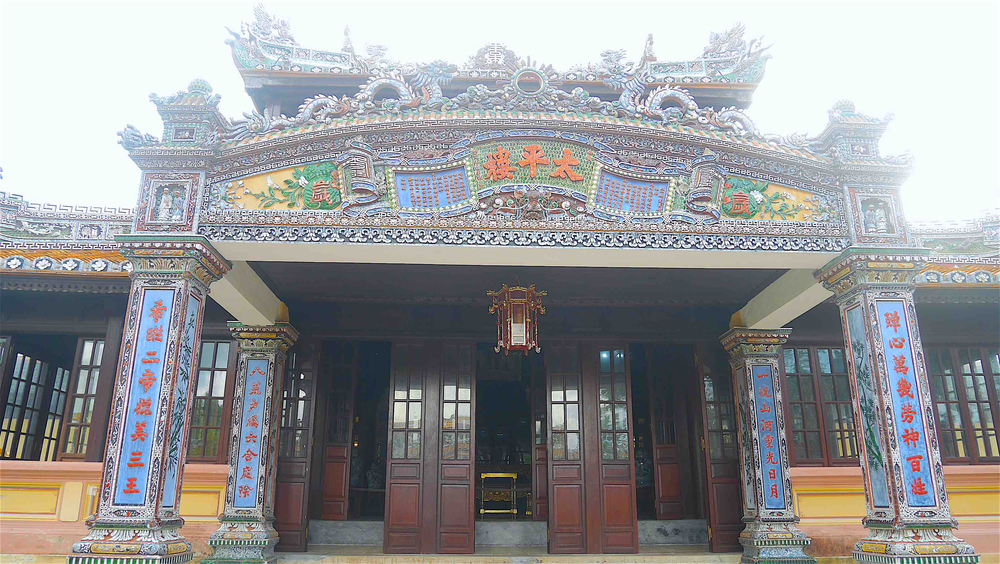
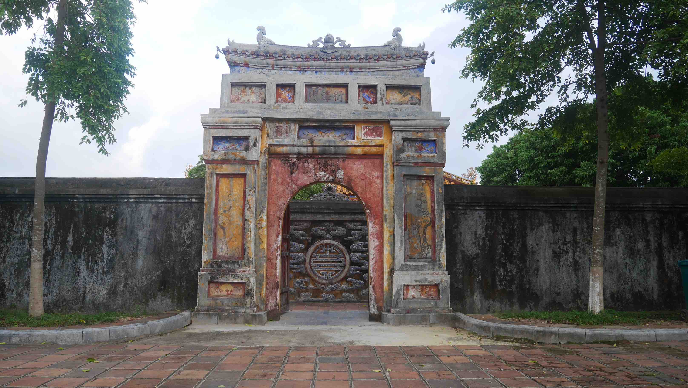

I arrived by train in <b>Hué</b> after my amazing journey in <b><a href="{{site.url}}/TamCoc" target="_blank">Tam Coc</a></b>. It was the only time that I travelled by night train in Vietnam and I must confess that the train is <b>very very</b> comfortable with a bed/sheets/pillow available. My cabin was for 4 people. It is quite expensive when compared with bus tough, almost double the price so the next night trips I decided to do them by bus despite all the fuzz about being dangerous. I was never afraid during any trip.

From the train station to the <b>Thanh An Guesthouse</b> it was only ~2km, so I decided to walk. The Guesthouse is located in a small alley in <i>Ngô Quyên</i> street and is one of the cheapest options in <b>Hué</b>. The location is good (just ~1.5km from the <b>Hué Citadel</b>), there is free coffee and bananas available at all times, motorbike rental and the receptionist could speak a very understandable English.

<b><highlight><middle>For the price I paid, 6$ for a double, I don't think that you can get any better in Hué.</middle></highlight></b>

<figure>
	
	<figcaption>The entrance to the Citadel.</figcaption>
</figure>

After leaving my backpack at the Guesthouse, I went right away to the <b>Hué Citadel</b>, the major touristic attraction of Hué. It is the former imperial seat of government, consisting of temples, pavilions, gates, shops and galleries, featuring art and costumes from various periods of Vietnamese history. This complex is <b>huge</b>, so allow at least 2-3 hours to fully enjoy everything inside. The entrance fee is 150 000 Dong (~6$) per person.

The citadel was badly knocked about during various wars including the American one, and as a result some areas are now only empty fields. The were some buildings being restored at that time (it seems like this is going on for the last 20 years), but the ones available to visit are really beautiful.

<figure>
	
	<figcaption>Rehearsal for some show.</figcaption>
</figure>

<figure>
	
	<figcaption>Beautiful imperial art of the citadel.</figcaption>
</figure>

<figure>
	
	<figcaption>A chinese gate.</figcaption>
</figure>

<figure>
	
	<figcaption>Amazing and beautiful.</figcaption>
</figure>

 
<h1>How to get there and away</h1>
<ul>
<li>Train from Ninh Binh to Hué.</li>
<li>Arranged transportation from our hotel to Hoi An.</li>
</ul>

 
<h1>What to do/see</h1>
<ul>
<li>Trang An Grottoes.</li>
<li>Bich Dong Pagoda.</li>
<li>Bai Dinh Temple.</li>
<li>Get a bycicle and get lost! It's the best way to explore Tam Coc, no doubt!</li>
</ul>

 
<h1>Where to sleep</h1>
<ul>
<li><b>Thanh An Guesthouse</b>, 6$ for a double room.</li>
</ul>