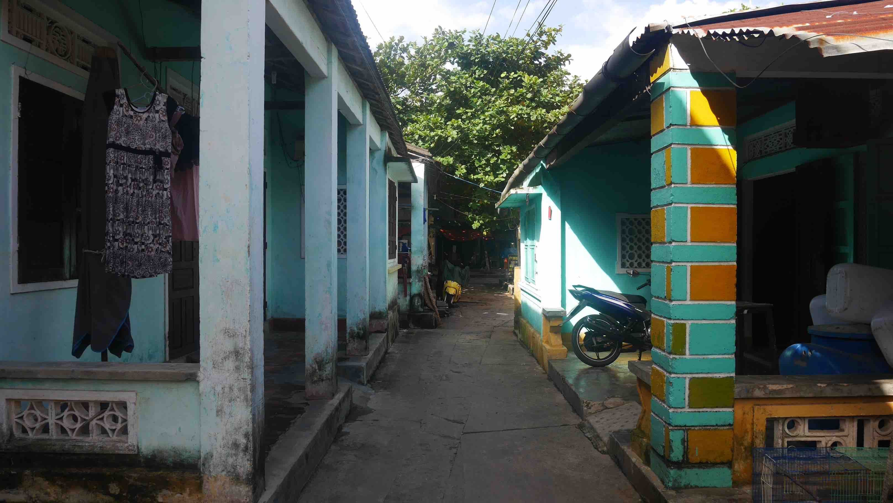

Hội An is a trully beautiful city. The Old Town is very well preserved when compared to the rest of Vietnam, and has a really nice atmosphere in the evening/night because of all the lights scattered along the winding lanes. Although now all the shops cater to tourists, their architecture has been preserved, which granted the status of <b>UNESCO World Heritage Site</b> to the town since 1999.

The bus ride from <b><a href="{{site.url}}/Hue" target="_blank">Hué</a></b> to Hội An should take about 4 hours and that is how I got there. The only problem was that it started to rain <b>a lot</b>, which made me look into the weather forecast for the next few days, and it was supposed to rain on the next 5/6 days...

<figure>
	
	<figcaption>On my way to Hội An.</figcaption>
</figure>

I ended up staying for X days, but I feel I spent 1/2 days too much mainly because of the rain. I stayed in <b>Homeland River Homestay</b> for X€ double room. It has free bicycle rental and is located on the <b>Cẩm Nam</b> island which is right across the river from the Old Town. This area is very calm but there isn't much happening there, so if you want to eat/buy something (and you will), you always have to cross the river.

To enter most of the main attractions in the Old Town you require a <i>ticket</i>, which is sold in strategic access points like bridges. Now comes the tricky part. Don't believe anyone trying to tell you that you need to buy the ticket to walk the streets. If you want to cross the <b>Japanese Covered Bridge</b> you need a ticket, but if you don't want to pay for it you can always use the nearby footway on the waterfront.

<b><highlight><middle>If you don't want to contribute for the "<i>it is ok to rip off the tourist</i>" attitude, just ignore everyone that says you need a ticket for the Old Town. You certainly don't need one.</middle></highlight></b>

In my X days in town I was only asked about the ticket once, on an small alley that leads to the riverside. Since I was aware of this and didn't have one, I just turned back and continued by an alternate alley.

<figure>
	
	<figcaption>The famous Japanese Covered Bridge.</figcaption>
</figure>

<figure>
	
	<figcaption>A small alley somewhere in Old Town.</figcaption>
</figure>

If you want to do some shopping I think that Hội An presents to you the most diverse shops you can find, from custom made suits to old communist propaganda. Just be aware on the quality of the products because when there is a lot of offer that usually means that sometimes their quality is a bit dubious.

In case you want to eat/drink cheaply I recommend you to go to the island on the other side of the bridge near the Japanese Covered Bridge. You can find <b>Bia hơi</b> (beer brewed daily and matured for a short period) for only 4 000VND (about .15 cents). This is where you can also find some <b>cooking classes</b>, another popular activity in Hội An that happens on a daily basis. The other cheap option, and the one I used the most, is to eat in the central market, where you have a big offer of food at very reasonable prices (1-2€).

<b><highlight><middle>However, the best thing to do in Hội An is just to walk around town at night.</middle></highlight></b>

 
<h1>How to get there and away</h1>
<ul>
<li>Bus from <b><a href="{{site.url}}/Hue" target="_blank">Hué</a></b> to Hội An.</li>
<li>Arranged transportation from our Guest House to Dalat.</li>
</ul>

 
<h1>What to do/see</h1>
<ul>
<li>Old Town.</li>
<li>Do some shopping from custom made suits to old communist propaganda.</li>
</ul>

 
<h1>Where to sleep</h1>
<ul>
<li><b>Thanh An Guesthouse</b>, 6$ for a double room, a very nice receptionist and very reliable for transportation. For what you pay you get amazing value.</li>
</ul>