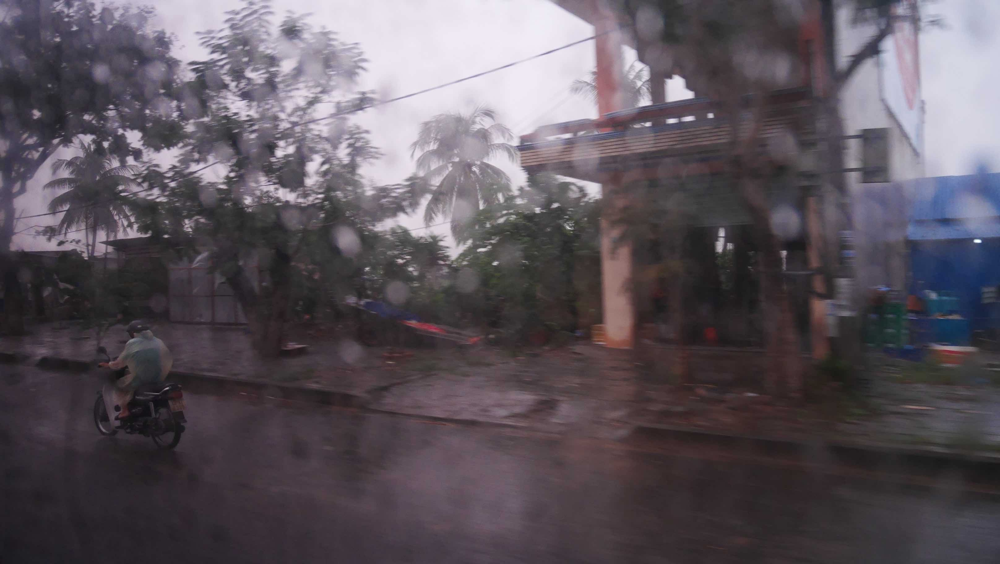
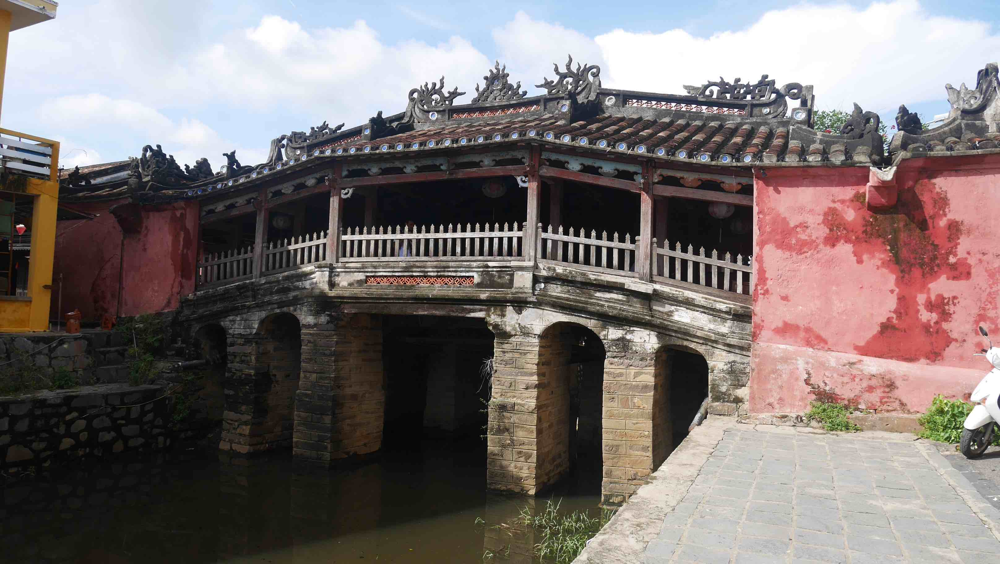

Hội An is a trully beautiful city. The Old Town is very well preserved when compared to the rest of Vietnam, and has a really nice atmosphere in the evening/night because of all the lights scattered along the winding lanes. Although now all the shops cater to tourists, their architecture has been preserved, which granted the status of <b>UNESCO World Heritage Site</b> to the town since 1999.

The bus ride from <b><a href="{{site.url}}/Hue" target="_blank">Hué</a></b> to Hội An should take about 4 hours and that is how I got there. The only problem was that it started to rain <b>a lot</b>, which made me look into the weather forecast for the next few days, and it was supposed to rain on the next 5/6 days...

<figure>
	
	<figcaption>On my way to Hội An.</figcaption>
</figure>

I ended up staying for X days, but I feel I spent 1/2 days too much mainly because of the rain. I slept in <b>Homeland River Homestay</b> for about X€ double room. It has free bicycle rental and is located on the <b>Cẩm Nam</b> island which is right across the river from the Old Town. This area is very calm but there isn't much going on, so if you want to eat/buy something (and you will), you always have to cross the river.

<figure>
	
	<figcaption>CAPTION.</figcaption>
</figure>

<b><highlight><middle>For the price I paid, 6$ for a double, I don't think that you can get any better in Hué.</middle></highlight></b>

 
<h1>How to get there and away</h1>
<ul>
<li>Bus from <b><a href="{{site.url}}/Hue" target="_blank">Hué</a></b> to Hội An.</li>
<li>Arranged transportation from our Guest House to Dalat.</li>
</ul>

 
<h1>What to do/see</h1>
<ul>
<li>Imperial Citadel.</li>
<li>Emperors Tombs.</li>
<li>Thien Mu Pagoda.</li>
<li>Thuan An Beach</li>
</ul>

 
<h1>Where to sleep</h1>
<ul>
<li><b>Thanh An Guesthouse</b>, 6$ for a double room, a very nice receptionist and very reliable for transportation. For what you pay you get amazing value.</li>
</ul>