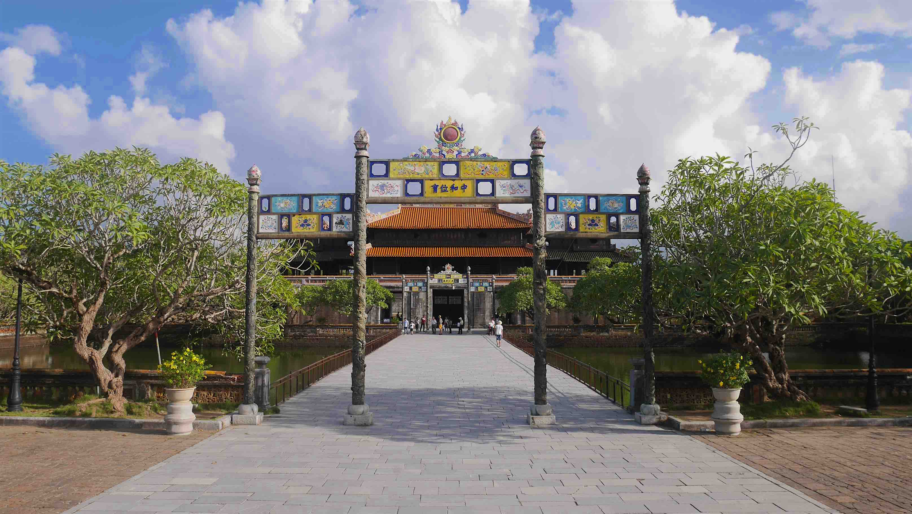

I arrived by train in <b>Hué</b> after my amazing journey in <b><a href="{{site.url}}/TamCoc" target="_blank">Tam Coc</a></b>.
<b><highlight><middle>For the price I paid, 6$ for a double, I don't think that you can get any better in Hué.</middle></highlight></b>

<figure>
	
	<figcaption>The entrance to the Citadel.</figcaption>
</figure>

 
<h1>How to get there and away</h1>
<ul>
<li>Train from <b><a href="{{site.url}}/TamCoc" target="_blank">Ninh Binh</a></b> to Hué.</li>
<li>Arranged transportation from our Guest House to Hoi An (~4 hour bus).</li>
</ul>

 
<h1>What to do/see</h1>
<ul>
<li>Imperial Citadel.</li>
<li>Emperors Tombs.</li>
<li>Thien Mu Pagoda.</li>
<li>Thuan An Beach</li>
</ul>

 
<h1>Where to sleep</h1>
<ul>
<li><b>Thanh An Guesthouse</b>, 6$ for a double room, a very nice receptionist and very reliable for transportation. For what you pay you get amazing value.</li>
</ul>