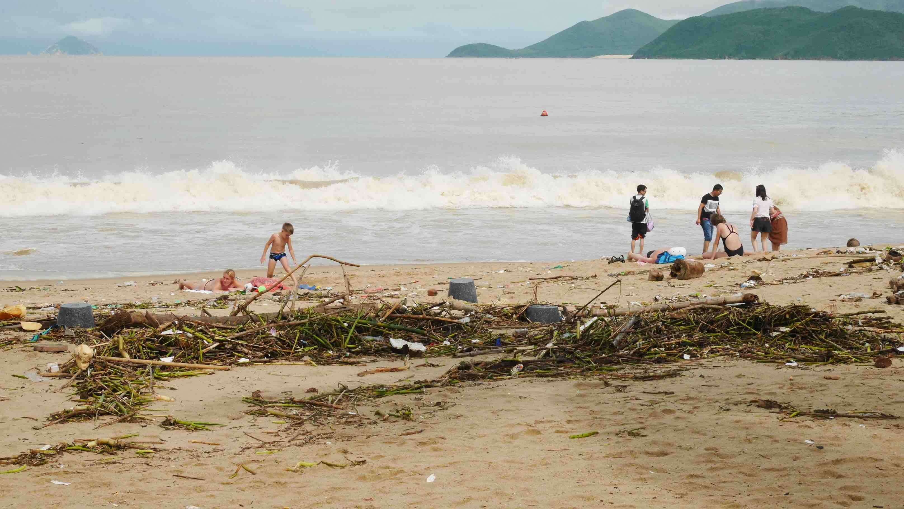
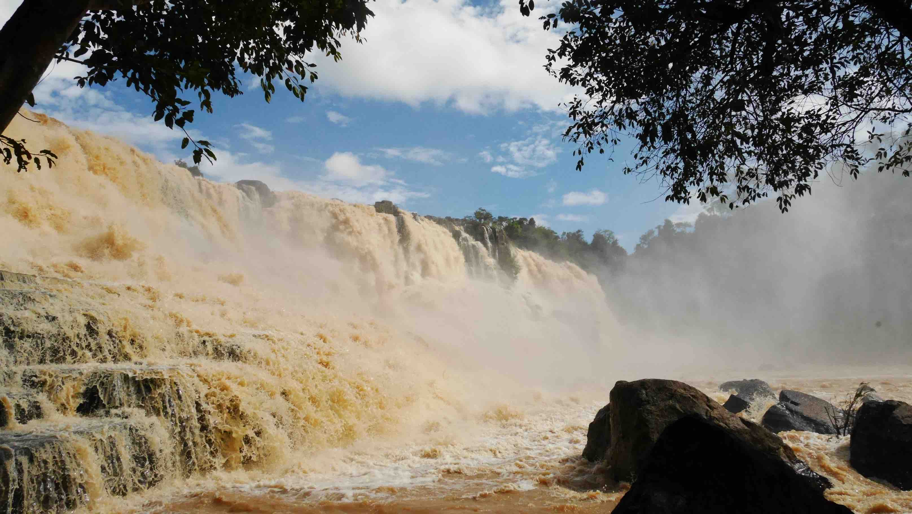
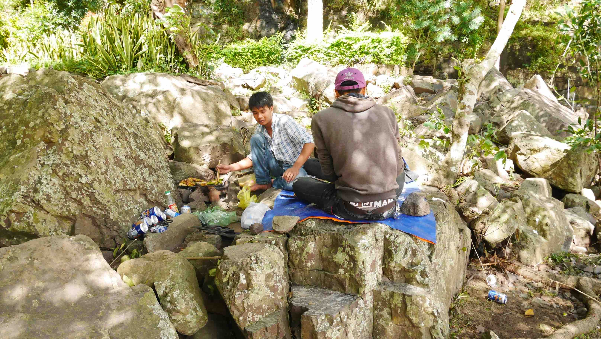
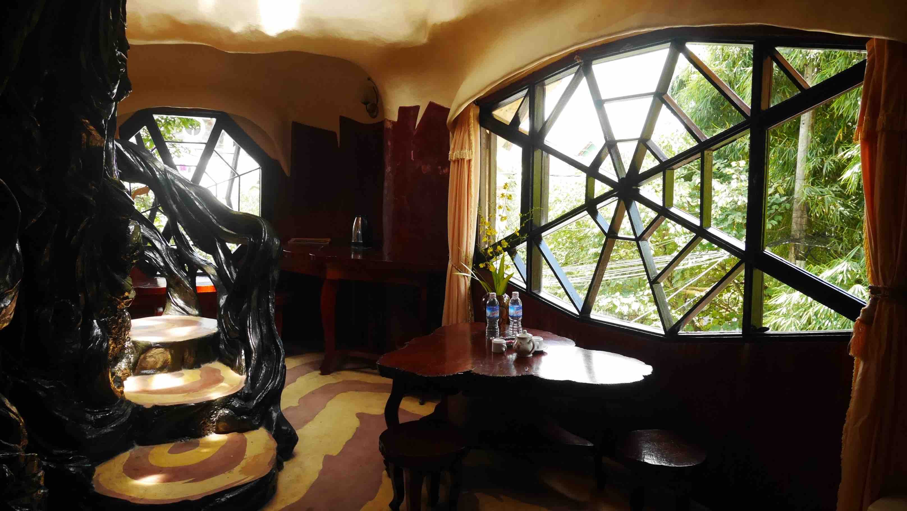
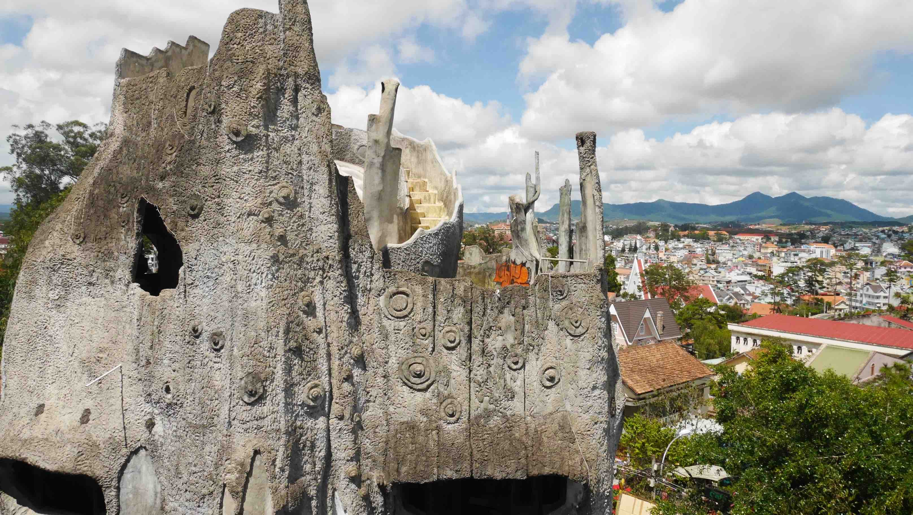
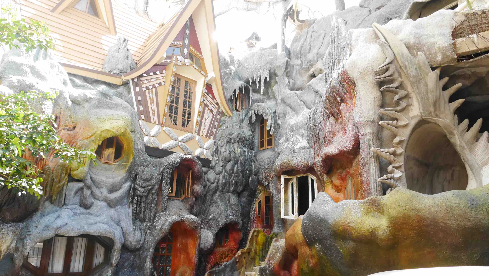
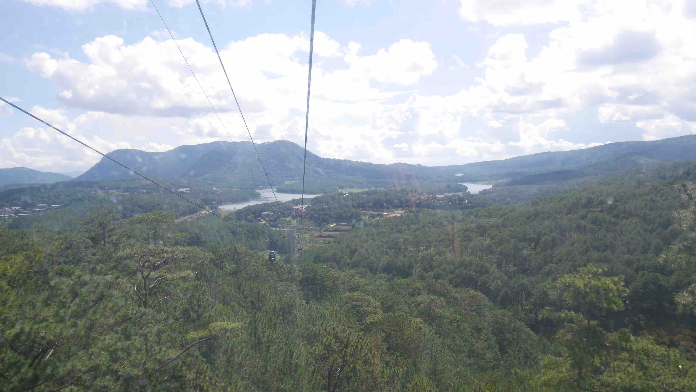
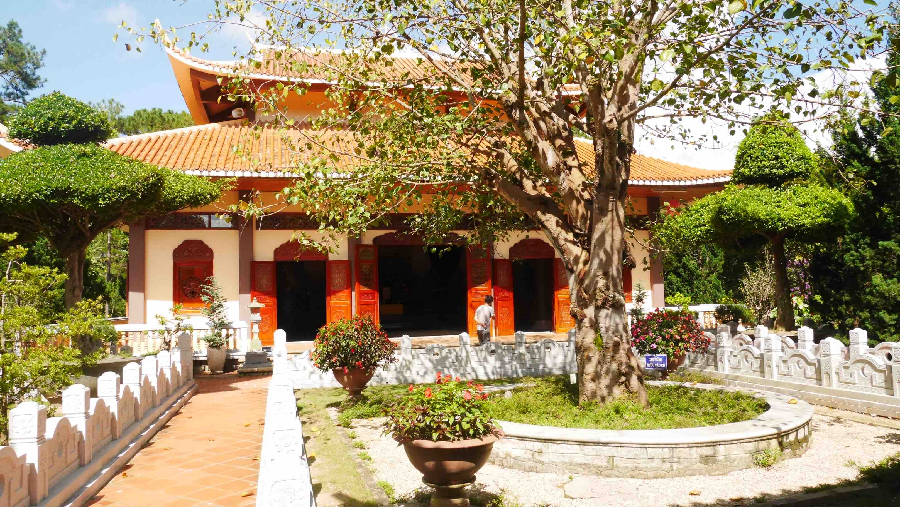

I actually didn't go directly from <b><a href="{{site.url}}/HoiAn" target="_blank">Hội An</a></b> to Đà Lạt because I did a quick stop (1 night) in <b>Nha Trang</b>. However, I will not make a post about the city because I don't think it is worth it. Nha Trang is flooded with Russian tourists and even the restaurant's menu has a page written in Russian, something very unique that I only saw here.

The place I stayed in was a little bit shady to say the least. We were moved to the hotel in front of the one we booked in and our booking was canceled because we <i>"didn't show up"</i> (this way we can't make a review on the website). However, their transportation to Đà Lạt was spot on.

The beach is what makes Nha Trang a tourist destination. But when I was there, well... I'll just leave this here:

<figure>
	
	<figcaption>The beach in Nha Trang isn't what I expected.</figcaption>
</figure>

Needless to say that I was out of there the next morning.

The ride from Nha Trang to Đà Lạt takes approximately 3-4 hours and the bus will leave you in downtown. From there we just walked to <b>Nguyen Minh Hostel</b> where we ended up staying for 2 nights. A cheap place (10$ double bed with breakfast) that had the most <i>painful</i> bed ever.

Đà Lạt is a big draw for domestic tourists, because of its French influenced architecture, and it is a well known destination for honeymoons. <i>Le Petit Paris</i> it is called, although I'm not sure that you can call this place a romantic destination, at least by European standards. The city centre is quite small, feels very urban, and some buildings are in disrepair. However, if you move a little away from the centre you'll find spacious landscapes, coffee plantations, waterfalls etc.

<figure>
	
	<figcaption>Đà Lạt seen from above.</figcaption>
</figure>

One can easily spend 2-3 days exploring the town and its surroundings. It is somewhat refreshing from all the hot weather felt in Vietnam due to its altitude. A cool thing that you can do is rent a scooter and go exploring the falls 30km south and west of Đà Lạt. On your way to the <b>Pongour Falls</b> or the <b>Elephant Fall</b> you can make a quick stop on the <b>Prenn Falls</b> just outside town on Highway 20.

The <b>Pongour Falls</b> are the ones worth visiting. Due to the rain of the past days (I got some during my time in <b><a href="{{site.url}}/HoiAn" target="_blank">Hội An</a></b>), the water flow on the waterfall was huge and the whole scenery was quite powerful. Don't rush things and just enjoy the scenery! If you want, you can bring your lunch and have it there like some local people were doing, although you have some really good <b>Bánh Mì</b> (typical Vietnamese sandwich) in the last shack right before reaching the waterfall.

<figure>
	
	<figcaption>The <b>Pongour Falls</b> after a few days of rain.</figcaption>
</figure>

<figure>
	
	<figcaption>People enjoying lunch over the waterfall.</figcaption>
</figure>

On your way to/from the waterfalls you'll see tons of beautiful landscapes, including numerous coffee plantations. What do their coffee is different from the ones you can find anywhere around the world? Well, they are part-digested coffee cherries eaten and defecated by <b>Weasels</b>! If you have the time you should stop here, enjoy your view and have some coffee!

<b><highlight><middle>It is said that this coffee is the most expensive in the world.</middle></highlight></b>

<figure>
	
	<figcaption>The coffee plantation.</figcaption>
</figure>

Now that you have explored the surroundings of Đà Lạt, you should visit at least 2 places in town before you move on. One of them is the <b>Hằng Nga</b> also known as the <b>Crazy House</b> (it also works as a Guest House). Its architecture, comprising complex, organic, non-rectilinear shapes, has been described as expressionist and its architect has admitted that his work was inspired by the work of <b>Antoni Gaudí</b> the famous Catalan architect.

Also in town, accessible by a 5-10 minute cable ride, you can visit a Zen Buddhist temple called <b>Trúc Lâm Temple</b>. The temple has a magnificent view over the dams below and its gardens are very well preserved.

<figure>
	
	<figcaption>A room inside the Crazy House.</figcaption>
</figure>

<figure>
	
	<figcaption>The top of the building with a stunning view to the city.</figcaption>
</figure>

<figure>
	
	<figcaption>The details are stunning.</figcaption>
</figure>

<figure>
	
	<figcaption>The cable ride is not for the faint-hearted, although the view is amazing.</figcaption>
</figure>

<figure>
	
	<figcaption>The Trúc Lâm Temple.</figcaption>
</figure>

If you want to eat cheaply in town I have 2 places that I can recommend. One of them, and the most obvious one, is the central market that happens every day in downtown. The other one is right across the street of my Hostel (Nguyen Minh Hostel) and its called <b>Thien Tam 5 Vegetarian Restaurant</b>, a vegetarian place that is run by an ex Monk that serves <b>really</b> good food for as low as .50 cents.

I got a night bus directly to <b>Ho Chi Minh City (Saigon)</b> arranged by my Hostel, a trip that took ~7 hours. To wrap things up, I think that if you've a limited amount of time you are better of not stopping in Đà Lạt, however if you have 2 days to spare it becomes a nice stop between <b>Ho Chi Minh City / Hoi An</b>.

 
<h1>How to get there and away</h1>
<ul>
<li>Bus from <b><a href="{{site.url}}/HoiAn" target="_blank">Hội An</a></b> (arranged by our Guest House) to Đà Lạt.</li>
<li>Night Bus to Ho Chi Minh City arranged by our Hostel.</li>
</ul>

 
<h1>What to do/see</h1>
<ul>
<li>Waterfalls (Prenn/Pongour/Elephant).</li>
<li>Hằng Nga (Crazy House).</li>
<li>Coffee plantation.</li>
<li>Trúc Lâm Temple.</li>
</ul>

 
<h1>Where to sleep</h1>
<ul>
<li><b>Nguyen Minh Hostel</b>, 10$ for a double bed with breakfast included. I used their scooter rental and did my laundry with them, and both were spot on.</li>
</ul>