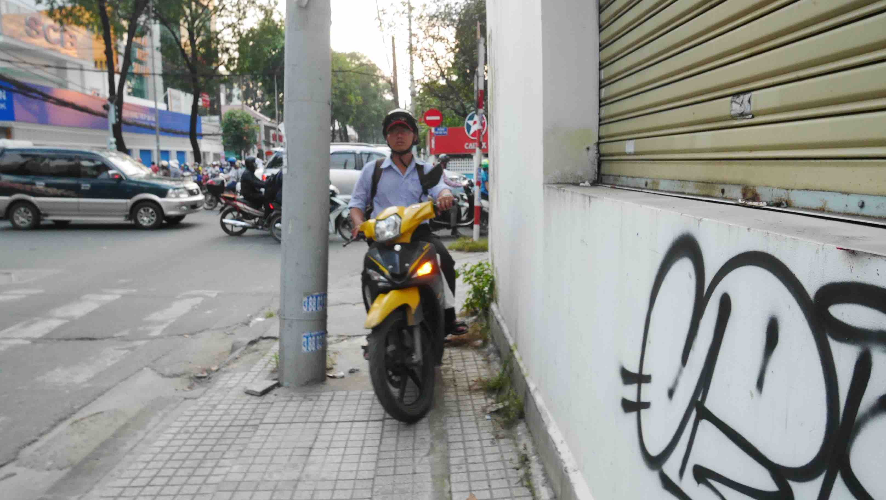

I got in <b>HCMC</b> from <b><a href="{{site.url}}/Dalat" target="_blank">Đà Lạt</a></b> when the clock showed 5 in the morning. One might think that this is a bad time to get to an unknown place, you don't have your place to sleep open, you've your belongings with you that you've to carry, the streets might be empty and everything is closed... But this is not the case with <b>HCMC</b>.

I was very hungry when I got there and was left in the middle of the street so I just went to the nearest McDonald's to eat something and it was one of the few things opened at that time. When I got there a lot of costumers were there already, which I found odd. However, as soon as I headed out to try and go to my Hostel to try and check in I found the streets/parks <b>full</b> of people doing stuff like <i>tai chi</i> and other kinds of exercises. What surprised me the most was the average age of people exercising outside. Most of them seemed to be above 40/50 y/o which is very surprising and refreshing when compared to these kind of habits in my country.

In the end, I was able to get to my Hostel and stay there for a while until I could check in. <b>Saigon Friends Hostel</b> had a nice double bed private room for ~15$ per night with air conditioning but no breakfast. The impression that I got while there was that this place (maybe all places in HCMC...?) looked to be full of people transitioning from/to <b>Cambodia</b>.

<figure>
	
	<figcaption>Cute alleys of HCMC.</figcaption>
</figure>

<b>HCMC</b> is not a very <i>pleasant</i> place to visit. It is a <b>huge</b> city where everyone is in a rush, tons of motorbikes riding the streets, and not that much to visit. You can always visit things like the <b>War Remnants Museum</b>, <b>Reunification Palace</b> and even the <b>Chi Chi Tunnels</b>, which, at least for me, are not very appealing.

Also, from an independent point of view, <b>HCMC</b> is not an easy place to get around, but even if it was I don't think I would need that to visit anything because this kind of stuff is not on my bucket list (a metro system is due to be finished in 2019). The only 2 attractions that I visited because they are pretty central and if you walk around the city you will eventually go past them are the <b>Post Office</b> and the <b>Notre Dame Cathedral (Nhà thờ Đức Bà)</b>.

<figure>
	
	<figcaption>Streets of HCMC.</figcaption>
</figure>

<figure>
	
	<figcaption>Typical traffic in Vietnam.</figcaption>
</figure>

<figure>
	
	<figcaption>Sometimes, you've to improvise so you don't have to stop in a red light signal.</figcaption>
</figure>

In case that you got to <b>HCMC</b> with the same intention as me, which was to go to <b>Phnom Penh</b>, the capital of <b>Cambodia</b>, there is one bus company that I can recommend, but it won't be the cheapest one available. After some online research I chose to go with <b><a href="http://giantibis.com/" target="_blank">Giant Ibis</a></b>, office located in the Phạm Ngũ Lão street. I went there the day before to buy the bus tickets which costed me ~20$.

There is one guy that will be your <i>guide</i> during the whole journey. He will get all the passports from all passengers (don't worry...), along with the cost of the Cambodian Visa + 5$ which is basically a <i>rip off/service fee</i> for the company. Of course you can reject, make a fuss about it and all, but you've to handle all the visa process alone and the bus might not wait for you on the other side of the border (there are many reports about this online). <b>One thing that you can do to save this hassle and money is to get an E-Visa.</b>

<b><highlight><middle>This is a common practice in this part of the world. Land border crossings in Indochine will require a bribe. All of this must be paid in Dollars.</middle></highlight></b>

Trust me, if this is your first time crossing the borders by land (like me) this will be a piece of cake. The bribes/hassle between Cambodia/Lao and Lao/Thailand are far way more <i>in your face</i> and obvious than this one.

<figure>
	
	<figcaption>Vietnam side of the Vietnam/Cambodia border.</figcaption>
</figure>

<figure>
	
	<figcaption>In Cambodian soil!</figcaption>
</figure>

This trip will take 1 entire day to get to <b>Phnom Penh</b> with a 1 hour lunch break at the border. It's the best time to change your money or just spend what you have. You'll probably get to <b>Phnom Penh</b> at sunset, so it's better to have a place booked in advance.

<b><highlight><middle>Bye Vietnam, it was really fun! Cám ơn, and see you next time!</middle></highlight></b>

 
<h1>How to get there and away</h1>
<ul>
<li>Night Bus from <b><a href="{{site.url}}/Dalat" target="_blank">Đà Lạt</a></b> (arranged by our Hostel) to Ho Chi Minh City.</li>
<li>Bus to the Cambodia capital, Phnom Penh.</li>
</ul>

 
<h1>What to do/see</h1>
<ul>
<li>Just explore the city streets by foot!</li>
</ul>

 
<h1>Where to sleep</h1>
<ul>
<li><b>Saigon Friends Hostel</b>, 15$ for a double bed without breakfast.</li>
</ul>