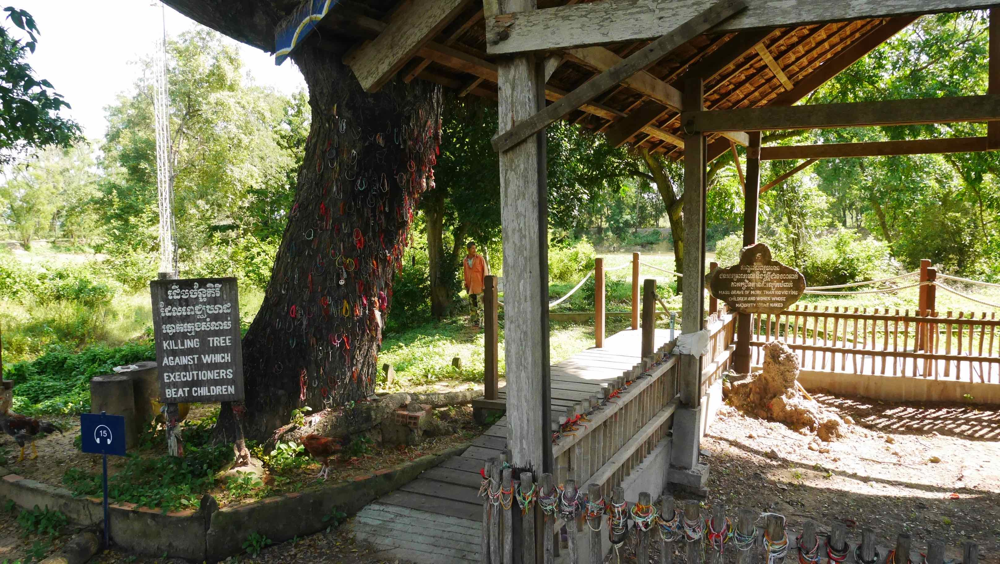

Phnom Penh is the capital and the most populous city of Cambodia. Once known as the <i>Pearl of Asia</i>, it was considered one of the loveliest French-built cities in Indochina in the 1920s.

I got in Phnom Penh after a long day trip from <b><a href="{{site.url}}/HCMC" target="_blank">Ho Chi Minh City</a></b> in Vietnam. It was almost night when the Giant Ibis bus left us by the night market entrance, near the river. From there to the place I booked, <b>Velkommen Guesthouse</b>, it was only a 5 min walk. I got a double room for 14$ a night without breakfast. The location is great, the young guys working there are great, but there is not much going on, so if you're looking for a social place to stay this is not your best option.

I stayed in <b>Phnom Penh</b> for 3 days and they happened to be during the <b>Water Festival</b>, an annual three day celebration that marks the reversal of the current in <b>Tonle Sap</b> river and the end of the moonsoons. It is one of the most important festivals in Cambodia along with the Khmer New Year.

<figure>
	
	<figcaption>Water Festival celebrations.</figcaption>
</figure>

The one thing that I really wanted to see in <b>Phnom Penh</b> was the <b>Killing Fields of Choeung Ek</b>. There are a number of sites where more than a million people were killed and buried by the Communist Khmer Rouge regime, during its rule of the country from 1975 to 1979. The mass killings are widely regarded as part of a broad state-sponsored <b>genocide</b>. The remains of 8985 people were exhumed in 1980 from mass graves and 43 of the 129 communal graves have been left untouched.

The site is about 7.5km south of the city limits and I arranged a private transportation (<i>tuk tuk</i>) from one of my Guest House's young employees. I paid 15$, but I think this was a little bit expensive for the service provided that was basically only the return journey.

<figure>
	
	<figcaption>On my way to the Killing Fields.</figcaption>
</figure>

<figure>
	
	<figcaption>Monks on their daily routine of getting offerings.</figcaption>
</figure>

You should allow at least 1.5/2 hours to explore the whole area. When you buy the ticket, a free audio guide will be handed to you with multiple languages available. This audio guide is <b>amazing</b>, and if you aren't very familiarized with the <b>Khmer Rouge</b> history, this will be your best friend. It includes stories by those who survived the <b>Khmer Rouge</b>, a Choeung Ek guard and executioner talking about some of the techniques they used to kill innocent and defenceless prisoners, including women and children, among many other interesting stories.

Overall, the experience is very intense and, because the audio guide is so good, that place will get into your head. Ultimately you will reach the <b>Memorial Stupa</b>, built in 1988 and with more than 8000 skulls arranged by sex and age. After the tour, still inside the complex, you can visit the museum where you can learn more about this site and even watch a movie if you want to.

<b><highlight><middle>I really recommend this experience as it is still one of my favourite ones in Cambodia.</middle></highlight></b>

<figure>
	
	<figcaption>A mass grave on the right and a <i>killing tree</i> on the left.</figcaption>
</figure>

<figure>
	
	<figcaption>Some of the skulls inside the <b>Memorial Stupa</b>.</figcaption>
</figure>

<figure>
	
	<figcaption>The skulls are arranged by sex and age.</figcaption>
</figure>

<figure>
	
	<figcaption>Our <i>tuk tuk</i>, very different from the ones you're used to see.</figcaption>
</figure>

<b><highlight><middle>Money in Cambodia:</middle></highlight></b>

When you go to an ATM you're able to withdraw both <b>Cambodia Riel</b> and <b>US Dollars</b>! Yes, you read it right, <b>US Dollars</b>... While in Cambodia you'll have to deal with 2 completely different currencies when paying for stuff. It is completly fine to pay 2 Dollars and 4000 Riel for something and getting 1 Dollar and 1000 Riel in change. It is very very confusing at first, but you'll get it right in no time. <b>1USD = 4000KHR</b> as of November/2016.

 
<h1>How to get there and away</h1>
<ul>
<li>Night Bus from <b><a href="{{site.url}}/Dalat" target="_blank">Đà Lạt</a></b> (arranged by our Hostel) to Ho Chi Minh City.</li>
<li>Bus to the Cambodia capital, Phnom Penh.</li>
</ul>

 
<h1>What to do/see</h1>
<ul>
<li>Just explore the city streets by foot!</li>
</ul>

 
<h1>Where to sleep</h1>
<ul>
<li><b>Saigon Friends Hostel</b>, 15$ for a double bed without breakfast.</li>
</ul>