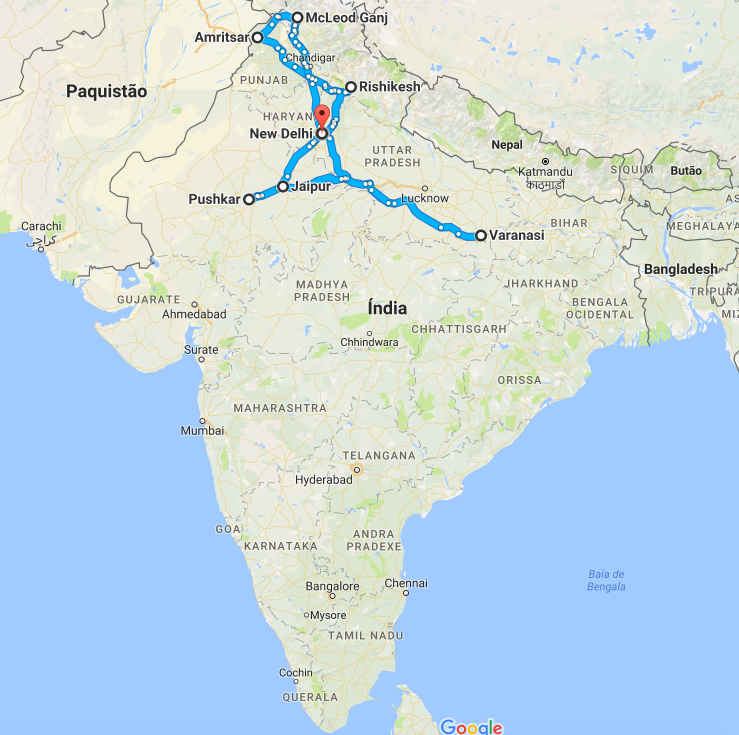

I spent 3 weeks in Vietnam between 19th October and 10th November (TODO CONFIRM) 2016. I travelled as a couple and always slept in Hostels/Trains/Buses.

This itinerary is my personal taste and I didn't use any kind of agency to book anything. I mostly used the internet to search for some logistics regarding transportation. I also used the Vietnam's edition of Lonely Planet but you don't really need any guide book because it's <b>really easy</b> to travel in Vietnam. Just ask at the reception of where you are staying on how to get to any place and you'll have everything in place for the next day.

<b><highlight><middle>Itinerary and transportation:</middle></highlight></b>

<ul>
<li><b><a href="{{site.url}}/Hanoi" target="_blank">Hanoi </a></b>(2 days, bus - ferry - bus to Cát Bà island)</li>
<li><b><a href="{{site.url}}/CatBa" target="_blank">Cát Bà </a></b>(2 days, bus - ferry - bus to Tam Coc)</li>

</ul>

<b><highlight><middle>&emsp;Flight, train and bus...</middle></highlight></b>

<ul>
	<li>
	<b>Flight:</b>
	<ul>
		 <li>
		I bought my plane tickets in <b><a href="https://www.skyscanner.pt/" target="_blank">SkyScanner</a></b> from Porto to New Delhi and from New Delhi to Hanoi.
		</li>
	</ul>
	</li>
	 <li>
	<b>Train:</b>
	<ul>
		 <li>I bought my 2AC train tickets in the <b><a href="https://www.irctc.co.in" target="_blank">Indian Railway Catering and Tourism Corporation (IRCTC)</a></b>. If you're not from India you need to send your passport copy by email to them for you to get your account enabled. When you have done that, you should be able to buy tickets with your credit card. Be careful with the train tickets, <b>some of the most famous routes get sold out months in advance.</b></li>
	</ul>
	</li>
	 <li>
	<b>Transportation:</b>
	<ul>
		 <li><b>New Delhi:</b> the metro takes you to the train station where you can get from there to Amritsar on a direct train.</li>
		 <li><b>Amritsar:</b> from the train station to the Golden Temple its about ~2km. You can just walk or take a rikshaw for 30-50 rupees. From there to the bus to Pathankot you need to take a tuk tuk/rickshaw, it should cost between 30-50eupees. From Pathankot you should have a bus to Dharamshala in the same bus station and once you reach Dharamshala just ask someone to point you the bus to MacLeod Ganj on the same station.</li>
		 <li><b>McLeod Ganj:</b> the ticket booth for buses is kinda tricky to find, but it is located in the main square right at the entrance of the village. From there you get a bus to Pathankot. The train station that goes to Rishikesh is Pathankot Cantt, and if you ask the bus driver to leave you there, you should stop behind the station where you have a beaten path to the station. A lot of people also left there, it should be easy to spot. Once you get to Rishikesh if you want to catch a shared tuk tuk (Vikram) to Laxman Jhula it should cost you between 10-20 rupees (they first asked us for 200, so you should bargain hard).</li>
		 <li><b>Rishikesh:</b> from Laxman Jhula take a tuk tuk to the bus station, it should cost between 20-40 rupees (I walked to the station so this price is my personal opinion about it). Take a bus from there to Haridwar where you can get a train to Ajmer. When you get to Ajmer I know that you can take a local bus to Pushkar that should stop near the entrance of the train station, but I took a shared tuk tuk for 10 rupees to the bus station. The bus will leave you in walking distance of Pushkar village.</li>
		 <li><b>Pushkar:</b> the bus station is in walking distance, just at the entrance of the village. From there you can take a local bus to Jaipur.</li>
		 <li><b>Jaipur:</b> since the place where I was staying was close to the train station I just walked. From there I took a night train to Varanasi.</li>
		 <li><b>Varanasi:</b> the train station is really far from where most hostels are (Varanasi Junction), so you should take a tuk tuk to there for about 150 rupees.</li>
		 <li><b>New Delhi / Agra:</b> I rented a driver for a full day from New Delhi to Agra and back. I shared with another travellers, it cost us 60€ for all of us.</li>
	</ul>
	</li>
</ul>

<figure>
	
	<figcaption>My India Itinerary.</figcaption>
</figure>

<b><highlight><middle>&emsp;Costs:</middle></highlight></b>
<ul>
<li><b>~15€ per day, all included.</b></li>
</ul>
&emsp;<b>This does not include flights,</b> but includes all kind of daily expenses, rooms (between 7-14€ double room except New Delhi), food (between 1-3€ local food mostly), entrance tickets, transportation (train, bus and occasional tuk tuk) etc...

<b><highlight>Visa:</highlight></b>
<ul>
<li>Online e-visa on the official <a href="https://indianvisaonline.gov.in/evisa/" target="_blank">Indian visa place</a>. It cost me 60€ for a 1 month visa. (Portuguese citizen)</li>
</ul>

<b><highlight><middle>&emsp;Highlights:</middle></highlight></b>
<ul>
<li><b>New Delhi</b>, MadPackers hostel city tour.</li>
<li><b>Amritsar</b>, walking around the incredible Golden Temple while watching peoples prayers.</li>
<li><b>McLeod Ganj</b>, the view is amazing and also the spiritual temple of the Dalai Lama.</li>
<li><b>Rishikesh</b>, Laxman Jhula.</li>
<li><b>Pushkar</b>, sitting and relaxing around the Pushkar Lake.</li>
<li><b>Jaipur</b>, the Amer Fort is quite nice and has an amazing view.</li>
<li><b>Varanasi</b>, the morning boat tour and walking on the Ghats. Also, the cremation sites are overwhelming and an once in a lifetime experience.</li>
<li><b>Agra</b>, obviously the mighty Taj Mahal.</li>
</ul>