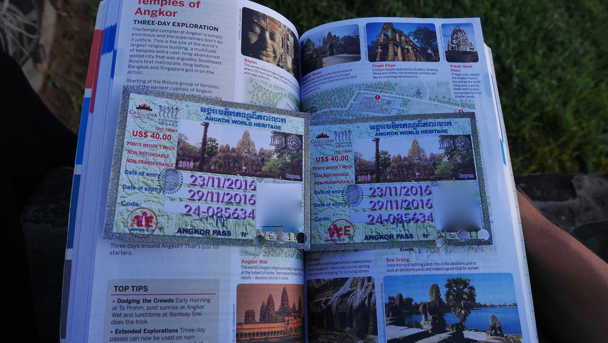
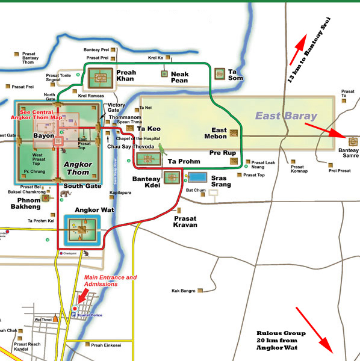
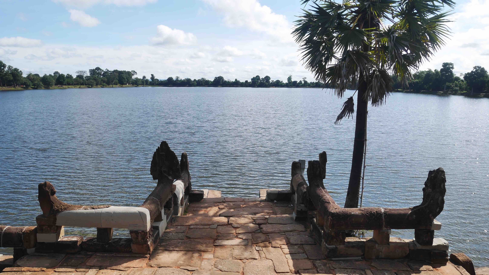
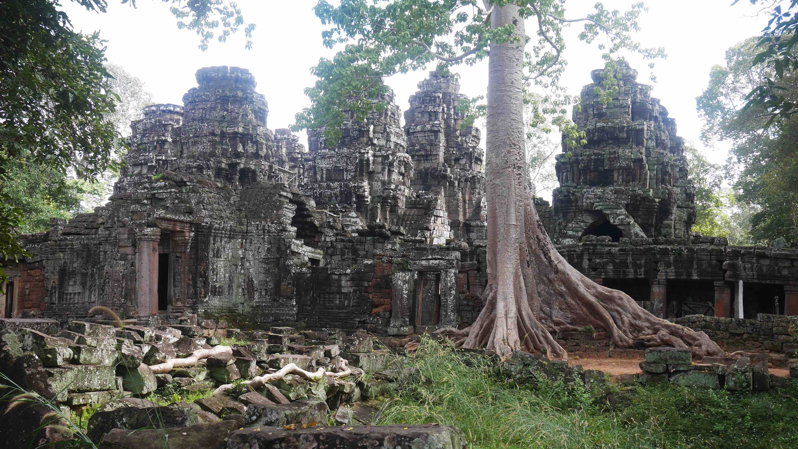
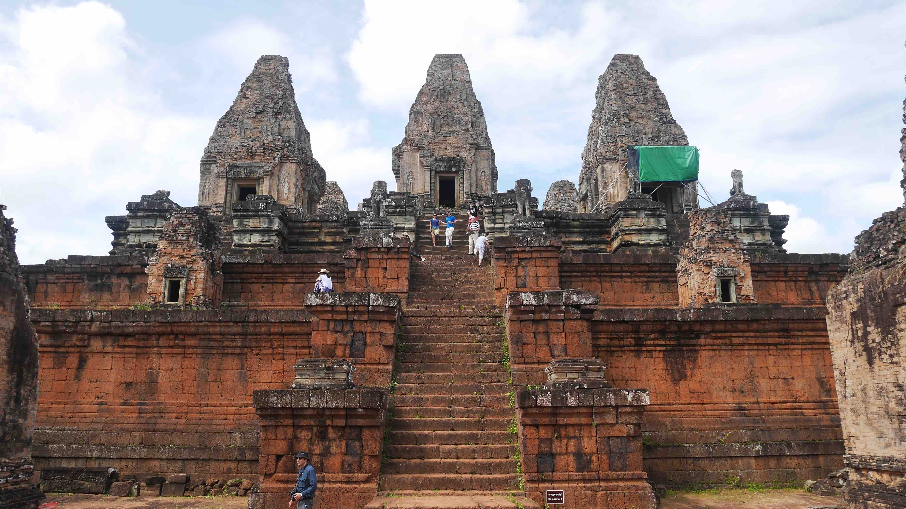
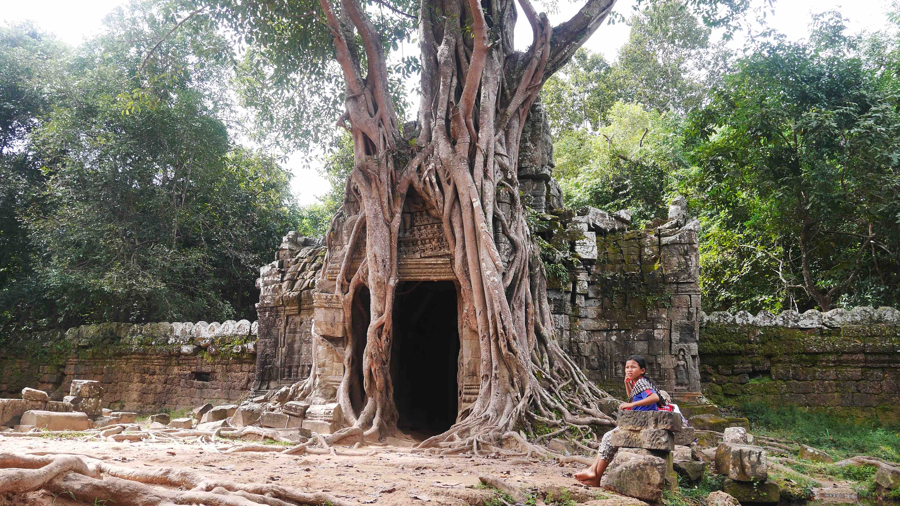
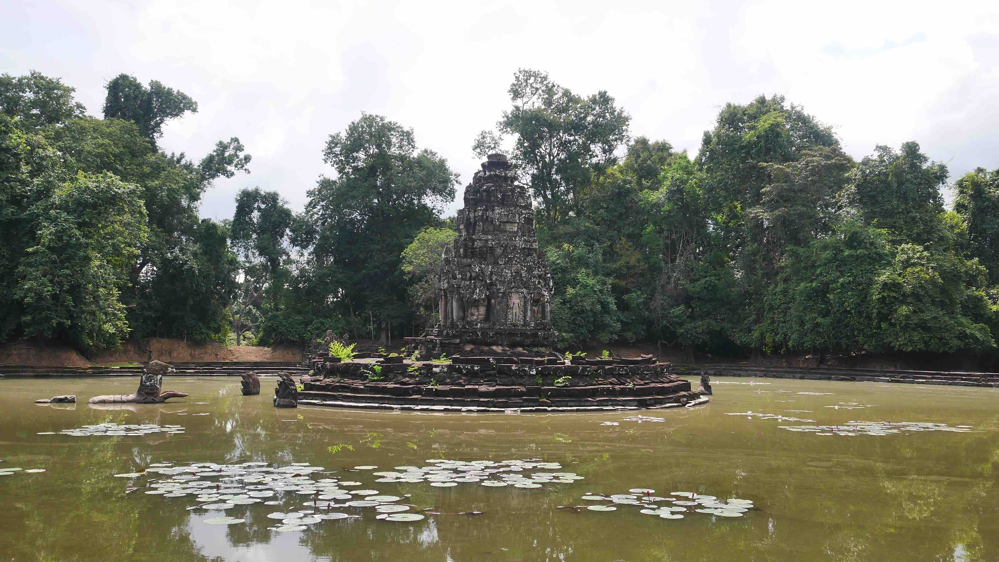
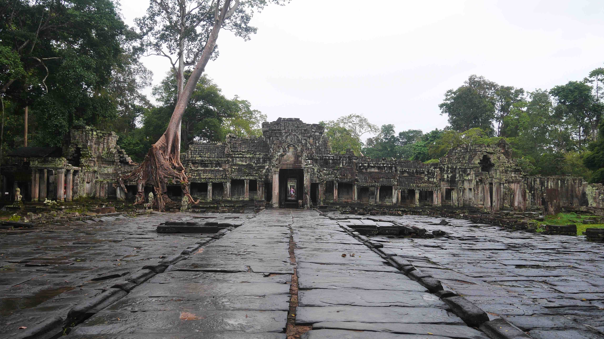

Siem Reap is the most touristic city of whole Cambodia. In fact, it's not hard to understand why, because the <b>Angkor Temple Complex</b> is something unique in the whole world. Many people come here from Thailand to see the temples, but I think that this is something that deserves to be savoured and not rushed. If you're planning to visit this amazing place, please allow yourself <b>at least</b> 3 full days.

<b>Angkor Wat</b> has 3 different price ranges depending on how much time you want to spend there. I bought the 3-day ticket for 40$ (as of November 2016, 1 day 20$ and 7 days 60$) and the ticket allowed me to go in/out whenever I wanted. The ticket is valid for 1 week and the days don't have to be consecutive. I fully recommend you to spend more than 1 day there to fully enjoy everything that this gigantic complex of temples has to offer. Despite being far more impressed by the temples in <b><a href="{{site.url}}/Land-of-Smiles-4/" target="_blank">Bagan - Myanmar</a></b>, I still got blown away by some temples in here. It is a different experience.

<b><highlight><middle>Cycling through the beautiful landscape of Angkor Wat was definitely my best experience in Cambodia.</middle></highlight></b>

<b><a href="{{site.url}}/Battambang/" target="_blank">Battambang</a></b> was very disappointing so I came to Siem Reap after just 1 day. <b>Baphuon Villa</b> was the place I booked for the next 4 nights. The hotel is ran by an expat living there and the staff that works there is very friendly. If you get there by bus like me, one of the tuk-tuk drivers that work for the hotel will pick you up and will be designated <i>your guide</i> for the whole duration of your stay.

This is a very smart way to do business, because in a place cramped with tuk-tuk drivers and where it can be difficult to get clients, if you're able to be part of a hotel it will be easier to get your costumers and the costumer are more likely to trust you. They work on a fixed price rate for the day (~15$) and since it's their reputation and their spot on the hotel that is on the line, they provide a very friendly and trustable service.

<figure>
	
	<figcaption>My 3 day ticket for Angkor.</figcaption>
</figure>

On my first day exploring the temples I arranged the tuk-tuk service for the entire day, but in retrospective I wouldn't do it again. I felt that exploring this gigantic complex of temples by tuk-tuk, althought faster and a lot less tiring, takes a bit of the excitement and adventure out of your trip. Your driver will first take you to the ticket booth where you'll face a long line of people bying tickets like you and then he'll take you to every sight that you want to visit.

I felt that I was being part of a gigantic circus, a bit like those groups of tourists that only leave their buses to visit something, take some pictures, come back inside the bus and repeat... This is something that I personally don't enjoy and don't recommend at all.

<b><highlight><middle>As a result of that I ended up renting a bicycle for the next 2 days and went on exploring by myself.</middle></highlight></b>

<figure>
	
	<figcaption>The big (green) and small (red) circuit.</figcaption>
</figure>

I did the big circuit on my first day by tuk-tuk. This circuit has none of the major attractions such as the mysterious <b>Bayon</b> or the imponent <b>Angkor Wat</b>, but has a plentiful of temples that should in no way be ignored. I decided to see these first, because I was afraid that if I saw the big ones first, these lesser known temples would not make an impact on me.

The big circuit can be done in half a day if you go with a tuk-tuk. You'll probably start by visiting <b>Banteay Kdei</b> followed by <b>Pre Rup</b>, <b>East Mebon</b>, <b>Ta Som</b>, <b>Neak Pean</b> and finally <b>Preah Khan</b>. All of these are worth a visit, but of course that you'll not be so impressed by them as you'll be by the other <i>big 2</i>.

<figure>
	
	<figcaption>Srah Srang, just across Banteay Kdei.</figcaption>
</figure>

<figure>
	
	<figcaption>Banteay Kdei from outside.</figcaption>
</figure>

<figure>
	
	<figcaption>Pre Rup, a famous spot for the sunset.</figcaption>
</figure>

<figure>
	
	<figcaption>Ta Som temple is small but very unique.</figcaption>
</figure>

<figure>
	
	<figcaption>Neak Pean is surrounded by a big lake.</figcaption>
</figure>

<figure>
	
	<figcaption>The entrace of Preah Khan temple.</figcaption>
</figure>

I took around 5 hours to complete this so called <i>big circuit</i> and I was stuck for maybe half an hour in Preah Khan because it rained. It's possible to combine this circuit with the <i>small</i> one in just 1 full day but you really <b>shouldn't</b> do this because you will be in a rush to fit them all until sunset. There are 2 considerable options; if you have the 1-day ticket just skip these temples, but if you bought the 3-day ticket you will be more than fine in spending 1 full day exploring this <i>big</i> circuit.

My second day was a very tiring one. I grabbed a bicycle in the morning and only returned to the hotel right before sunset. I think I must have cycled ~20km all day and visited <b>Ta Prohm</b>, <b>Ta Keo</b>, <b>Bayon</b> (my absolute favourite), <b>Angkor Thom</b> and finally the magnificient <b>Angkor Wat</b>, along with various small ones becuase I was passing by them anyway.

This was when I confirmed what I thought the day before while exploring by tuk-tuk. Riding a bicycle is a lot more fun and rewarding while also giving you the freedom to just stop whenever you want and taking your time without worrying about someone waiting for you outside.

<b><highlight><middle>Trust me, unless you've a health issue of some kind, please just try to cycle around!</middle></highlight></b>

 
<h1>How to get there and away</h1>
<ul>
<li>From <b><a href="{{site.url}}/Samloem" target="_blank">Sihanoukville</a></b> to Battambang I booked a night bus from the pier to the TVK Station outside Battambang city centre.</li>
<li>From Battambang to Siem Reap I booked a bus on one of the many offices around town. The trip should cost ~4-5$.</li>
</ul>

 
<h1>What to do/see</h1>
<ul>
<li>Temples, colonial architecture and cafes...</li>
</ul>

 
<h1>Where to sleep</h1>
<ul>
<li><b>Baphuon Villa</b>, 12$ double bed per night.</li>
</ul>