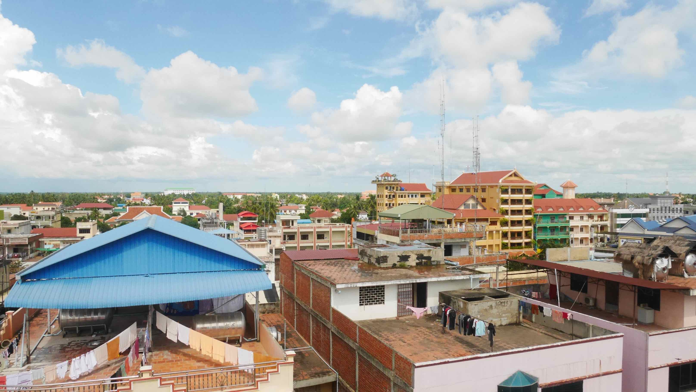

Siem Reap is the most touristic city of whole Cambodia. In fact, it's not hard to understand why, because the <b>Angkor Temple Complex</b> is something unique in the whole world. Many people come here from Thailand to see the temples, but I think that this is something that deserves to be savoured and not rushed. If you're planning to visit this amazing place, please allow yourself <b>at least</b> 3 full days.

<b>Angkor Wat</b> has 3 different price ranges depending on how much time you want to spend there. I bought the 3-day ticket for 40$ (as of November 2016, 1 day 20$ and 7 days 60$) and the ticket allowed me to go in/out whenever I wanted. I fully recommend you to spend more than 1 day there to fully enjoy everything that this gigantic complex of temples has to offer. Despite being far more impressed by the temples in <b><a href="{{site.url}}/Land-of-Smiles-4/" target="_blank">Bagan - Myanmar</a></b>, I still got blown away by some temples in here. It is a different experience.

<b><highlight><middle>Cycling through the beautiful landscape of Angkor Wat was definitely my best experience in Cambodia.</middle></highlight></b>

<b><a href="{{site.url}}/Battambang/" target="_blank">Battambang</a></b> was very disappointing so I came to Siem Reap after just 1 day.

<figure>
	
	<figcaption>The view over Battambang from First Hotel.</figcaption>
</figure>

 
<h1>How to get there and away</h1>
<ul>
<li>From <b><a href="{{site.url}}/Samloem" target="_blank">Sihanoukville</a></b> to Battambang I booked a night bus from the pier to the TVK Station outside Battambang city centre.</li>
<li>From Battambang to Siem Reap I booked a bus on one of the many offices around town. The trip should cost ~4-5$.</li>
</ul>

 
<h1>What to do/see</h1>
<ul>
<li>Temples, colonial architecture and cafes...</li>
</ul>

 
<h1>Where to sleep</h1>
<ul>
<li><b>First Hotel</b>, 6$ double bed per night.</li>
</ul>