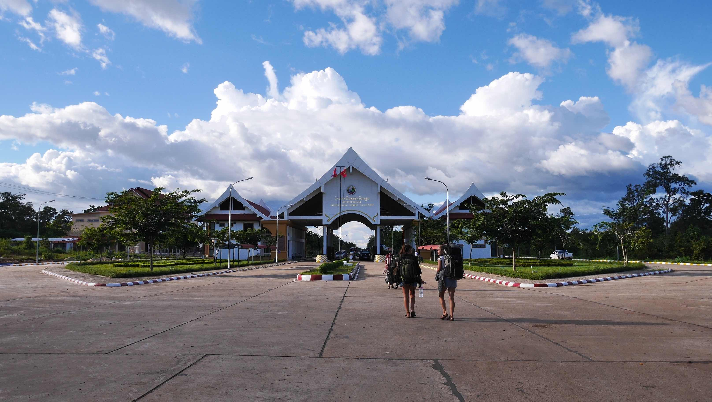
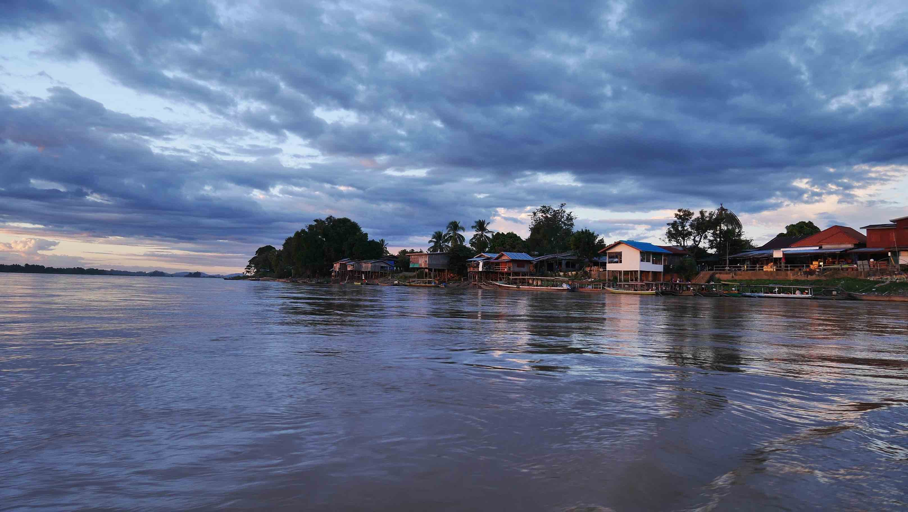
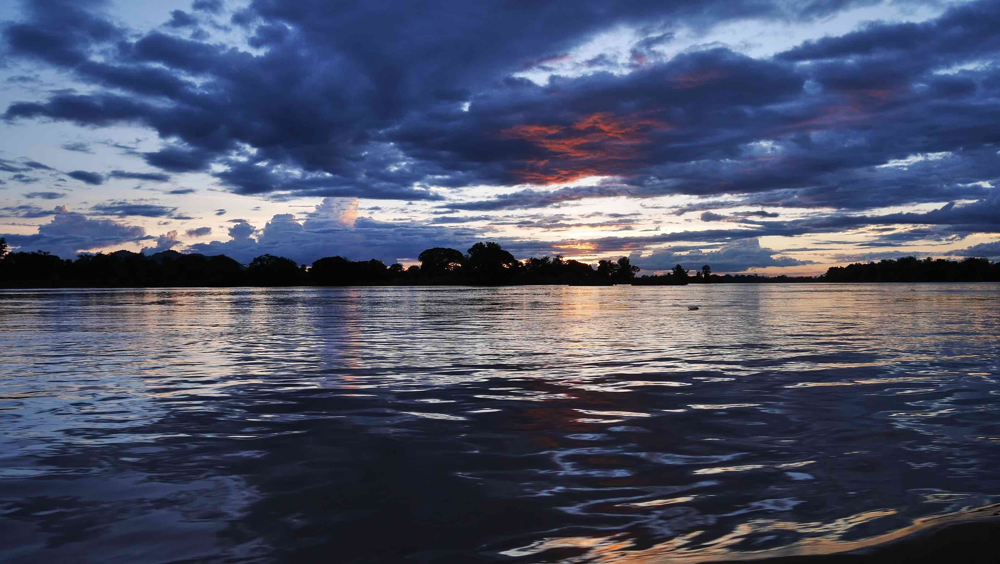
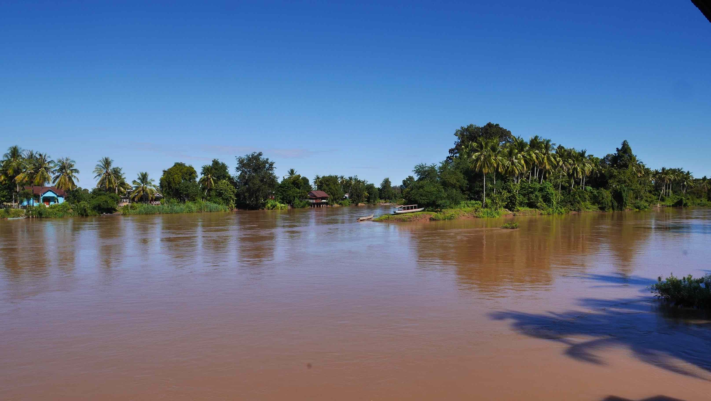

The journey to Lao's soil wasn't an easy one. Long, long trip on a mini van full of people, without air conditioning and a scorching sun that made an old man pass out in the middle of nowhere. Luckily he got better during lunch time and we proceed to the border. We stopped just before the Cambodian border to exchange some money and fill the visa form. This proccess took a lot of time for unknown reasons to me, but we got everything done just before sunset. It is a little bit stressing to be in <i>no man's land</i> without your passport.

<figure>
	
	<figcaption>Lao border.</figcaption>
</figure>

The trip from the border to the <b>Nakasong</b> pier it's only ~18km. Once you get there, you need to walk to the pier and say that the name of the island where you want to go. <b>Don Det</b> and <b>Don Khon</b> are the two major destinations, where all the accomodation and sights are. I ended up staying in <b>Don Khon</b>, the more peaceful island and with less shops/bars and noise all around.

It only takes ~10 minutes from the pier to <b>Don Khon</b>, but it was during this trip on a small boat during sunset that I started to really love the scenery. I didn't had anything booked for the night, and it was almost dark when we landed in the island and started to look for accomodation. <b>Don Det</b> has a lot more accomodation available, and cheaper too, but we got a nice bungalow with river view for about ~13$ per night. Nothing fancy, but the views were really nice. Unfortunately, I don't remember the name of the place, but it is located to the northwest side of the island and it is run by a shy young man.

You actually have to pay upfront (something that I didn't like to do at the time, but it is a common pratice in Lao) for every night that you want to stay in there. The place also has a restaurant, like any place, where you can have breakfast/lunch/dinner. However, I had most of my breakfasts on a little shack owned by a lovely lady in the <i>main</i> road because it was significantly cheaper.

<figure>
	
	<figcaption>Nakasong's pier.</figcaption>
</figure>

<figure>
	
	<figcaption>Our very first sunset in Lao's soil.</figcaption>
</figure>

<figure>
	
	<figcaption>The view from our room.</figcaption>
</figure>

<b><highlight><middle>Cycling through the beautiful landscape of Angkor Wat was definitely my best experience in lao.</middle></highlight></b>

 
<h1>How to get there and away</h1>
<ul>
<li>From <b><a href="{{site.url}}/Battambang" target="_blank">Battambang</a></b> to Siem Reap it's only a ~3.5 hours bus journey.</li>
<li>From Siem Reap to 4000 Islands I used the Asia Van Transfer (AVT), and for 25$ I had everything arranged from Siem Reap to Don Khon. Expect 1 full day on the road.</li>
</ul>

 
<h1>What to do/see</h1>
<ul>
<li>Explore ALL the temples that Angkor Wat has to offer! My favourite was the mysterious Bayon!</li>
</ul>

 
<h1>Where to sleep</h1>
<ul>
<li><b>Baphuon Villa</b>, 12$ double bed per night. The young staff is very nice and you've trustable tuk-tuk drivers working for them, as well as bicycles to rent.</li>
</ul>