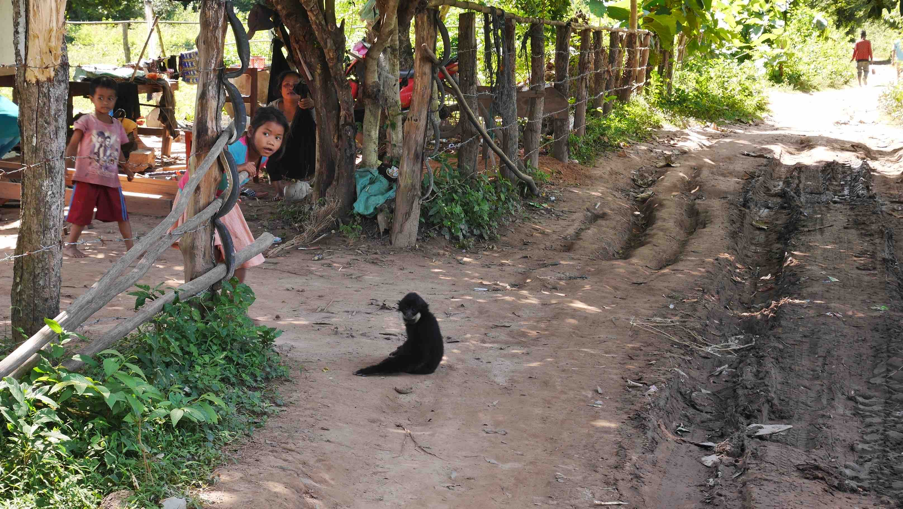

The journey to Lao's soil wasn't an easy one. Long, long trip on a minivan full of people, without air conditioning and a scorching sun that made an old man pass out in the middle of nowhere. Luckily he got better during lunch time and we proceed to the border. We stopped just before the Cambodian border to exchange some money and fill the visa form. This process took a lot of time for unknown reasons to me, but we got everything done just before sunset. You can read more about it in my <b><a href="{{site.url}}/SiemReap" target="_blank">Siem Reap</a></b> post.

<b><highlight><middle>The only problem is that it is a little bit stressing to be in <i>no man's land</i> without your passport.</middle></highlight></b>

<figure>
	
	<figcaption>Lao border.</figcaption>
</figure>

The trip from the border to the <b>Nakasong</b> pier, it's only ~18km. Once you get there, you need to walk to the pier and say that the name of the island where you want to go. <b>Don Det</b> and <b>Don Khon</b> are the two major destinations, where all the accomodation and sights are. I stayed in <b>Don Khon</b>, the more peaceful island and with less shop/bars and noise all around.

It only takes ~10 minutes from the pier to <b>Don Khon</b>, but it was during this trip on a small boat on sunset that I started to really love the scenery. I didn't have anything booked for the night, and it was almost dark when we landed on the island and started to look for accomodation. <b>Don Det</b> has a lot more accomodation available, and cheaper too, but we got a nice bungalow with a river view for about ~13$ per night. Nothing fancy, but the views were really nice. Unfortunately, I don't remember the name of the place, but it is located in the northwest side of the island and it is run by a shy young man.

You actually have to pay upfront (something that I didn't like to do at the time, but it is a common practice in Lao) for every night that you want to sleep in there. The place also has a restaurant, like any place, where you can have breakfast/lunch/dinner. However, I had most of my breakfasts on a little shack owned by a lovely lady in the <i>main</i> road because it was significantly cheaper. The breakfast was nothing more than coffee with eggs and bread.

<figure>
	
	<figcaption>Nakasong's pier.</figcaption>
</figure>

<figure>
	
	<figcaption>Our very first sunset in Lao's soil.</figcaption>
</figure>

<figure>
	
	<figcaption>The view from our room.</figcaption>
</figure>

The best thing to do in <b>Don Khon</b> is to rent a bicycle and make a trip around the island. Bicycles can be rented by as little as 1$ per day. Even though <b>Don Khon</b> is practically double of the size of <b>Don Det</b>, 1 day is enough for you to get to know everything on the island, however I think it is better to split in 2 days and not rush. I spent 1 day exploring everything in <b>Don Khon</b> and another day to go to <b>Don Det</b> by bicycle.

<b><highlight><middle>Cycling through the beautiful landscape of the marvelous 4000 Islands will remain in your memory forever.</middle></highlight></b>

<b>There is one major scam that you need to be aware of in Don Khon.</b> Near the French bridge that connects both islands, there is a shack where occasionally someone will ask you for money <i>to get through</i>. Just ignore because you're not obliged to do so.

When you're getting yourself lost on the roads of <b>Don Khon</b> you'll notice that there used to be a railway. In the southern point of the island, where you can actually see Cambodia's soil, you'll encounter an old locomotive used by the French. Also, don't miss the <b>Li Phi Waterfall</b> nearby, nothing overwhelming, but something that I think it's worth to stop by.

<figure>
	
	<figcaption>I can't guarantee that it won't fall soon.</figcaption>
</figure>

<figure>
	
	<figcaption>Even when you stop for lunch you'll have a great view.</figcaption>
</figure>

<figure>
	
	<figcaption>Yet another amazing sunset view from our bungalow.</figcaption>
</figure>

A cool and curious thing that happened to me was to see a live <b>Gibbon</b>, playing with a little girl. At first it just looked like something weird in the way, but when I got closer I clearly saw that it was an animal. The kids' father eventually walked off with the <b>Gibbon</b> because he didn't seem to like the fact that there were 2 tourists watching that <i>show</i> and I'm not too sure about the legality of owning these kind of species.

<figure>
	
	<figcaption>The Gibbon playing with the young girl.</figcaption>
</figure>

<figure>
	
	<figcaption>A closer look at this beautiful animal.</figcaption>
</figure>

Regarding <b>Don Det</b>, I was just ~1/2hours there, so I don't have a strong opinion about the island, but there is a lot more infrastructures ready for tourism, which attracts a lot more people. It is noisier and busier, so I can't recommend it if you're looking for a calm stay.

The 4000 Islands area is really beautiful, and if you're travelling between Cambodia/Lao you should definitely stop for 2/3 days or more there. In case you're coming from the busy <b><a href="{{site.url}}/SiemReap" target="_blank">Siem Reap</a></b> like me, it will be a so much enjoyable calmness that I'm sure you'll be glad to have.

When you feel ready to move on, almost every place sells you onward travel tickets. You'll have to get a boat to the Nakasong pier and from there you can easily walk to the <i>bus station</i>. My next stop was <b>Pakse</b>, but most tourists go directly to the North. The trip to Pakse should cost around 80 000 Kip or ~9$.

 
<h1>How to get there and away</h1>
<ul>
<li>From <b><a href="{{site.url}}/SiemReap" target="_blank">Siem Reap</a></b> to 4000 Islands I used the Asia Van Transfer (AVT), and for 25$ I had everything arranged from Siem Reap to Don Khon. Expect 1 full day on the road.</li>
<li>To get to Pakse, you need to get a boat to the Nakasong Pier and there you'll have a lot of buses that will leave you in Pakse city center. ~9 dollars.</li>
</ul>

 
<h1>What to do/see</h1>
<ul>
<li>Explore the island from north to south by bicycle!</li>
<li>Day trip to Don Det.</li>
<li>Old French locomotive.</li>
<li>Li Phi Waterfall.</li>
</ul>

 
<h1>Where to sleep</h1>
<ul>
<li><b>Bungalows up north the main road, owned by a young man</b>, ~13$ double bungalow by the river.</li>
</ul>