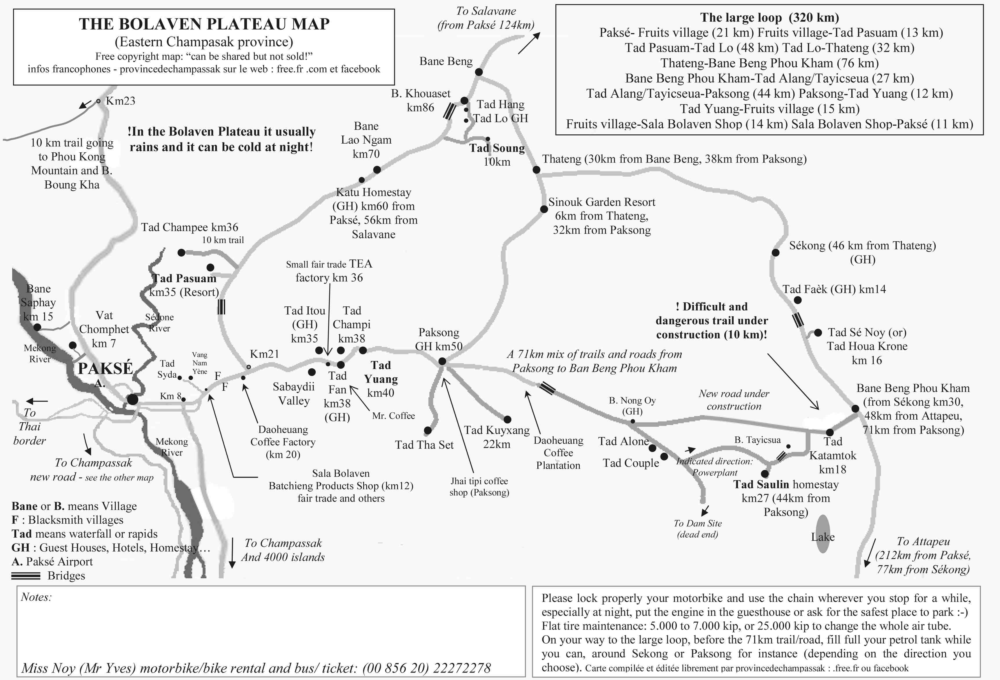

The <b>Bolaven Plateau</b> is an elevated region in southern Lao, and it is known for its cool climate, numerous waterfalls coffee plantations. A lot of ethnic groups made their homes in the region, Laven (Bolaven means ‘Home of the Laven’) being the largest one. Several other Non-Khmer ethnic groups, including the <b>Alak</b>, <b>Katu</b>, <b>Tahoy</b> and <b>Suay</b>, also live on the plateau.

<b><highlight><middle>This is the only reason to stop in ugly and uncharming Pakse.</middle></highlight></b>

After some days of relaxation in the <b><a href="{{site.url}}/4000Islands" target="_blank">4000 Islands</a></b>, I was ready for new adventure, so I stoped in Pakse to start riding the <b>Large Loop</b>, 320km splitted in 3 days.

<figure>
	
	<figcaption>The map that everybody uses for the Bolaven Plateau (Miss Noy).</figcaption>
</figure>

 
<h1>How to get there and away</h1>
<ul>
<li>From <b><a href="{{site.url}}/SiemReap" target="_blank">Siem Reap</a></b> to 4000 Islands I used the Asia Van Transfer (AVT), and for 25$ I had everything arranged from Siem Reap to Don Khon. Expect 1 full day on the road.</li>
<li>To get to Pakse, you need to get a boat to the Nakasong Pier and there you'll have a lot of buses that will leave you in Pakse city center. ~9 dollars.</li>
</ul>

 
<h1>What to do/see</h1>
<ul>
<li>Explore the island from north to south by bicycle!</li>
<li>Day trip to Don Det.</li>
<li>Old French locomotive.</li>
<li>Li Phi Waterfall.</li>
</ul>

 
<h1>Where to sleep</h1>
<ul>
<li><b>Bungalows up north the main road, owned by a young man</b>, ~13$ double bungalow by the river.</li>
</ul>