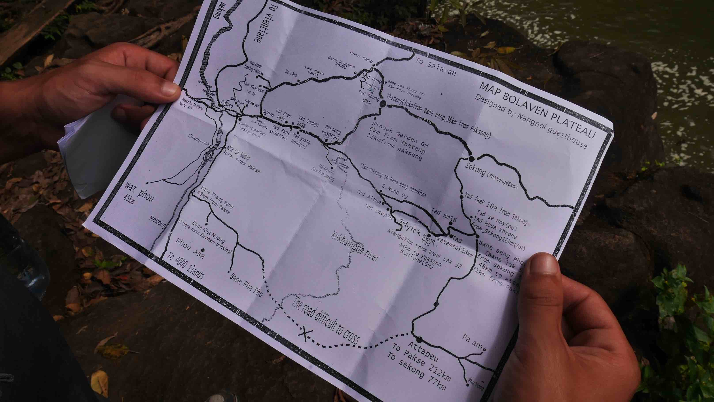
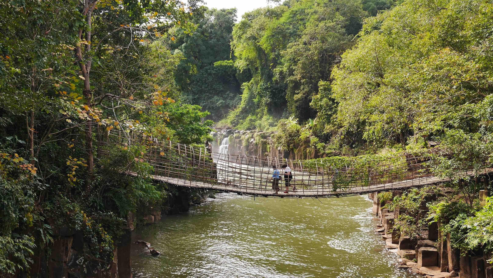
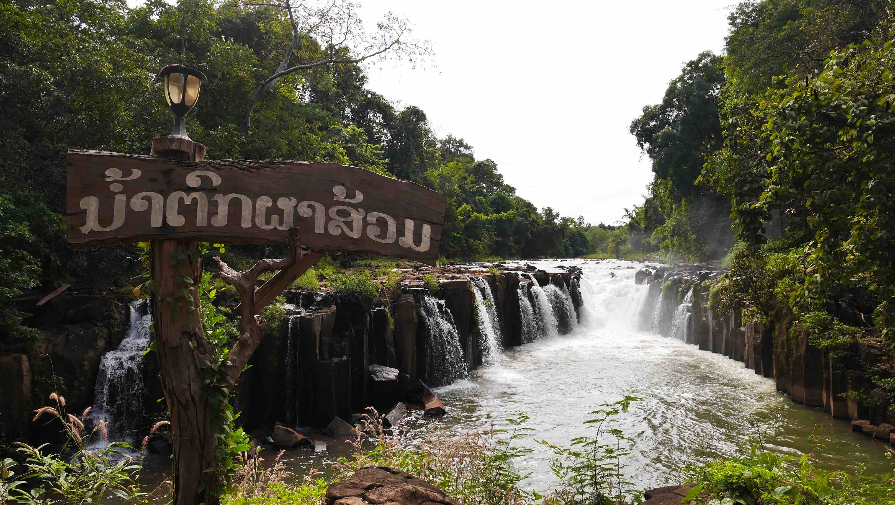
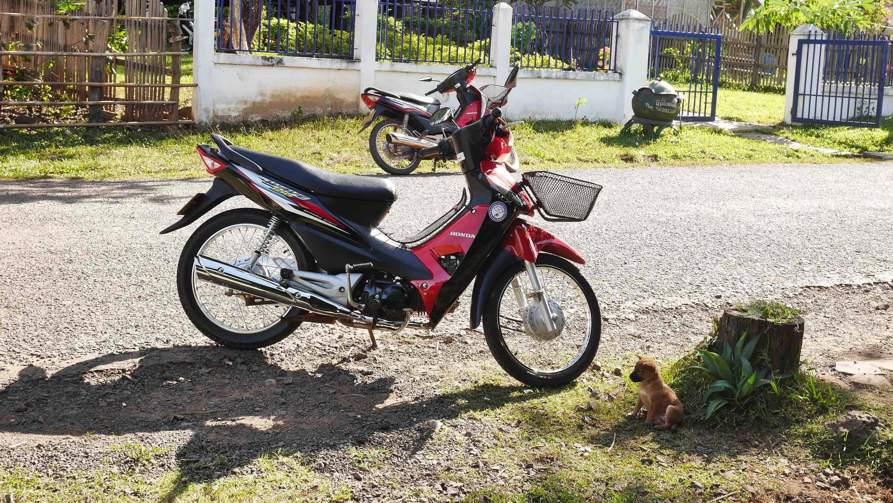

The <b>Bolaven Plateau</b> is an elevated region in southern Lao, and it is known for its cool climate, numerous waterfalls coffee plantations. A lot of ethnic groups made their homes in the region, Laven (Bolaven means ‘Home of the Laven’) being the largest one. Several other Non-Khmer ethnic groups, including the <b>Alak</b>, <b>Katu</b>, <b>Tahoy</b> and <b>Suay</b>, also live on the plateau.

<b><highlight><middle>This is the only reason to stop in ugly and uncharming Pakse.</middle></highlight></b>

After some days of relaxation in the <b><a href="{{site.url}}/4000Islands" target="_blank">4000 Islands</a></b>, I was ready for a new adventure, so I went to Pakse, the starting point to the <b>Bolaven Plateau Large Loop</b>, 320km of huge coffee plantations, waterfalls, farmland, ethnic diversity and miles of excellent roads, splitted into 3 days.

<figure>
	
	<figcaption>The map that everybody uses for the Bolaven Plateau (Miss Noy).</figcaption>
</figure>

It is important to take some considerations before doing this trip. First, be careful where you rent your motorbike and be sure that it is in good condition. If necessary, take it for a small ride before, just to be sure that the motorbike is in good condition. I would also recommend that you take an extra chain lock with you, just to be sure. I've read some reports from people that had their motorbike stolen even when using the chain lock that the renter gave them. You'll have to pay for a brand new motorbike if it gets stolen. To guarantee this money, people that rent motorbikes tend to ask for your passport during the lenght of your trip. It doesn't matter if it is illegal or not, it is how it works over there. I rented my motorbike for ~7$ per day with +1/2$ of gas each day.

You should also bring some warm clothes with you, because despite Lao being a very warm country, the Plateau becomes very cool at night. This is the reason, along with volcanic soil, why the coffee beans of Lao are known across the globe. Also, you should have a rough idea of where you'll be sleeping each night. There is a lot of places along the way where you can stop, but I chose to stay in <b>Tad Lo</b> (<b>Fandee Guesthouse</b>) 1 night and the other one near <b>Tad Alone / Tad Couple</b> waterfalls. I was supposed to stay in <b>Tad Saulin Homestay</b>, but they were asking for 15$ each person for a tent, so I said <i>'no'</i> and went further to find a much better place for ~10$ a double bed room.

<figure>
	
	<figcaption>The map I got from my Guesthouse was a little bit different, but the essential is the same.</figcaption>
</figure>

I stayed in a place called <b>Nang Noi Guesthouse</b> in Pakse and I can totally recommend them. I stayed 1 night before going to the <b>loop</b>, rented a motorbike in perfect condition (only 8000km), left my backpack in there while in the <b>loop</b>, another night when I finished the <b>loop</b> and my night bus ticket to <b>Vientiane</b>. I recommend you to send an email at least 1 day before getting there because they can be fully booked due to their popularity.

<b><highlight><middle>So let's start, shall we?!</middle></highlight></b>

My goal on the first day was to reach <b>Tad Lo</b> and visit all the available waterfalls on the way, ideally before sunset. There are people leaving Pakse everyday for the <b>loop</b>, which means that the sooner you get to where you'll be sleeping that day, the better chance you have to get the best price/quality room available.
There is one stop at km-35 to see <b>Tad Pasaum</b> waterfall, 1.20$ admission fee plus 0.25$ for the parking. The parking fee is something that you should not try to avoid or else you can get your motorbike stolen. It would not be the first time that something like that happens.

I slept that night in <b>Fandee Guesthouse</b>, a place owned by 2 expats living in Lao for many years now. They have very few bungalows available so you really should get there early if you want to sleep there. A really positive thing about the place is the kitchen available, something that not every place in <b>Tad Lo</b> is able to offer.

<figure>
	
	<figcaption>A nice path to get to our first waterfall, Tad Pasaum.</figcaption>
</figure>

<figure>
	
	<figcaption>Tad Pasaum waterfall was not memorable.</figcaption>
</figure>

<figure>
	
	<figcaption>A new friend in Tad Lo.</figcaption>
</figure>

 
<h1>How to get there and away</h1>
<ul>
<li>To get to Pakse from Don Khone, you need to get a boat to the Nakasong Pier and there you'll have a lot of buses that will leave you in Pakse city center. ~9 dollars.</li>
<li>NIGHT BUS TO VIENTIANE.</li>
</ul>

 
<h1>What to do/see</h1>
<ul>
<li>Explore the island from north to south by bicycle!</li>
</ul>

 
<h1>Where to sleep</h1>
<ul>
<li><b>Nang Noi Guesthouse</b>, ~13$ double bungalow by the river.</li>
<li><b>Fandee Guesthouse</b>, ~13$ double bungalow by the river.</li>
</ul>