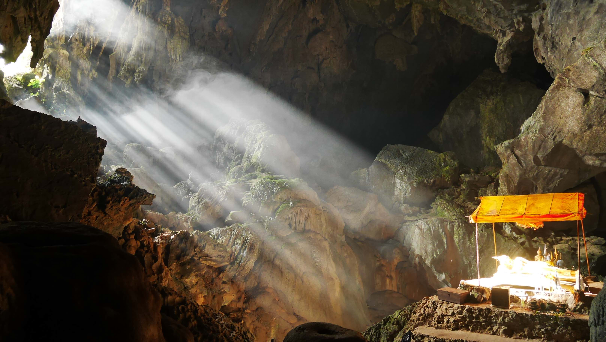

Honestly, Vang Vieng was one of the biggest surprises I had alonside <b><a href="{{site.url}}/Varanasi" target="_blank">Varanasi</a></b> in India on my 3 months trip. Whenever I read something about Vang Vieng, inevitably it would be all about <b>tubing</b> on the <b>Nam Song River</b>. <b>Tubing</b> is an activity where people would go down the river on a tube, stoping on one of many bars located in the river margins. Pulsating music, drinking games and drug fueled debauchery became the norm. 

During the day people would gather in one of many bars scatered around town and would chill while watching to 'Friends' episodes in an endless loop. At night it was <i>party time</i> with numerous bars with loud music and even free beer would be served in some of them!

<b><highlight><middle>Gladly, this is not the Vang Vieng that I encountered when I visited.</middle></highlight></b>

<figure>
	
	<figcaption>Vang Vieng was love at first sight.</figcaption>
</figure>

I left <b><a href="{{site.url}}/Vientiane" target="_blank">Vientiane</a></b> in the early morning and ~3-4h later I was left in the bus terminal at the entrance of the city. There is no need to book any pick up, unless you're staying on the west side of the river.

I stayed in <b>Dokboua Guesthouse</b> where I got a double room with private bathroom for ~8$. The location is pretty central (it's not hard, Vang Vieng is very small) and the old lady that runs the place is very nice, despite the clear difficulty with the English, but she always found a way to communicate! Wifi is available and she can arrange everything you need like buses for example, although this is pretty standard in every place.

<figure>
	
	<figcaption>It is possible to ride a hot air balloon in Vang Vieng!</figcaption>
</figure>

The best way to explore the surroundings of Vang Vieng is by bycicle or motorbike, easily rented in almost every street in town. This gives you the freedom to explore remote places at your own pace, but be careful because some roads might not be in the best condition. If you want to explore the west side, there is a bridge in town where you will be charged to cross, however if you head south there's another bridge where no one will be waiting for you.

<b><highlight><middle>I recommend you at least 2/3 days to explore the surroundings of Vang Vieng. The nature is stunning and deserves to be explored with time.</middle></highlight></b>

<b>Rent a motorbike for 1 full day. At least.</b> Exploring the beautiful nature around Vang Vient it's one of the most satisfying things to do. One of the reasons to rent the motorbike is to go to the famous <b>Blue Lagoon</b>, located at ~8km from downtown. The lagoon is quite nice and you'll have a bonus cave to explore in the area. The entrace fee was 10.000Kip in December 2016. Be sure to stop in <b>Pha Ngern view point</b> on your way to the lagoon, despite being quite a climb to the view point, you'll be rewarded with an amazing view once you're there. Definitely worth the hassle.

<figure>
	
	<figcaption>The view point is magnificient.</figcaption>
</figure>

<figure>
	
	<figcaption>The harvested fields of Vang Vieng.</figcaption>
</figure>

<figure>
	
	<figcaption>I think that the Blue Lagoon doesn't quite live up to its reputation...</figcaption>
</figure>

<figure>
	
	<figcaption>The cave next to the Blue Lagoon its amazing!</figcaption>
</figure>

I think that the best way to explore Vang Vieng's surroundings is to simply get lost. When you spot a dirt road, go for it! You'll always be rewarded with friendly smiles ans stunning nature. Just be sure to have enough fuel for the day. I tried to get gas on the west side but I was asked for almost triple the price of what it should be. I also had no luck when I tried to negotiate the price.

The rural area of Vang Vieng is the most interesting and appealing for me. I trully feel for the people that stay all day in some random bar watching episoded of <i>Friends</i> when they have this amazing scenery available to explore. Vieng Vieng is a lot more than your usual backpacker destination.

<figure>
	
	<figcaption>Be careful not only with the roads but also with the animals!</figcaption>
</figure>

<figure>
	
	<figcaption>Amazing landscape for a school, right?!</figcaption>
</figure>

<figure>
	
	<figcaption>Rural Vang Vieng, away from the tourist crowds.</figcaption>
</figure>

<figure>
	
	<figcaption>Coming through!</figcaption>
</figure>

<figure>
	
	<figcaption>The school if finished for today.</figcaption>
</figure>

PANKAKES BREAKFAST CHEAP GOOD

 
<h1>How to get there and away</h1>
<ul>
<li>Bus from <b><a href="{{site.url}}/Vientiane" target="_blank">Vientiane</a></b> to <b><a href="{{site.url}}/VangVieng" target="_blank">Vang Vieng</a></b>. The trip takes about ~3-4h.</li>
<li>MINIBUS TO LUANG PRABANG</li>
</ul>

 
<h1>What to do/see</h1>
<ul>
<li>Blue Lagoon.</li>
<li>Patuxai.</li>
</ul>

 
<h1>Where to sleep</h1>
<ul>
<li><b>Dokboua Guesthouse</b>, ~8$ double room with private bathroom.</li>
</ul>