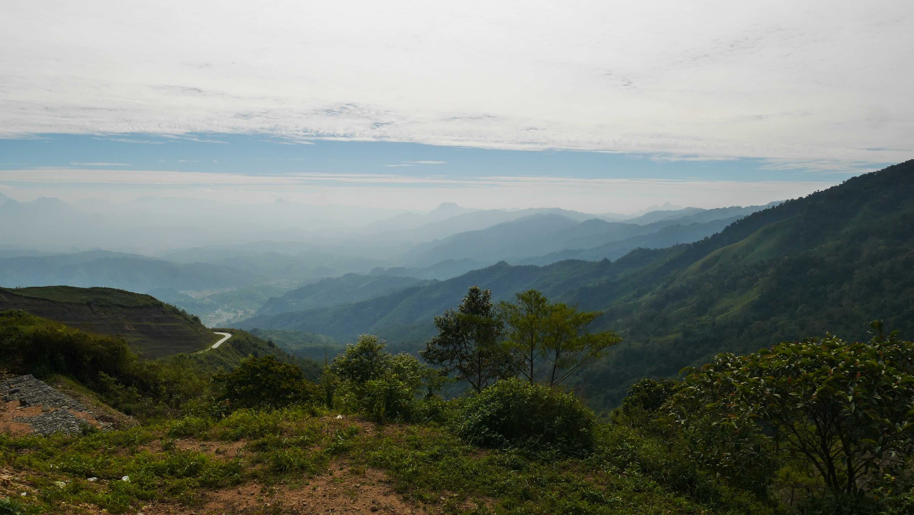
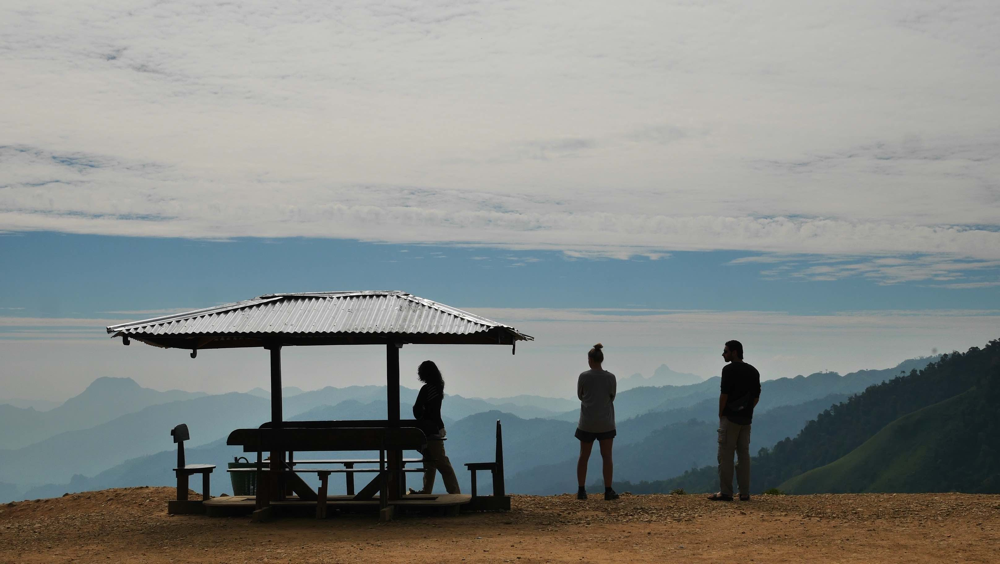

In my 3 month trip there were almost no major incidents which is somewhat remarkable. There was the old man that passed out in the middle of the road between Cambodia and Lao (you can read more about it <b><a href="{{site.url}}/SiemReap" target="_blank">here</a></b>), <b>and</b> the trip between <b><a href="{{site.url}}/VangVieng" target="_blank">Vang Vieng</a></b> and Luang Prabang.

This is a relatively short trip (~4h) with a short break in a view point with a trully terrific view over Lao. My trip was done in a new and confortable minivan full of other tourists. Some people in <b><a href="{{site.url}}/VangVieng" target="_blank">Vang Vieng</a></b> earn their life transporting around tourists to/from Luang Prabang. This is probably the most crowded route and place in Lao.

What happens when someone <i>threatens</i> your only way to get money to support yoursel and your family? Nothing good, right? That's precisely what happened midway into my journey to Luang Prabang. It is know that people drive like maniacs in Asia, but by now I was already used to it and it was the norm for me now. What I didn't expected was what came after...

<b><highlight><middle>Probably the scariest experience in all my travels.</middle></highlight></b>

Out of nowhere came a guy driving like a maniac overtaking us. I saw him getting very close, but he didn't touch our van. It was luck, skill, whatever you want to call it, but it didn't happen. This made our driver go <b>completely nuts</b> for the next 5 minutes or so, driving like a maniac, trying to overtake back the other van. Eventually he made it, and that was when he suddently stopped in the middle of the road to block the path for the other van. He then proceeds to grab a <b>Katana</b> that was hidden below the seat and storms out to the other driver. They eventually sorted it out and the other guy never overtook us again.

Despite all of this, I still could enjoy the views between <b><a href="{{site.url}}/VangVieng" target="_blank">Vang Vieng</a></b> and Luang Prabang. It is without a doubt one of the most scenic roads out there.

<figure>
	
	<figcaption>This is one of the most beautiful roads in Lao!</figcaption>
</figure>

<figure>
	
	<figcaption>A quick stop between Vang Vieng and Luang Prabang.</figcaption>
</figure>

 
<h1>How to get there and away</h1>
<ul>
<li>Minibus from <b><a href="{{site.url}}/VangVieng" target="_blank">Vang Vieng</a></b> to Luang Prabang, ~4h ride.</li>
<li></li>
</ul>

 
<h1>What to do/see</h1>
<ul>
<li>Blue Lagoon.</li>
<li>Pha Ngern view point.</li>
<li>Getting lost in the amazing wilderness!</li>
</ul>

 
<h1>Where to sleep</h1>
<ul>
<li><b>Dokboua Guesthouse</b>, ~8$ double room with private bathroom.</li>
</ul>