Cairo is Egypt's capital and largest city with a population of over 20.4 million. The streets are chaotic at rush hours and the metro can also be over populated. The overcrowded places are not as bad as in <b><a href="{{site.url}}/Delhi" target="_blank">New Delhi (India)</a></b>, but they're not too shabby either. It is also the most <i>relaxed</i> city in Egypt, where many women wear denim jeans on a more <i>westernish</i> fashion.

I flew in from Porto to Cairo with the intent of spending 2 weeks in Egypt. The countries capitals, usually, are not the most appealing to me, but I must say that I became very impressed with Cairo. The metro allows for an easy navigation through the city and you have tons of interesting stuff to visit and not only the usual boring shopping/museum stuff like the iconic <b>Tahrir square</b> where the revolution happened, <b>Al-Azhar Mosque</b> is one of the pillars of Islamic thought, the <b>Citadel</b> and, of course, the <b>Pyramids of Giza and the Sphinx</b>.

<figure>
	<a href="../images/egypt/cairo/cairo1.JPG">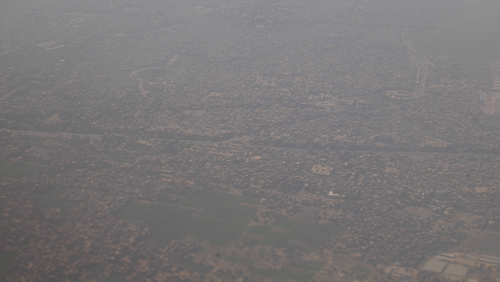</a>
	<figcaption>Not the best shot, but this is Cairo from above.</figcaption>
</figure>

I arrived at Cairo at ~9pm and since there was no public transportation available (March 2017) I opted to take a pickup from my hostel (<b>Wake Up! Cairo Hostel</b>) for ~8$. I took care of my <b>VISA</b> at the airport when I landed. Actually, it was really easy. If you're eligible for <b>VOA</b> you just have to buy it at the desk next to the entry immigration office, put it in the passport and you're good to go!

What is the first thing that people do when in Cairo? Yeah, go to the pyramids... Actually, it is easy to get to the <b>Pyramids of Giza</b> using public transportation (yes, they're not in the desert... They're right in the middle of the city). Just get into the metro and stop at the <b>Giza</b> station. Right outside the station you'll have the <b>Al Haram</b> street and this is where you'll board any collective bus running down the street. When you see the pyramids in front of you just ask the driver to get out and he'll leave you wherever you want.

<figure>
	<a href="../images/egypt/cairo/cairo2.JPG">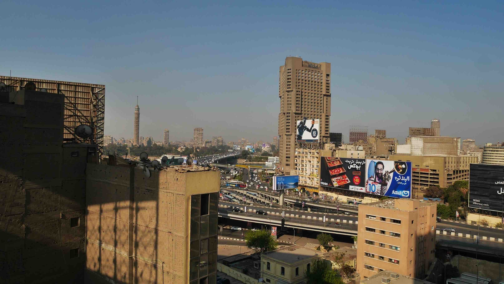</a>
	<figcaption>Cairo from the breakfast room in the hostel.</figcaption>
</figure>

<figure>
	<a href="../images/egypt/cairo/cairo3.JPG">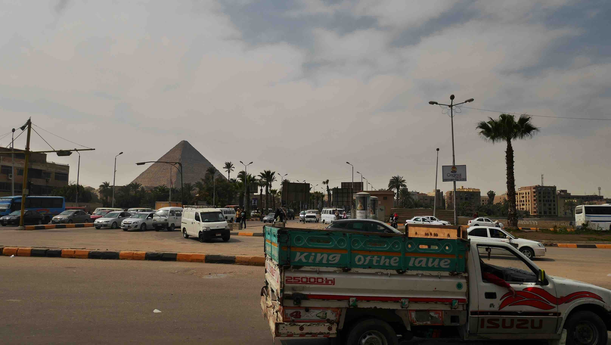</a>
	<figcaption>The bus driver dropped me off near the pyramids.</figcaption>
</figure>

I heard about people in my hostel that went to the Pyramids with an Egyptian friend, and that this can be of a great help when dealing with people there. I went alone and I must say that I wasn't quite ready for such a <b>stressful</b> atmosphere.

It all starts when you approach the ramp that leads to the entrance where the ticket booth is. Don't mind the police in there, they will only help you if you approach them. The first thing that you'll hear is that the entrance is on your left and you should go there. Be prepared to have more than 10 men surrounding and pressuring you to go there. It can be quite intimidating, but you should stay firm and keep on going up the ramp. Don't feel bad to ignore all of them, try to keep a smile on all the time and move!

<b><highlight><middle>Don't trust anyone in the Pyramids complex. Anyone.</middle></highlight></b>

Once you're inside the complex, you're just a moving wallet. I think I was ~2.5h inside the complex, and was only alone half an hour when I walked around the Pyramids where usually only camels go. People will try to sell you camel/horse rides all the time, will give you gifts <i>for free</i>, will tell you that you can't go <b>that</b> way without a camel and so on... Just keep smiling and ignore. It'll be hard and intense, but this is just the start.

The complex is big and hot. Bring plenty of water, fresh clothes and comfortable shoes. The pyramids are way bigger and stunning than I ever imagined and deserve to be contemplated with time. You can also go inside the <b>Great Pyramid</b> (17$) and one of the Pyramids (3.5$) depending on which one is open. The entrance ticket costed me 7$.

<figure>
	<a href="../images/egypt/cairo/cairo4.JPG">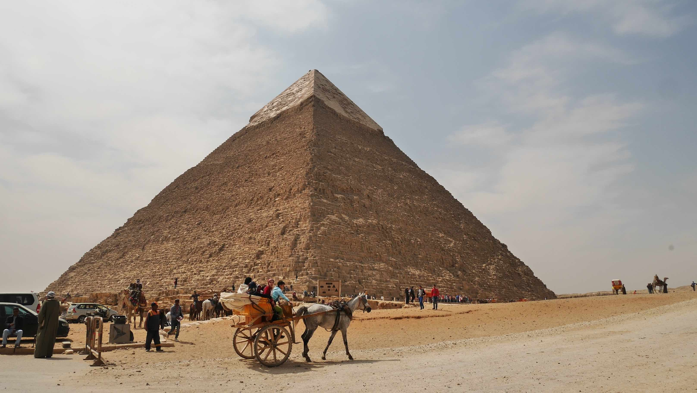</a>
	<figcaption>The great pyramid of Khufu.</figcaption>
</figure>

<figure>
	<a href="../images/egypt/cairo/cairo5.JPG">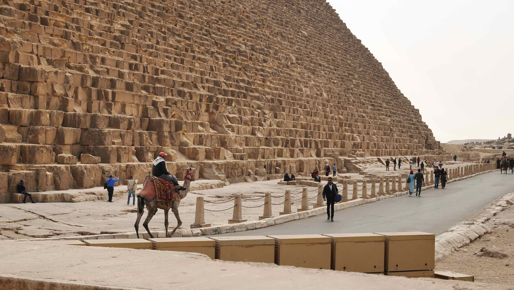</a>
	<figcaption>I would never imagine that 1 person = 1 block.</figcaption>
</figure>

<figure>
	<a href="../images/egypt/cairo/cairo6.JPG">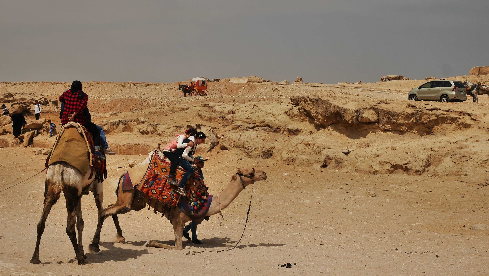</a>
	<figcaption>Careful!</figcaption>
</figure>

<figure>
	
	<figcaption>Not so exotic with Cairo on the horizon, right?!</figcaption>
</figure>

<figure>
	<a href="../images/egypt/cairo/cairo8.JPG">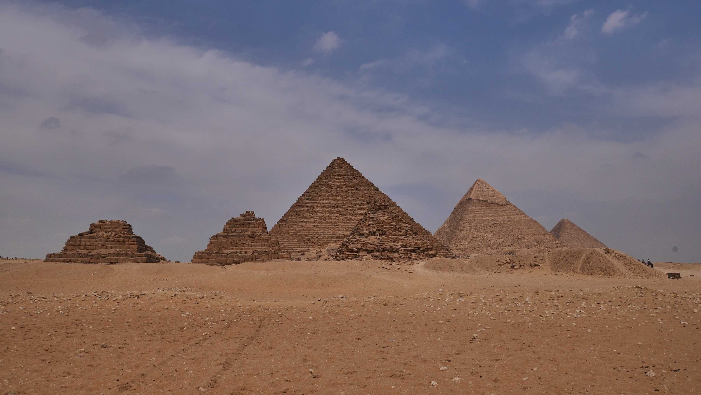</a>
	<figcaption>A rare moment when I got the Pyramids all for myself!</figcaption>
</figure>

<figure>
	<a href="../images/egypt/cairo/cairo9.JPG">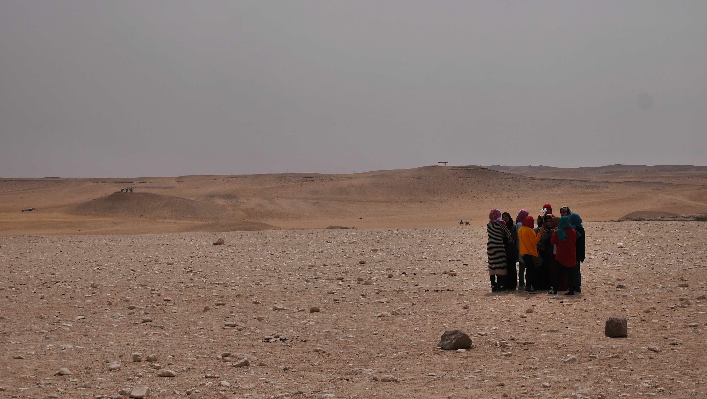</a>
	<figcaption>A school trip to the Pyramids.</figcaption>
</figure>

<figure>
	<a href="../images/egypt/cairo/cairo10.JPG">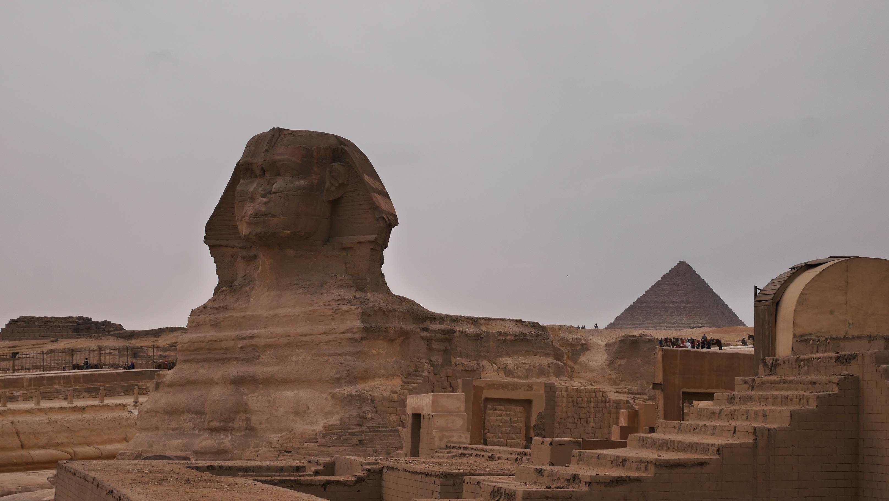</a>
	<figcaption>The great Sphinx.</figcaption>
</figure>

<figure>
	<a href="../images/egypt/cairo/cairo11.JPG">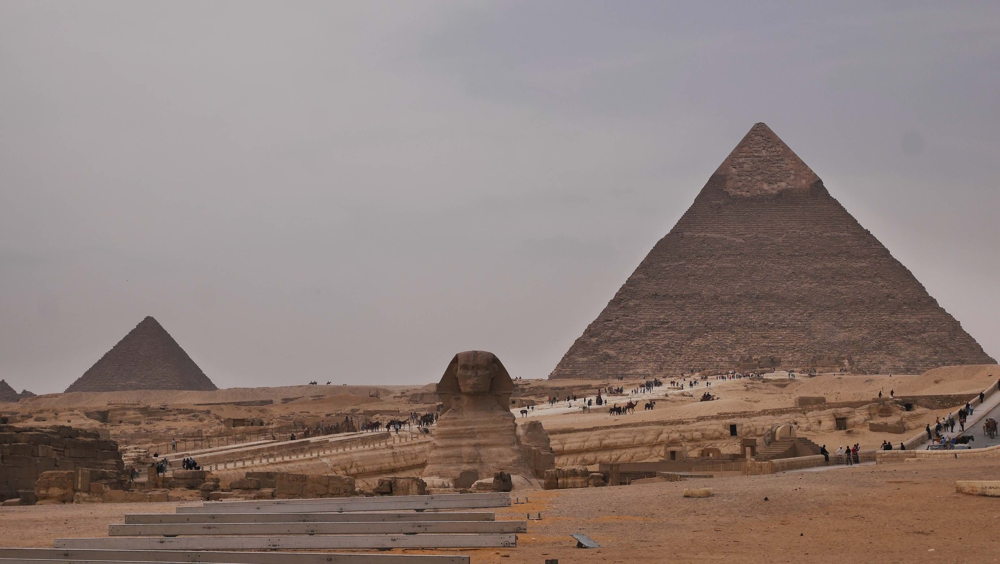</a>
	<figcaption>The Sphinx and the Great Pyramid of Khufu.</figcaption>
</figure>

Despite all the hassling (I met a guy at the hostel that went the next day with an Egyptian because he could not appreciate it the first time when he went alone...) I still enjoyed the Pyramids complex. Just like the <b><a href="{{site.url}}/Agra" target="_blank">Taj Mahal</a></b>, it is something very very very unique and will be in my memory forever.

You'll need at least another full day to explore downtown. If you plan to see the <b>Museum</b>, <b>Islamic/Coptic Cairo</b> and <b>Khan el-Khalili</b> it should be more than enough. It is easy to navigate through the city using the Metro and shared minivans available. I had the help of Mohamed & Mohamed, two friends I met in Couchsurfing that were a big big help!

<figure>
	<a href="../images/egypt/cairo/cairo12.JPG">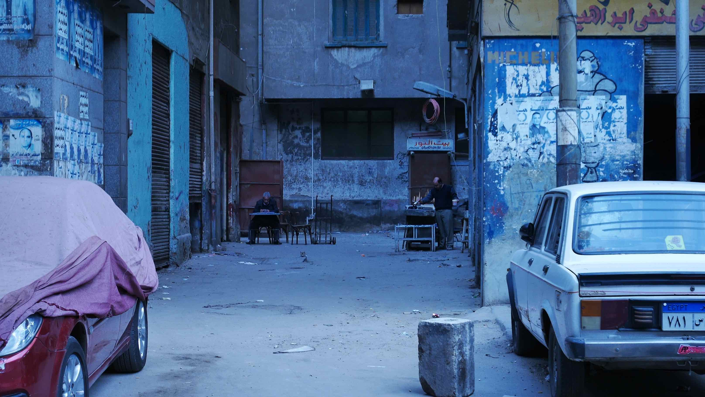</a>
	<figcaption>People working in the streets.</figcaption>
</figure>

<figure>
	<a href="../images/egypt/cairo/cairo13.JPG">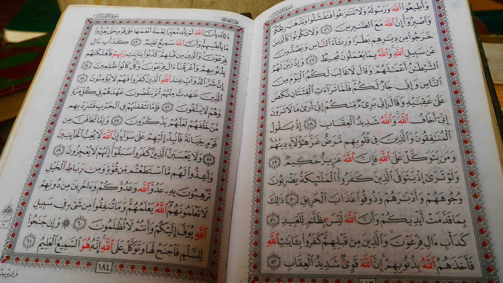</a>
	<figcaption>A sneak peak of al-Qurʾān.</figcaption>
</figure>

<figure>
	<a href="../images/egypt/cairo/cairo14.JPG">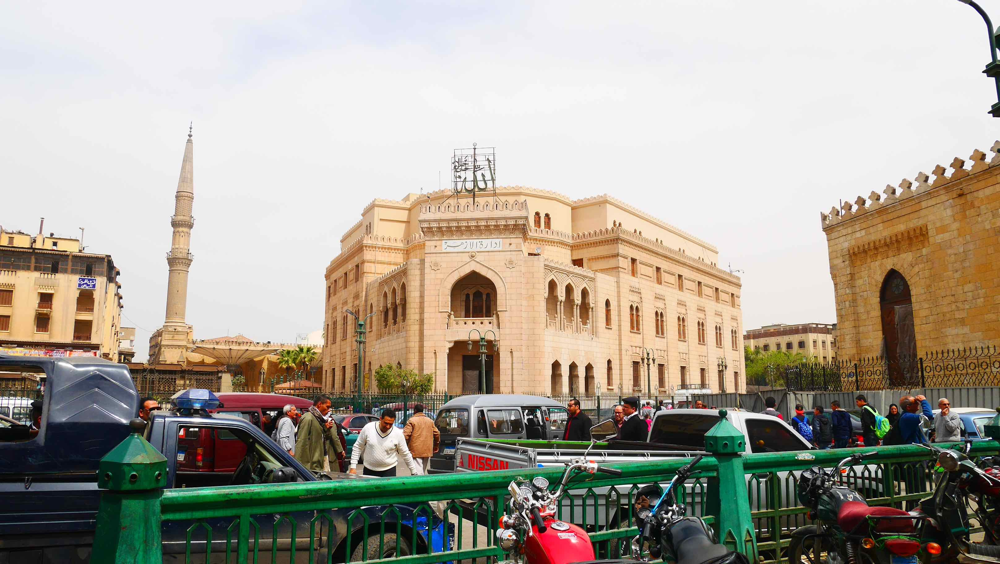</a>
	<figcaption>Al-Hussein and Sedey Hassan El Adawy mosque.</figcaption>
</figure>

<figure>
	<a href="../images/egypt/cairo/cairo15.JPG">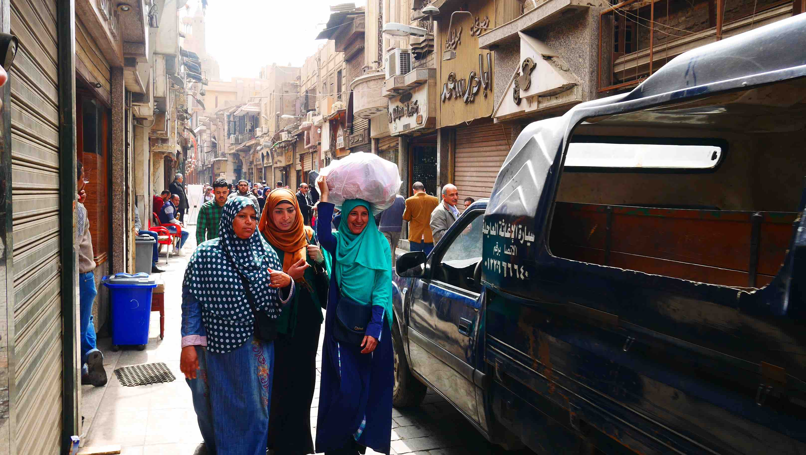</a>
	<figcaption>The busy Khan el Khalili street.</figcaption>
</figure>

<figure>
	<a href="../images/egypt/cairo/cairo16.JPG">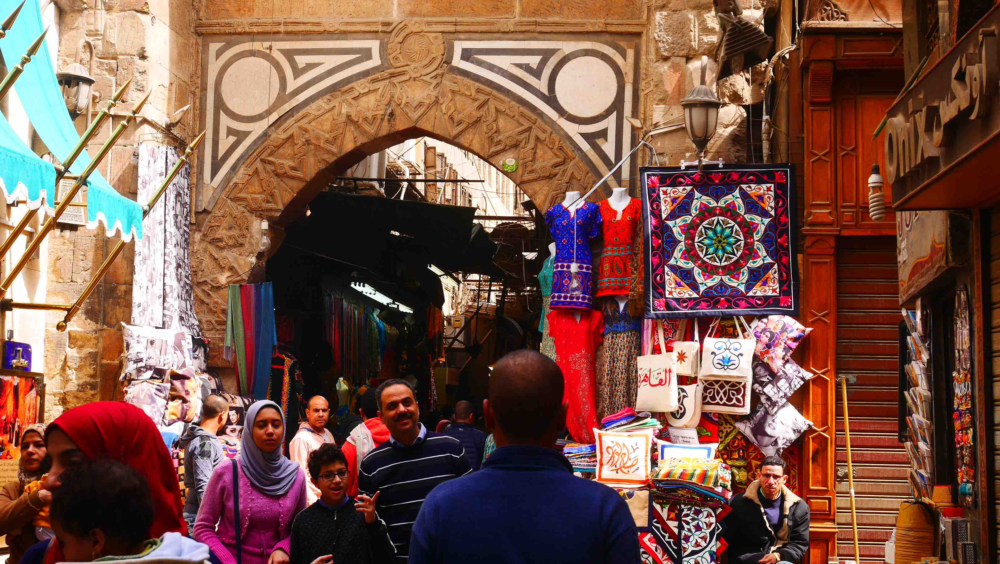</a>
	<figcaption>The mix of colours here is beautiful.</figcaption>
</figure>

<figure>
	<a href="../images/egypt/cairo/cairo17.JPG">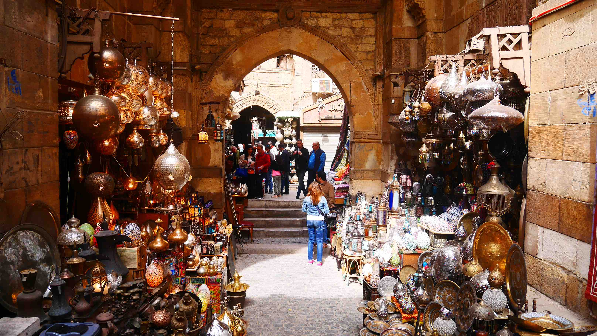</a>
	<figcaption>It's possible to buy anything here.</figcaption>
</figure>

The museum, located in the <b>Tahrir square</b>, is a must go. I'm not the kind of guy that goes to museums, but this time I don't regret at all going. All the relics that were found intact inside the <b>Tutankhamun</b> tomb are here. There are also <b>Mummies</b>. It's an amazing journey through time on one of the oldest civilizations on earth.

You should allow at least 2h to visit the whole museum. Also, you'll be charged a ridiculous amount (almost the price of the ticket) for each camera you bring, when the locals don't have to pay for it. You'll also be charged more for going inside the <b>Tutankhamun</b> and the <b>Mummies</b> room where you'll learn all about the mummification process.

<figure>
	<a href="../images/egypt/cairo/cairo18.JPG">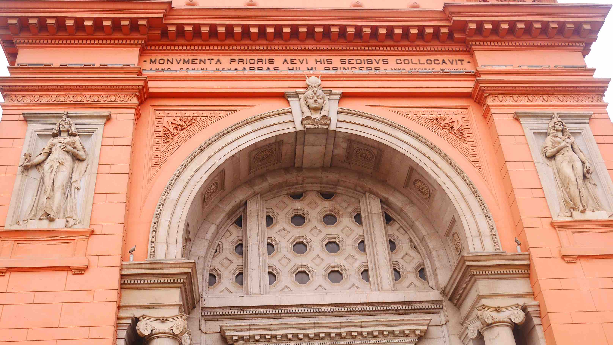</a>
	<figcaption>The entrance of the museum.</figcaption>
</figure>

<figure>
	<a href="../images/egypt/cairo/cairo19.JPG">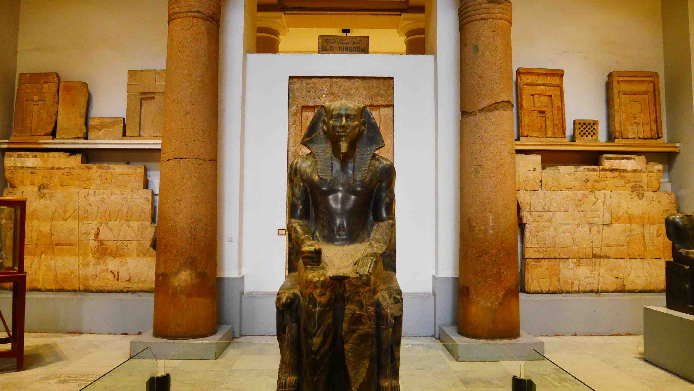</a>
	<figcaption>A ruler of the Old Kingdom.</figcaption>
</figure>

<figure>
	<a href="../images/egypt/cairo/cairo20.JPG">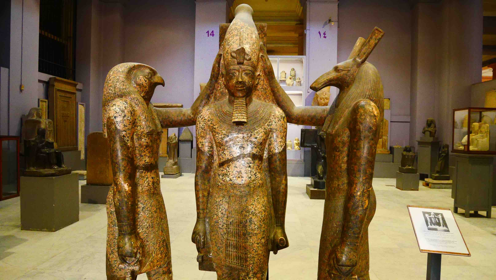</a>
	<figcaption>Anubis and Horus blessing a former king.</figcaption>
</figure>

<figure>
	<a href="../images/egypt/cairo/cairo21.JPG">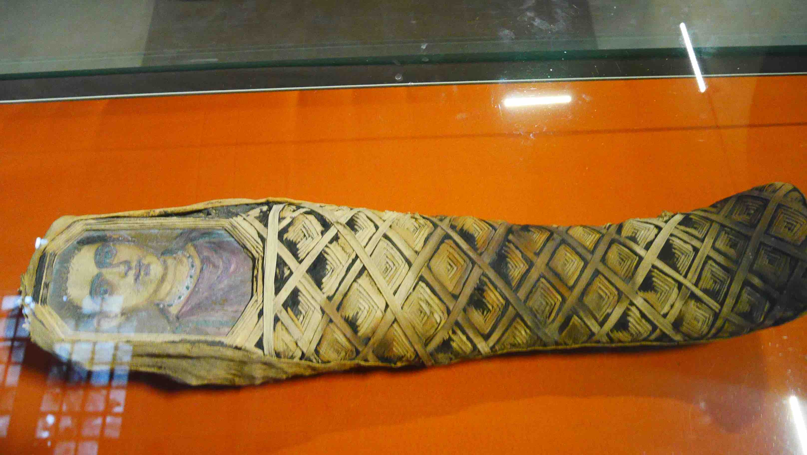</a>
	<figcaption>A creepy mummy!</figcaption>
</figure>

After 2 days in Cairo I went to <b>Luxor</b> by train on a ~12h journey (the train was delayed, but this seems to be the rule around there). From my hostel to the train station it was only ~2km so it is easily walkable. Once inside the station don't listen to anyone. There will be all kinds of people trying to tell you that you can't board the train, that the train was cancelled and so on...

In fact, it is not <i>easy</i> to buy a ticket from Cairo to Luxor. You always have 3 options when it comes to trains in Egypt; either you buy the ticket online, you buy it to the conductor or you buy it in the train station. All of these are fine <b>except</b> for the last one in Cairo. There is an overnight train from Cairo to Luxor that costs around ~100$ with dinner/breakfast and they'll tell you that as a tourist you can only board that train.

<b><highlight><middle>It is not possible at all to buy a day train from Cairo to Luxor at the Ramses train station.</middle></highlight></b>

With this in mind, I bough my train ticket online and I had absolutely no problem when the conductor came to check it. I even met a guy that was in the army, sitting next to me that chatted something laughable to him, making him smile back and keep going on his work (maybe he helped me?!). However, it is possible to buy tickets at the train stations in Luxor/Aswan. The only problem is from Cairo.

Overall, Cairo was a really nice surprise. The city is huge, but it is very rich historically and culturally. It is very easy to navigate the city by metro and shared minivans and if you want to spend 1 week there I'm pretty sure that you'll be entertained.

Oh, don't miss <b>Abou Tarek's</b> Koshary!

<figure>
	<a href="../images/egypt/cairo/cairo22.JPG">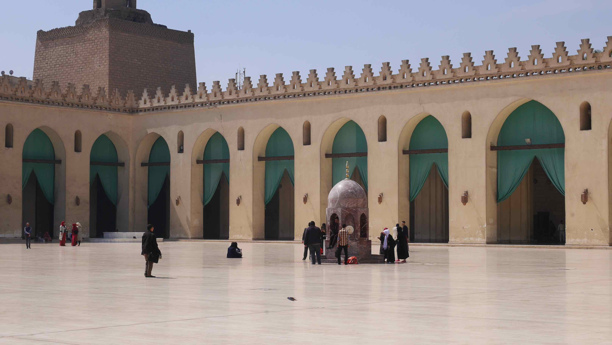</a>
	<figcaption>Inside one last mosque in Cairo!</figcaption>
</figure>

 
<h1>How to get there and away</h1>
<ul>
<li>I flew from Madrid to Cairo.</li>
<li>I took a direct train from the Ramses station to Luxor. Buy the ticket online, you'll not be able to buy it in the station or to the conductor if you go during the day on a regular train.</li>
</ul>

 
<h1>What to do/see</h1>
<ul>
<li>Al-Azhar Mosque.</li>
<li>Citadel.</li>
<li>Egyptian Museum.</li>
<li>Khan El Khalili.</li>
<li>Pyramids of Giza and the Sphinx.</li>
</ul>

 
<h1>Where to sleep</h1>
<ul>
<li><b>Wake Up! Cairo Hostel</b>, ~8$ dorm bed with breakfast included. Mido is a very good host and can help you with anything.</li>
</ul>