Aswan is a city in the south of Egypt and it's a lot smaller and quiet than <b><a href="{{site.url}}/Cairo" target="_blank">Cairo</a></b> and <b><a href="{{site.url}}/Luxor" target="_blank">Luxor</a></b>. The city is used as base to see one of the most unique monuments in the world, <b>Abu Simblel</b>, and I came here exactly with this in mind.

I arrived in the morning by train from <b><a href="{{site.url}}/Luxor" target="_blank">Luxor</a></b>, a trip that usually takes about ~3-4 hours. I had searched online for hostels in Aswan but didn't find any so I wanted to walk around to see if it really was the case or not... And it turned out to be the truth! Fortunately, I found another tourist at the reception of the <b>Memnon Hotel</b> and we decided to share a twin bedroom with private bathroom for 6$ each. It is really centrally located and has <i>breakfast</i> (toast and coffee) available, but it is by far the worst place I stayed in Egypt.

<figure>
	<a href="../images/egypt/aswan/aswan1.JPG">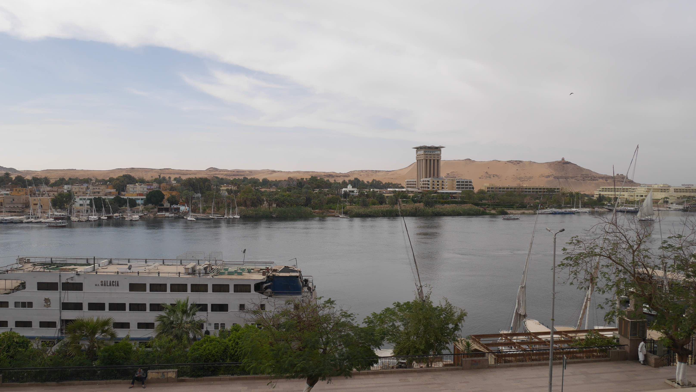</a>
	<figcaption>The view from my room was not that bad.</figcaption>
</figure>

<figure>
	<a href="../images/egypt/aswan/aswan2.JPG">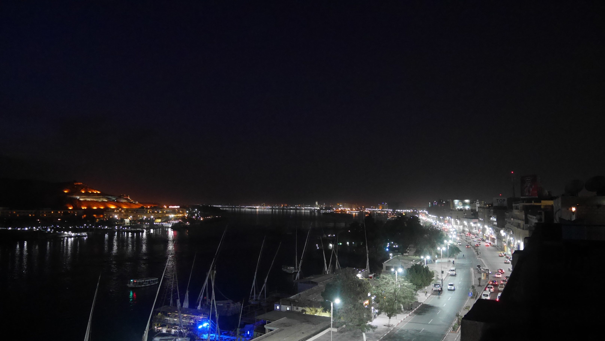</a>
	<figcaption>The Corniche at night.</figcaption>
</figure>

My main goal in Aswan was to visit <b>Abu Simbel</b> and I tried to visit it on the next day, but the guy at the <b>Memnon's</b> reception said that I could only book for the day after, and that was what I did. The trips are offered by every place in Aswan and the price can vary depending on where you buy it. I heard people sitting next to me on the van talking about 40€ tickets... That is a total rip off because they were staying at higher up places. I paid ~7€ for the same service just because I bought it in a cheap hotel.

Since I had 1 full day to spare before going to <b>Abu Simbel</b> I decided to walk around and see what Aswan had to offer. I first went to the West bank to visit the <b>Tombs of the Nobles</b> and also to see a typical <b>Nubian Village</b>. Nearly 1km north of the train station, in the <b>Corniche</b>, you have a public boat that transports people between the 2 sides of the river.

<figure>
	<a href="../images/egypt/aswan/aswan3.JPG">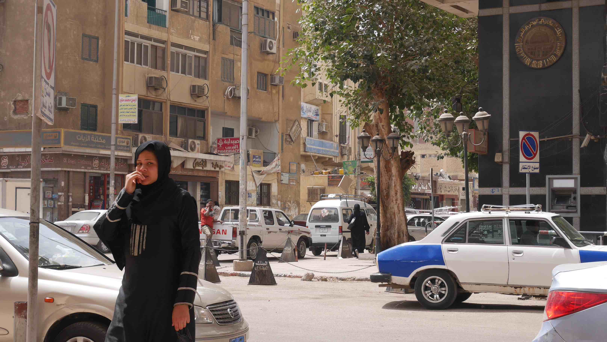</a>
	<figcaption>The streets of Aswan.</figcaption>
</figure>

<figure>
	<a href="../images/egypt/aswan/aswan4.JPG">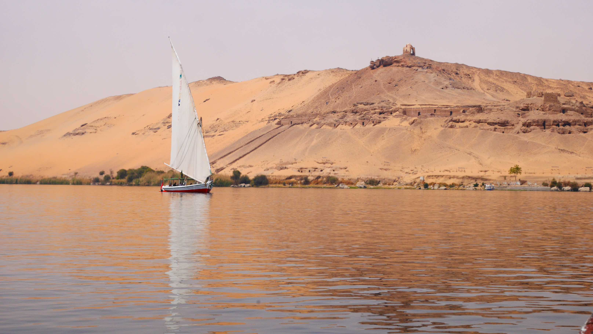</a>
	<figcaption>On my way to the west side.</figcaption>
</figure>

The <b>Tombs of the Nobles</b> is nothing impressive. They're just a bunch of tombs with almost nothing left to be appreciated. I came here from <b><a href="{{site.url}}/Luxor" target="_blank">Luxor</a></b> which meant that I had already visited the <b>West Bank</b> there. However, if you climb to the top of the hill, where you'll find a small shrine, you'll have a great view over <b>Aswan</b>.

This was the only place where I actually talked with Egyptian females. They even were the ones that took the initiative! You've to bear in mind that despite <b><a href="{{site.url}}/Cairo" target="_blank">Cairo</a></b> being a huge cosmopolitan city, the rest of the country is still very conservative.

<figure>
	<a href="../images/egypt/aswan/aswan5.JPG">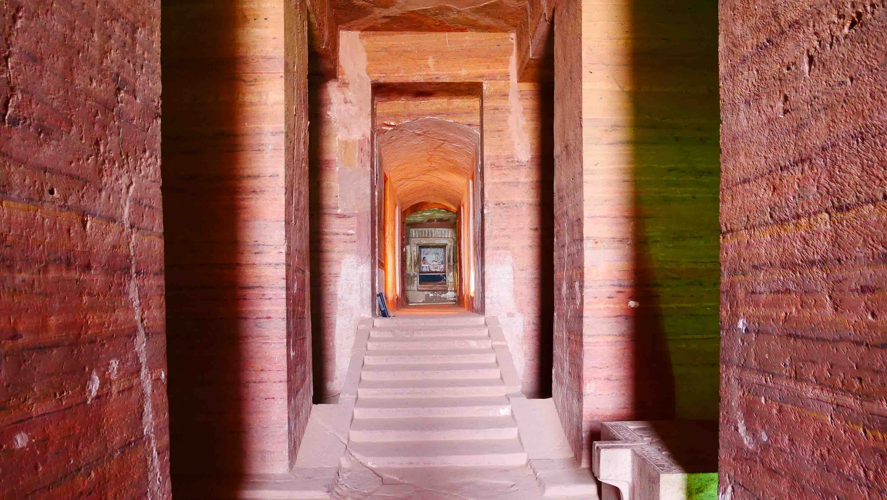</a>
	<figcaption>One of the tomb's entrance.</figcaption>
</figure>

<figure>
	<a href="../images/egypt/aswan/aswan6.JPG">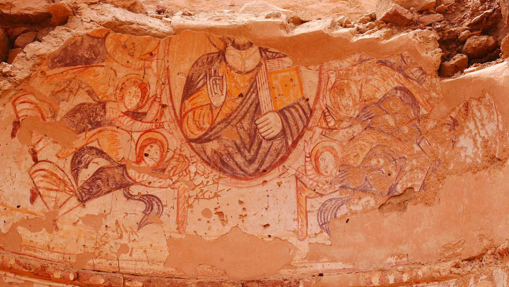</a>
	<figcaption>Catholic references?!</figcaption>
</figure>

<figure>
	<a href="../images/egypt/aswan/aswan7.JPG">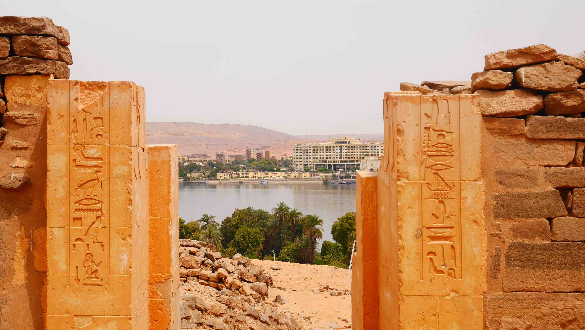</a>
	<figcaption>A gate to the city.</figcaption>
</figure>

<figure>
	<a href="../images/egypt/aswan/aswan8.JPG">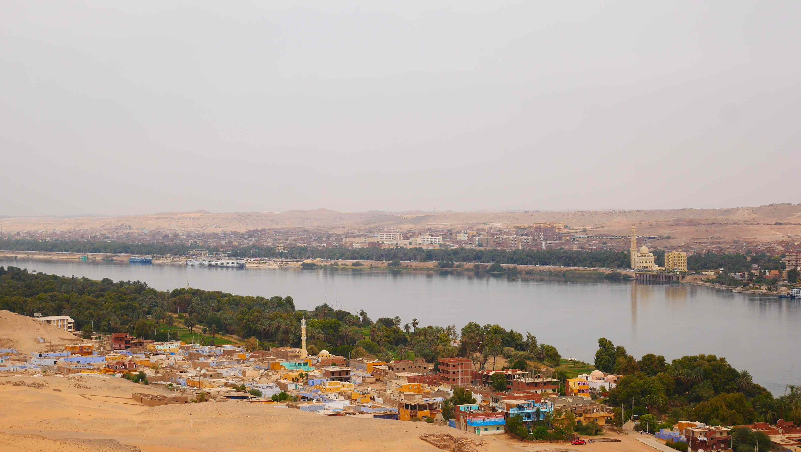</a>
	<figcaption>Nubian village on the west and Aswan downtown on the east.</figcaption>
</figure>

<figure>
	<a href="../images/egypt/aswan/aswan9.JPG">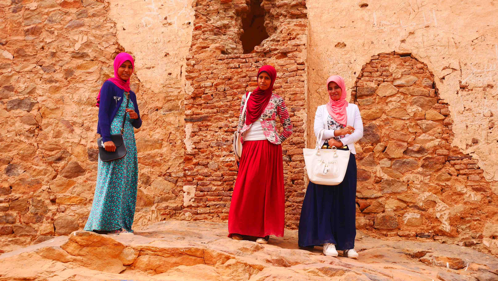</a>
	<figcaption>So stylish!</figcaption>
</figure>

On the <b>West bank</b> you can also visit a typical Nubian village. The houses are very decorated, but people here live under serious poverty. When I was there I met a very curious group of children that clearly were not used to see tourists there. They played the typical <i>hide and seek</i> game and I went along with it. Eventually one of them went to get a ball for us to play and 10 minutes later I was playing football with 10 of them and their mothers watching from some distance.

<b><highlight><middle>This was one of the most authentic experiences I had with locals of a different country.</middle></highlight></b>

<figure>
	<a href="../images/egypt/aswan/aswan10.JPG">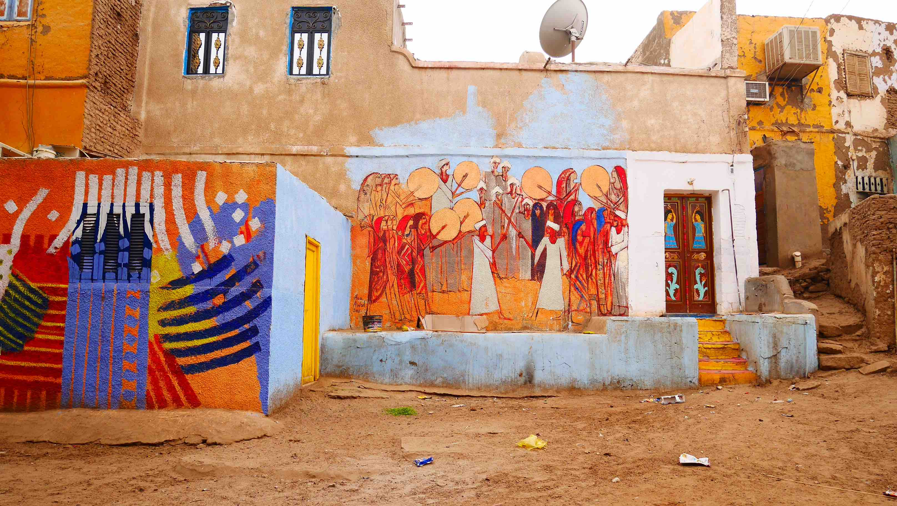</a>
	<figcaption>Typical Nubian house.</figcaption>
</figure>

<figure>
	<a href="../images/egypt/aswan/aswan11.JPG">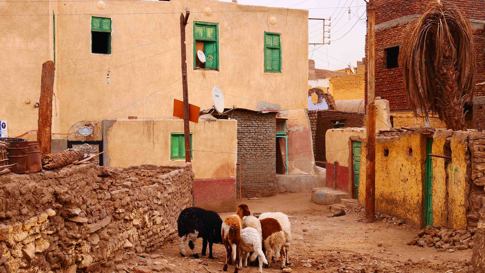</a>
	<figcaption>Some sheeps trying to make their way in hard conditions.</figcaption>
</figure>

<figure>
	<a href="../images/egypt/aswan/aswan13.JPG">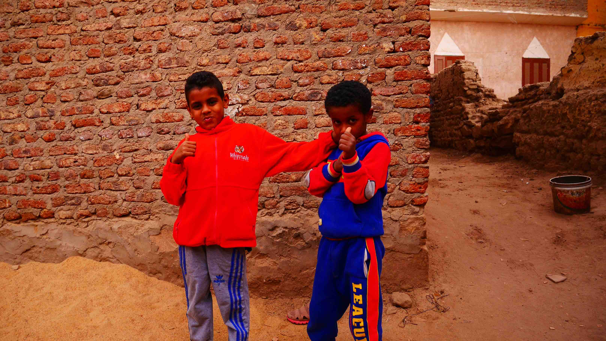</a>
	<figcaption>Two kids that joined the football match.</figcaption>
</figure>

<figure>
	<a href="../images/egypt/aswan/aswan12.JPG">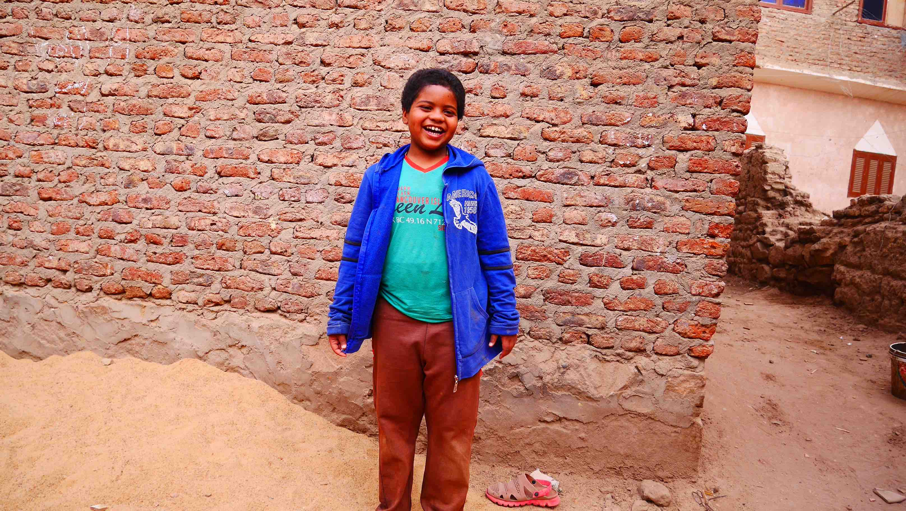</a>
	<figcaption>And another one.</figcaption>
</figure>

The convoy to <b>Abu Simbel</b> departs Aswan at around 5am and takes roughly ~3.5h to get to the temple. All of the journey is done through desert so you might as well take the chance to sleep a little bit more before getting to the destination, you'll not miss much, believe me.

<b><highlight><middle>Abu Simbel is stunning, magnificient and unique.</middle></highlight></b>

Only when I got there I understood the reason why so many people go all the way south just to visit this temple. Abu Simbel was formerly located further down the hillside, but due to the rising waters of Lake Nasser, the original locations are underwater. And what has been done? Well, the temple was carefully sawed into numbered stone cubes, moved uphill, and reassembled before the water rose. It was a remarkable work.

<figure>
	<a href="../images/egypt/aswan/aswan14.JPG">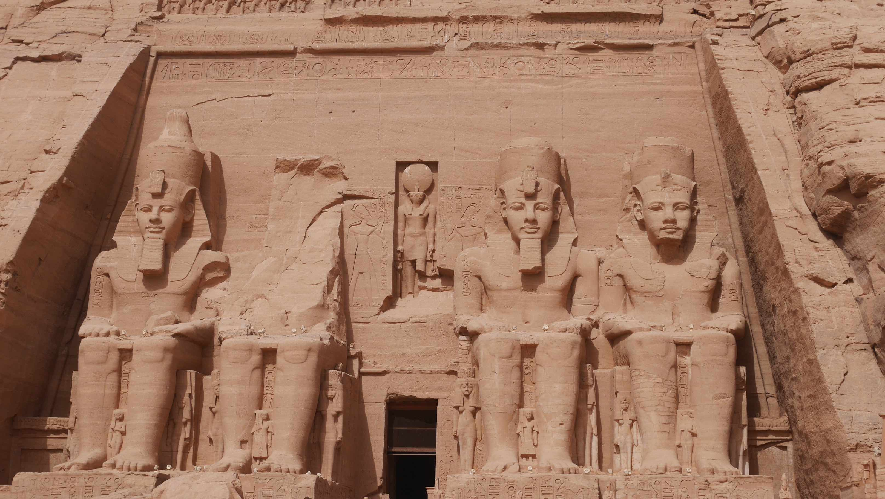</a>
	<figcaption>The entrance of Abu Simbel.</figcaption>
</figure>

<figure>
	<a href="../images/egypt/aswan/aswan16.JPG">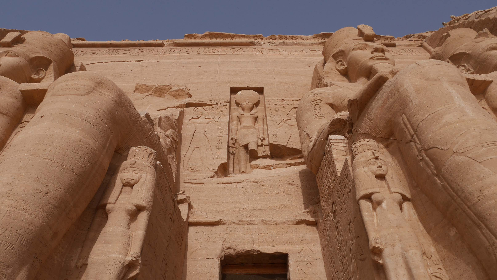</a>
	<figcaption>The closer you get the more impressive it gets.</figcaption>
</figure>

<figure>
	<a href="../images/egypt/aswan/aswan15.JPG">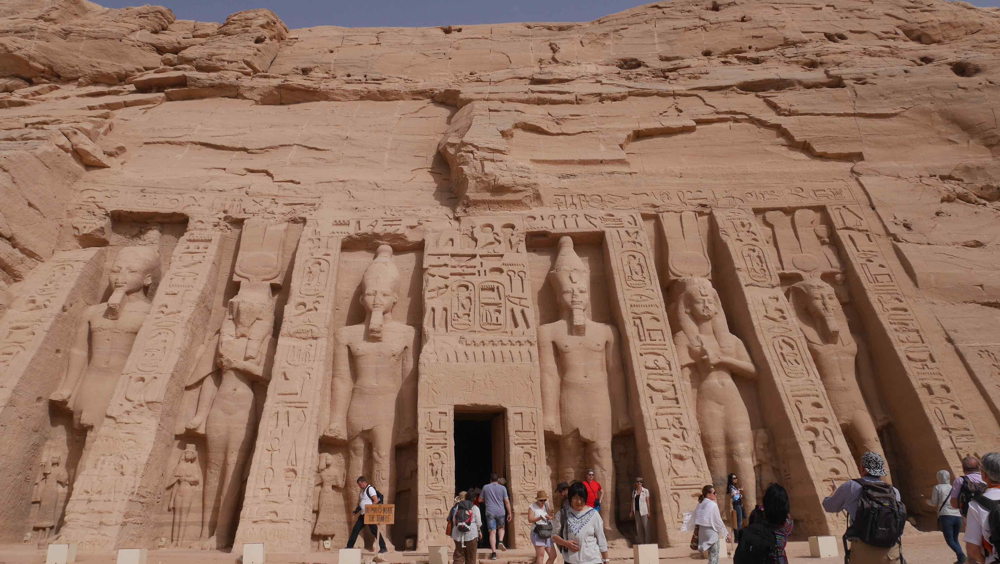</a>
	<figcaption>The entrance of Temple of Hathor, right next to Abu Simbel.</figcaption>
</figure>

The very next day I was off to <b><a href="{{site.url}}/Luxor" target="_blank">Luxor</a></b> once again. I really think that it is worth going all the way down to Aswan just to see <b>Abu Simbel</b>, but as soon as you visit it you can head off to the north again. People will usually describe Aswan as a beautiful city, but I just didn't find the beauty in it. The train station is within walking distance and there is an almost hourly service to <b><a href="{{site.url}}/Luxor" target="_blank">Luxor</a></b> and <b><a href="{{site.url}}/Cairo" target="_blank">Cairo</a></b>.

 
<h1>How to get there and away</h1>
<ul>
<li>I left <b><a href="{{site.url}}/Luxor" target="_blank">Luxor</a></b> to Aswan by train. It's easy to buy tickets at the train station in Luxor, there's always someone that speaks English there.</li>
<li>Train to <b><a href="{{site.url}}/Luxor" target="_blank">Luxor</a></b> directly from the Aswan train station.</li>
</ul>

 
<h1>What to do/see</h1>
<ul>
<li>West Bank (Tombs of The Nobles & Nubian people).</li>
<li>Abu Simbel.</li>
</ul>

 
<h1>Where to sleep</h1>
<ul>
<li><b>Memnon Hotel</b>, 6$ for a twin bed.</li>
</ul>