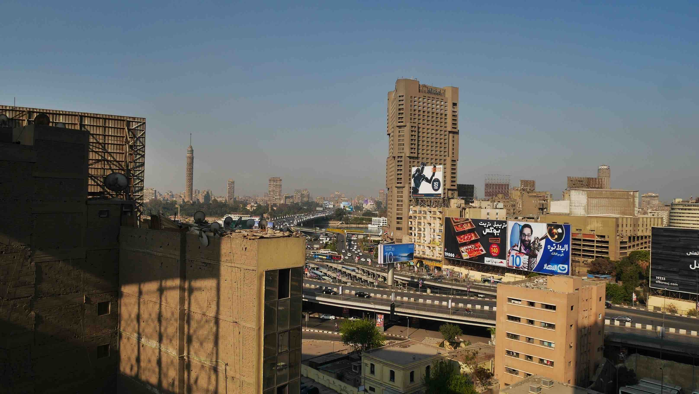
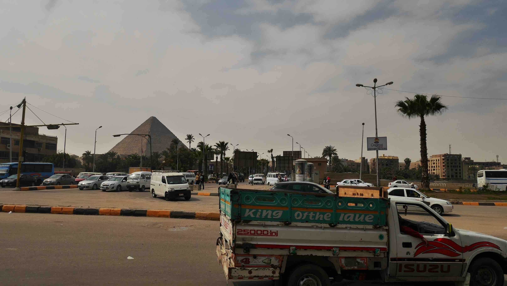
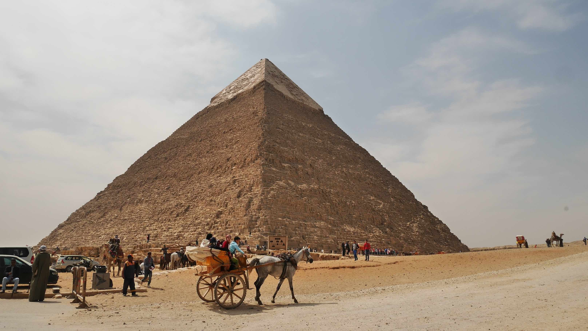
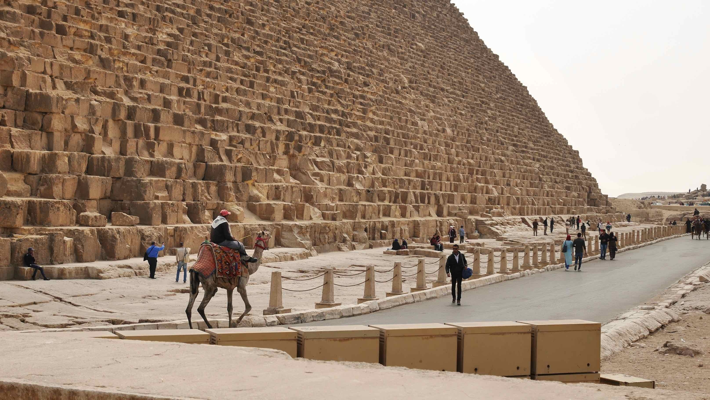
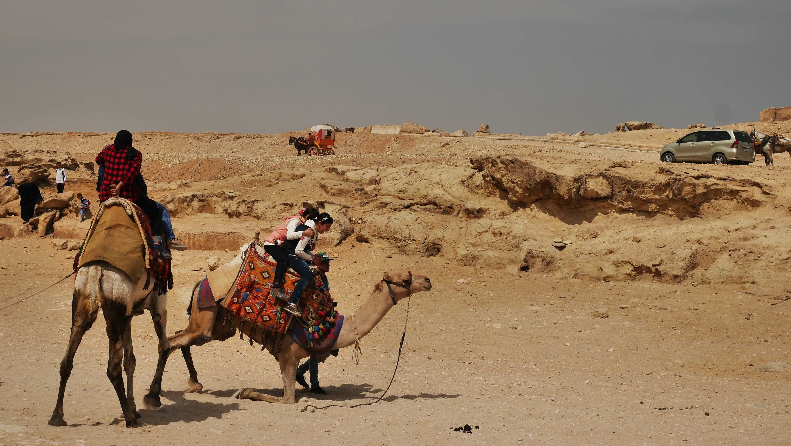
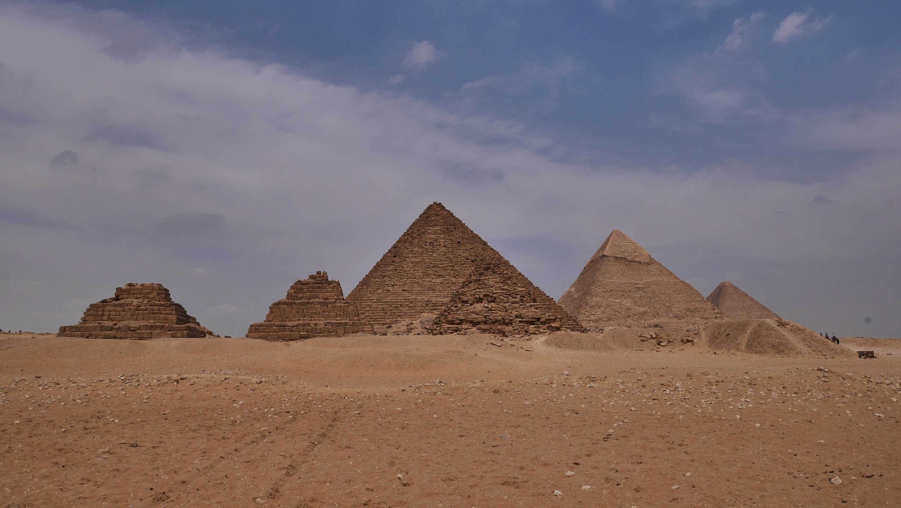

Cairo is Egypt's largest city and its capital with a population of over 20.4 million. The streets are chaotic at rush hours and the metro can also be over populated. The overcrowded places are not as bad as in <b><a href="{{site.url}}/Delhi" target="_blank">New Delhi (India)</a></b>, but they're not too shabby either. It is also the more <i>relaxed</i> city in Egypt, where many women wear denim jeans on a more <i>weasternish</i> fashion.

I flew in from Porto into Cairo with the intent of spending 2 weeks in Egypt. The capitals, usually, are not the most appealing to me, but I must say that I became very impressed with Cairo. The metro allows for an easy navigation through the city and you have tons of interesting stuff to visit and not only the usual boring shopping/museum stuff like the iconic <b>Tahrir square</b> where the revolution happened, <b>Al-Azhar Mosque</b> one of the pillars of Islamic thought, the <b>Citadel</b> and, of course, the <b>Pyramids of Giza and the Sphinx</b>.

<figure>
	
	<figcaption>Not the best shot, but this is Cairo from above.</figcaption>
</figure>

I arrived at Cairo at ~9pm and since there was no public transportation available (March 2017) I opted to take a pick up from my hostel (<b>Wake Up! Cairo Hostel</b>) for ~8$. I took care of my <b>VISA</b> at the airport when I landed. Actually, it was really easy. If you're eligible for <b>VOA</b> you just have to buy it at the desk next to the exit emmigration office, put it in the passport and you're good to go!

It is easy to get to the <b>Pyramids of Giza</b> using public transportation (yes, they're not in the desert, they're right in the middle of the city). Just get into the metro and stop at the <b>Giza</b> station. Right outside the station you'll have the <b>Al Haram</b> street and this is where you'll board any collective bus running down the street. When you see the pyramids in front of you just ask the driver to get out and he'll leave you wherever you want.

<figure>
	
	<figcaption>Cairo from the breakfast room in the hostel.</figcaption>
</figure>

<figure>
	
	<figcaption>The bus driver dropped me off near the pyramids.</figcaption>
</figure>

I heard about people in my hostel that went to the Pyramids with an Egyptian friend, and that this can be of a great help when dealing with people there. I went alone and I must say that I wasn't quite ready for such a <b>stressful</b> atmosphere.

It all starts when you approach the ramp that leads to the entrance where the ticket booth is. Don't mind the police in there, they will only help you if you approach them. First thing that you'll hear is that the entrance is on your left and you should go there. Be prepared to have more than 10 men surrounding and pressuring you to go there. It can be quite intimidating, but you should stay firm and keep on going up the ramp. Don't feel bad to ignore all of them, try to keep a smile on!

<b><highlight><middle>Don't trust anyone in the Pyramids complex. Anyone.</middle></highlight></b>

Once you're inside the complex, you're just a moving wallet. I think I was ~2.5h inside the complex, and was only alone half an hour when I walked around the Pyramids where usually only camels go. People will try to sell you camel/horse rides all the time, will give you gifts <i>for free</i>, will tell you that you can't go <b>that</b> way without a camel and so on... Just keep smiling and ignore. It'll be hard and intense, but this is just the start.

The complex is big and hot. Bring plenty of water, fresh clothes and confortable shoes. The pyramids are way bigger and stuning than I ever imagined and deserve to be contemplated with time. You can also go inside the <b>Great Pyramid</b> (300EGP) and one of the Pyramids (60EGP) depending on which one is open.

<figure>
	
	<figcaption>The great pyramid of Khufu.</figcaption>
</figure>

<figure>
	
	<figcaption>I would never imagined that 1 person = 1 block.</figcaption>
</figure>

<figure>
	
	<figcaption>Careful!</figcaption>
</figure>

<figure>
	
	<figcaption>Not so exotic with cairo on the horizon, right?!</figcaption>
</figure>

<figure>
	
	<figcaption>A rare moment when I got the Pyramids all for myself!</figcaption>
</figure>

 
<h1>How to get there and away</h1>
<ul>
<li>Minibus from <b><a href="{{site.url}}/VangVieng" target="_blank">Vang Vieng</a></b> to Luang Prabang, ~4h ride.</li>
<li>I took a night bus to <b><a href="{{site.url}}/Vientiane" target="_blank">Vientiane</a></b> and crossed the border into Thailand.</li>
</ul>

 
<h1>What to do/see</h1>
<ul>
<li>Kuang Si Waterfalls.</li>
<li>Alms Ceremony.</li>
<li>Buddhist temples all around downtown.</li>
</ul>

 
<h1>Where to sleep</h1>
<ul>
<li><b>Wake Up! Cairo Hostel</b>, ~8$ dorm bed with breakfast included.</li>
</ul>