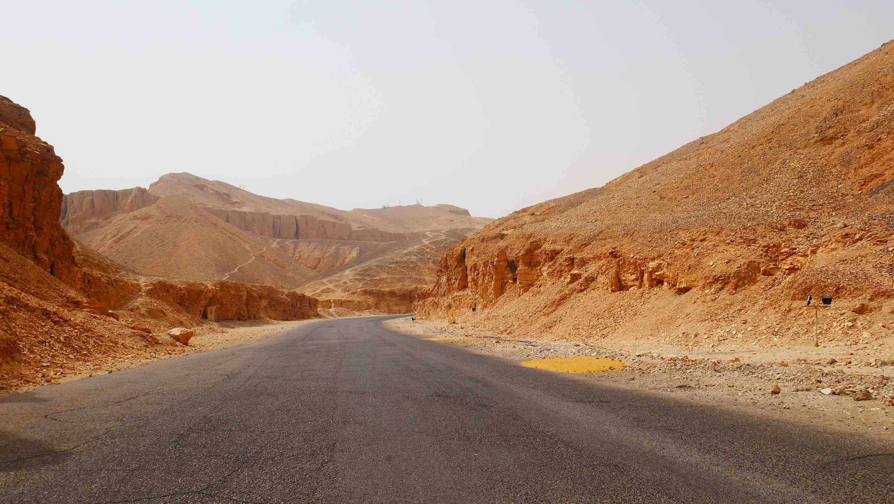

Cairo is Egypt's capital and largest city with a population of over 20.4 million. The streets are chaotic at rush hours and the metro can also be over populated. The overcrowded places are not as bad as in <b><a href="{{site.url}}/Delhi" target="_blank">New Delhi (India)</a></b>, but they're not too shabby either. It is also the most <i>relaxed</i> city in Egypt, where many women wear denim jeans on a more <i>westernish</i> fashion.

<figure>
	
	<figcaption>Luxor</figcaption>
</figure>

<b><highlight><middle>It is not possible at all to buy a day train from Cairo to Luxor at the Ramses train station.</middle></highlight></b>

 
<h1>How to get there and away</h1>
<ul>
<li>I flew from Madrid to Cairo.</li>
<li>I took a direct train from the Ramses station to Luxor. Buy the ticket online, you'll not be able to buy it in the station or to the conductor if you go during the day on a regular train.</li>
</ul>

 
<h1>What to do/see</h1>
<ul>
<li>Al-Azhar Mosque.</li>
<li>Citadel.</li>
<li>Egyptian Museum.</li>
<li>Khan El Khalili.</li>
<li>Pyramids of Giza and the Sphinx.</li>
</ul>

 
<h1>Where to sleep</h1>
<ul>
<li><b>Wake Up! Cairo Hostel</b>, ~8$ dorm bed with breakfast included. Mido is a very good host and can help you with anything.</li>
</ul>