Luxor is probably the premier travel destination in Egypt and it is considered by many the <bb>world's greatest open-air museum</b>. The town has two major districts, <b>West</b> (Valley of the Kings and Queens) and <b>East</b> (trains/restaurants/hotels) bank. The <b>West</b> side of the Nile used to be the capital of Egypt and it is the most rich area regarding the history of the country. The <b>East</b> side is <i>modern</i> and bustling, most of the people live there.

I arrived late in town by train from <b><a href="{{site.url}}/Cairo" target="_blank">Cairo</a></b>, a journey that was supposed to take 10h but in fact took 14h... So when I got off the train it was already night. Fortunately, I intended to stay in a place called <b>Bob Marley House Hostel</b> (there are 2 of them in <b>Luxor</b>, don't ask me why...) that is only 10min by foot from the train station. Luxor is <b>extremely</b> cheap and this particular hostel offered dorm beds with breakfast and coffee/tea for free all day for only... <b>3.5$</b> a night.

The first person I met when I got to my dorm bed was a brazilian guy mamed Gabriel that was coming from Aswan to visit some of the highlights of the west bank that he missed when he first stopped in Luxor. I promptly offered to go with him and split the costs of our journey. The west bank is vast and you'll need some kind of transportation especially for the Valley of the Kings, because it is really far. The other sites you can visit with a bicycle or, like I did in some of them, by foot.

<figure>
	
	<figcaption>On my way to the Valley of the Kings.</figcaption>
</figure>

It is easy to go to the West bank cheaply. Behind the <b>Luxor Temple</b>, before the <b>Mummification Museum</b>, there's a boat that crosses the river almost every 20min or so for just 0.10$. Once on the other side the <i>fun</i> begins. Or if you're <i>lucky</i> like me it'll start once you go into the boat. The tourism in Egypt has taken its toll since the revolution, and it is in moments like these that you can really see the reality in there. We were the only tourists on the other side of the river which lead to all the touts surrounding us with ridiculous offers. Eventually we struck a deal with one of them and we were off!

<b><highlight><middle>The west bank of Luxor proved to be the highlight of this historical city.</middle></highlight></b>

Don't try to explore all the sights in the west bank in one day. It'll be hot and you'll not enjoy because you'll be always in a constant rush. I would always recommend <b>at least</b> 2 full days to visit the west bank, but only if you have a car available, if you're going to explore with a bicycle you'll need another day.

<figure>
	<a href="../images/egypt/luxor/luxor2.JPG">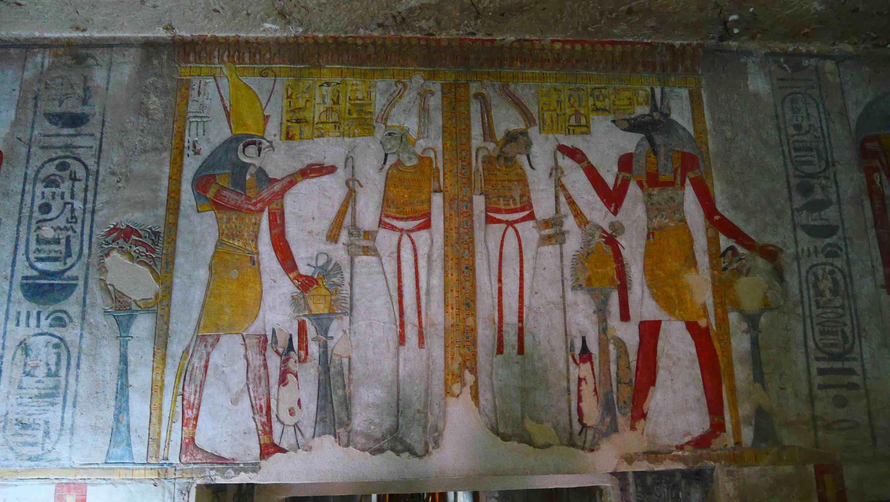</a>
	<figcaption>Inside one of the tombs in the Valley of the Kings.</figcaption>
</figure>

<figure>
	<a href="../images/egypt/luxor/luxor3.JPG">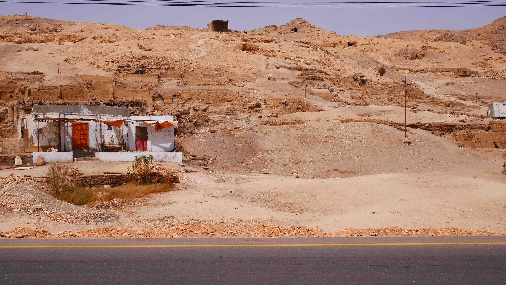</a>
	<figcaption>A traditional house in west bank.</figcaption>
</figure>

<figure>
	<a href="../images/egypt/luxor/luxor4.JPG">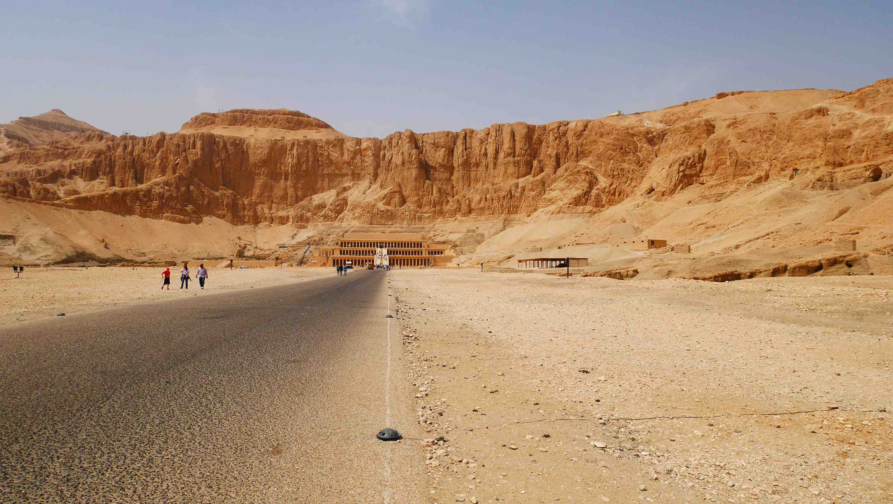</a>
	<figcaption>My first view over <b>Hatshepsut</b>, probably the must stunning sight in Luxor.</figcaption>
</figure>

<figure>
	<a href="../images/egypt/luxor/luxor5.JPG">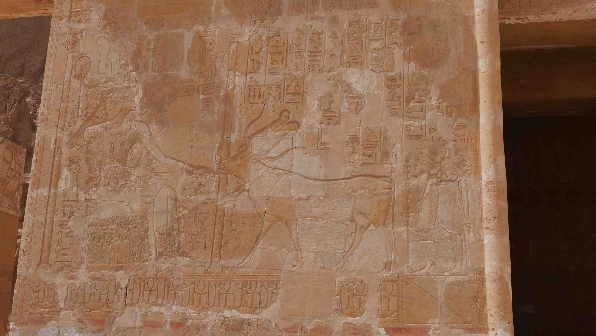</a>
	<figcaption>Magnificient wall in <b>Hatshepsut</b>.</figcaption>
</figure>

<figure>
	<a href="../images/egypt/luxor/luxor6.JPG">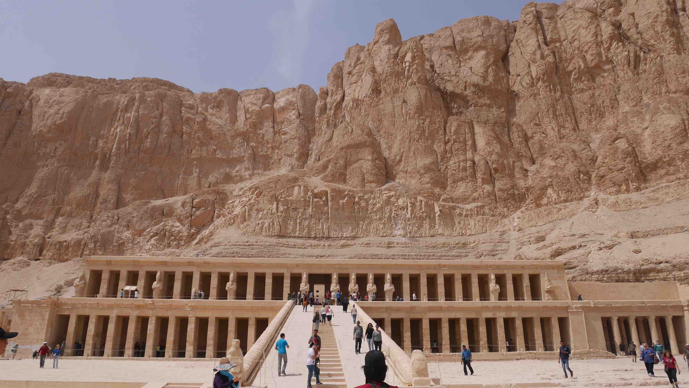</a>
	<figcaption>A close up of <b>Hatshepsut</b>.</figcaption>
</figure>

<figure>
	<a href="../images/egypt/luxor/luxor7.JPG">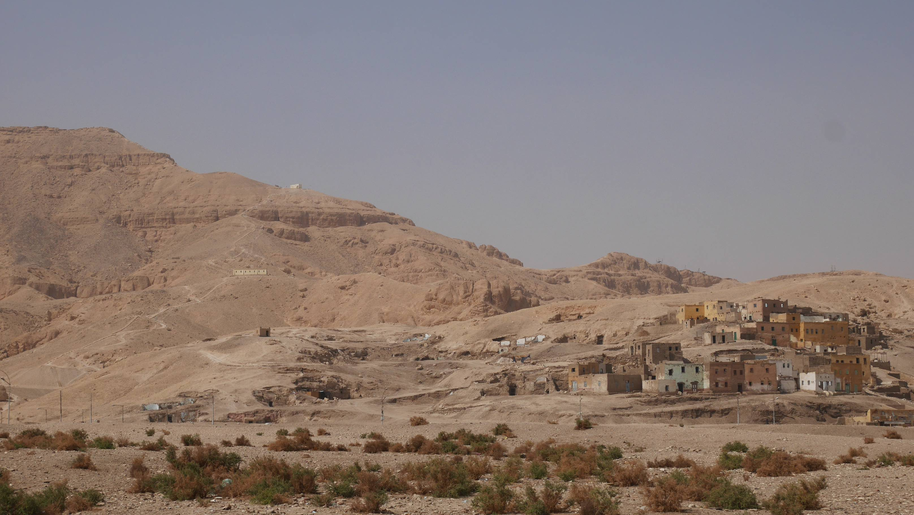</a>
	<figcaption>A picturesque village in the west bank.</figcaption>
</figure>

The <b>Valley of the Kings</b> is an amazing site because it is where the ancient Pharaohs were buried. Unfortunately, most of the tombs are closed to the public and your ticket only allows you to visit 3 tombs of all the ones available that day. Photography is also not allowed inside, but if you give a <i>Baksheesh</i> to the guy there he'll turn a blind eye.

<b>Hatshepsut</b> is a truly magnificient temple carved in the mountain. Inside there's not much to see, but from afar this temple is really one of a kind. From here I walked to the next nearest temple, <b>Medinet Habu</b>, the Mortuary Temple of Ramesses III.

<figure>
	<a href="../images/egypt/luxor/luxor8.JPG">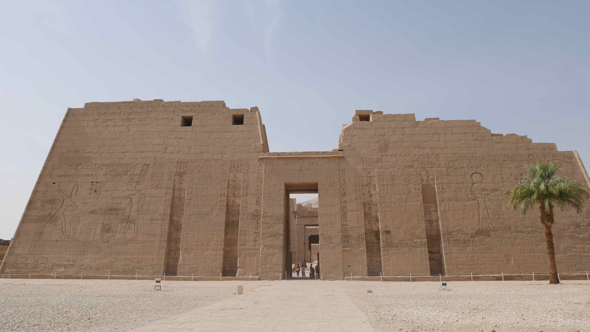</a>
	<figcaption>The entrance of Medinet Habu.</figcaption>
</figure>

<figure>
	<a href="../images/egypt/luxor/luxor9.JPG">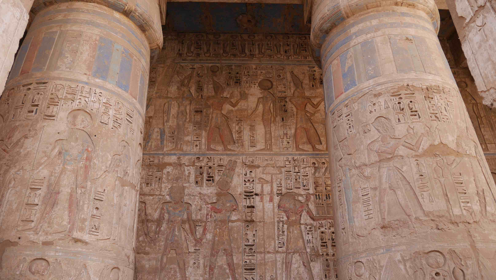</a>
	<figcaption>Some of the colors are still visible.</figcaption>
</figure>

<figure>
	<a href="../images/egypt/luxor/luxor10.JPG">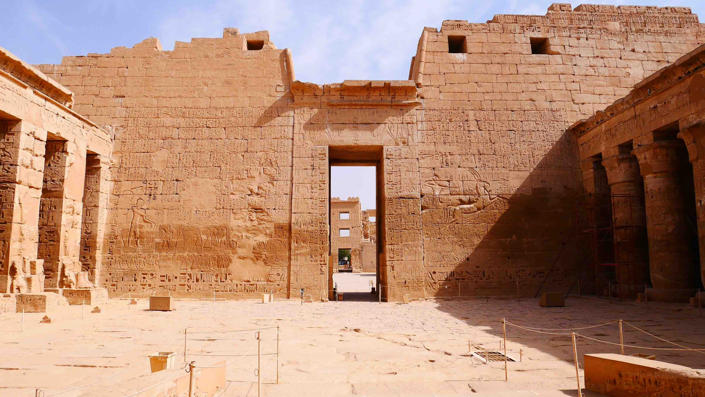</a>
	<figcaption>The details are so vivid still.</figcaption>
</figure>

Just 1km away from <b>Medinet Habu</b> you have the <b>Colossi of Memnon</b>, that is basically two massive stone statues of a Pharaoh (Amenhotep III). It is not the most impressive sight, but it is free and it is on the way back so why not?!

I even got a ride back to the boat! A stranger was kind enough to let me go with him and his son on his motorbike. He was a seller in <b>Valley of the Queens</b> and I would find him there when I went there to visit the valley. I could have still visited more places, but I would be rushing and I had plenty of time.

<figure>
	<a href="../images/egypt/luxor/luxor11.JPG">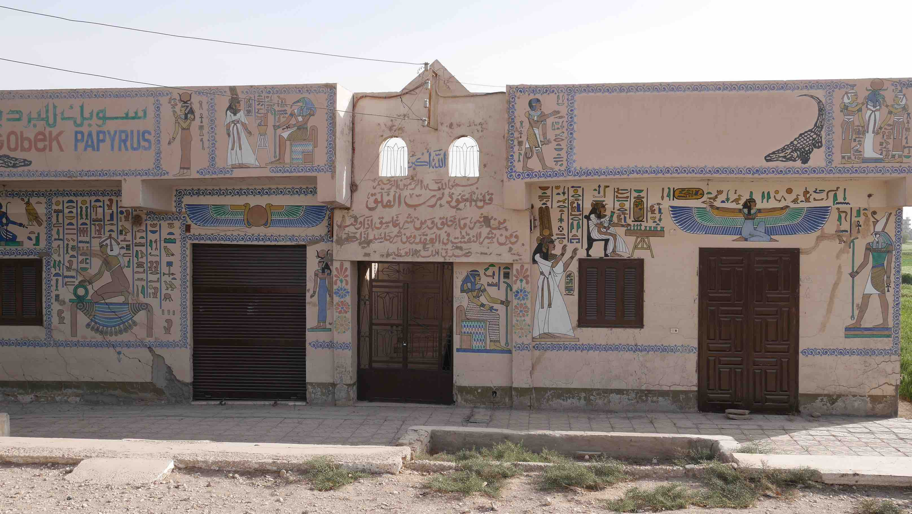</a>
	<figcaption>No such thing as boring houses in Luxor!</figcaption>
</figure>

<figure>
	<a href="../images/egypt/luxor/luxor12.JPG">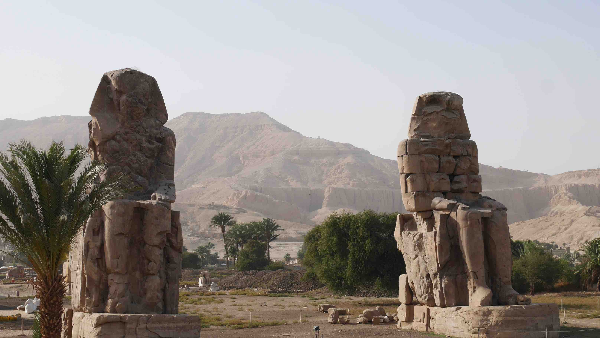</a>
	<figcaption>The Colossi of Memnon.</figcaption>
</figure>

<figure>
	
	<figcaption>My ride back to the boat.</figcaption>
</figure>

The following day was spent exclusively exploring the <b>East Bank</b>. From my hostel to the farthest attraction (<b>Karnak Temple</b>) I had to cover ~4km by foot, easily doable if you walk by the <b>Corniche</b>. It is very pleasant, no traffic whatsoever and you'll almost certainly struck a conversation with someone. It'll be most likely at first to try to sell you a boat ride or something, but once you're able to go through that you'll be able to have an actual conversation!

I don't know why, but the fact is that the <b>Karnak Temple</b> was the sight where I found more tourists. Even more than in the <b><a href="{{site.url}}/Cairo" target="_blank">Pyramids of Giza</a></b> which is remarkable. The temple is beautiful, but I don't think that it is as beautiful as the sights on the West Bank.

<figure>
	<a href="../images/egypt/luxor/luxor14.JPG">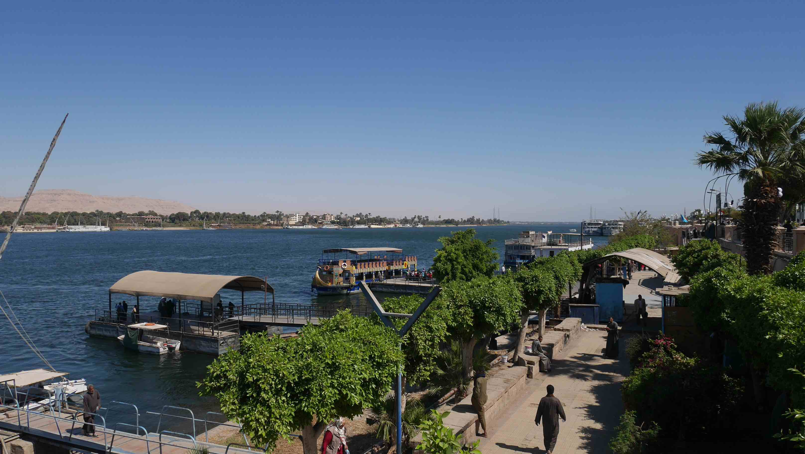</a>
	<figcaption>The Corniche in the morning is very pleasant for a stroll.</figcaption>
</figure>

<figure>
	<a href="../images/egypt/luxor/luxor15.JPG">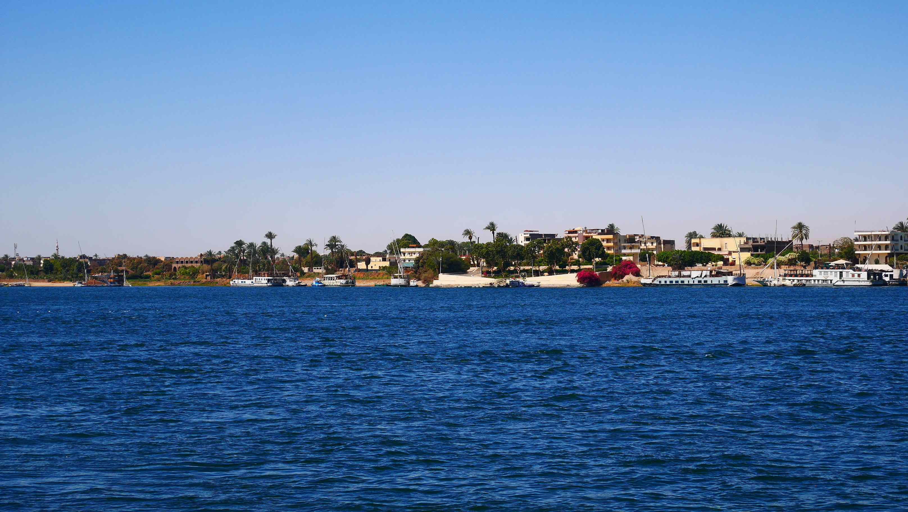</a>
	<figcaption>The West Bank.</figcaption>
</figure>

<figure>
	<a href="../images/egypt/luxor/luxor16.JPG">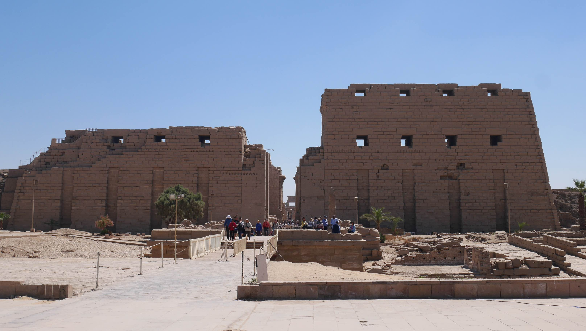</a>
	<figcaption>Karnaks' temple entrance.</figcaption>
</figure>

 
<h1>How to get there and away</h1>
<ul>
<li>I flew from Madrid to Cairo.</li>
<li>I took a direct train from the Ramses station to Luxor. Buy the ticket online, you'll not be able to buy it in the station or to the conductor if you go during the day on a regular train.</li>
</ul>

 
<h1>What to do/see</h1>
<ul>
<li>Al-Azhar Mosque.</li>
<li>Citadel.</li>
<li>Egyptian Museum.</li>
<li>Khan El Khalili.</li>
<li>Pyramids of Giza and the Sphinx.</li>
</ul>

 
<h1>Where to sleep</h1>
<ul>
<li><b>Bob Marley House Hostel</b>, 3.5$ dorm bed with breakfast included. Really central and close to the train station.</li>
</ul>